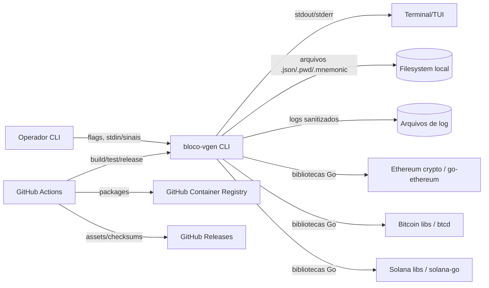
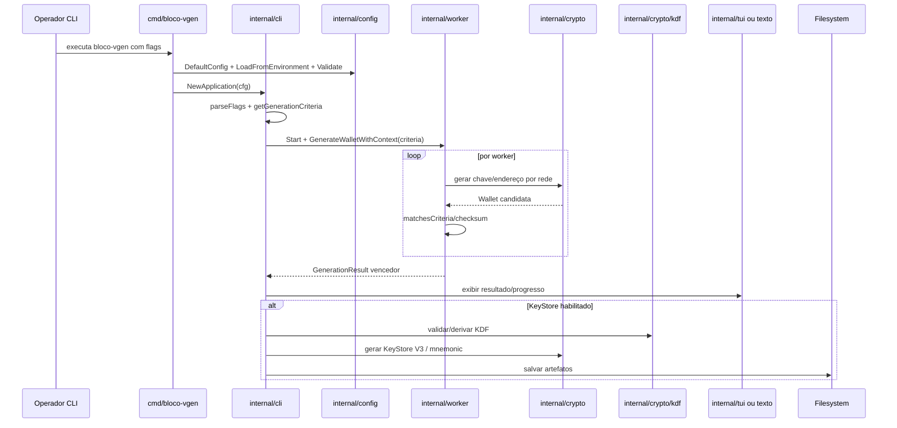

# Architecture — Architect

> Projeto: `bloco-wallet-generator`  
> Fase: Interpretação / Architect  
> Nível de documentação: completo  
> Escala: 🟢 CONFIRMADO | 🟡 INFERIDO | 🔴 LACUNA

## Sumário executivo

`bloco-wallet-generator` é uma aplicação **CLI monolítica local** escrita em Go. No legado, o binário principal (`bloco-vgen`) expõe comandos para geração de carteiras vanity, análise estatística, benchmark e versão. Por decisão humana do Revisor, a nomenclatura-alvo deve usar `bloco-vanity-generator` para produto/repositório/documentação e `bloco-vgen` como binário compatível. A arquitetura é modular por pacotes: bootstrap em `cmd/`, orquestração em `internal/cli`, configuração em `internal/config`, geração criptográfica em `internal/crypto`, concorrência em `internal/worker`, interface terminal em `internal/tui` e tipos utilitários em `pkg/`. 🟢

O sistema não possui backend remoto, banco de dados, API HTTP nem fila. O estado persistente é composto por **artefatos locais**: keystores, passwords, mnemonics, logs, binários e imagens Docker gerados pelo processo ou por CI/CD.

## Drivers arquiteturais

| Driver | Descrição | Confiança |
|---|---|---:|
| Segurança de segredos | Private keys, mnemonics e salts não devem vazar em logs; keystore deve cifrar private key. | 🟢 |
| Performance | Busca vanity é probabilística e exige concorrência, object pooling e hot path otimizado. | 🟢 |
| Experiência CLI/TUI | Usuário opera por terminal, com fallback de TUI para texto. | 🟢 |
| Compatibilidade Ethereum | KeyStore V3, EIP-55, scrypt/PBKDF2 e compatibilidade com clientes Ethereum. | 🟢 |
| Multi-rede | Suporte Ethereum, Bitcoin e Solana, com diferenças por formato de chave/endereço. | 🟢 |
| Build reprodutível | Docker multi-stage e CI com Go 1.24/1.25, race, lint e scans. | 🟢 |

## Estilo arquitetural

| Aspecto | Classificação | Evidência | Confiança |
|---|---|---|---:|
| Topologia | Monólito CLI local | Um binário Go em `cmd/bloco-vgen` | 🟢 |
| Modularização | Camadas/pacotes por responsabilidade | `internal/*`, `pkg/*` | 🟢 |
| Persistência | Filesystem local | `keystores/`, logs, Docker artifacts | 🟢 |
| Integração externa runtime | Bibliotecas blockchain, terminal e filesystem; sem chamadas RPC obrigatórias | go.mod e código analisado | 🟢 |
| Concorrência | Worker pool com goroutines e stats collector | `internal/worker` | 🟢 |
| UI | CLI Cobra/Fang + TUI Bubble Tea | `internal/cli`, `internal/tui` | 🟢 |

## Visão de contexto

## Containers lógicos

Embora seja uma aplicação CLI única, a arquitetura pode ser lida como containers lógicos internos:

| Container lógico | Tecnologia | Responsabilidade | Confiança |
|---|---|---|---:|
| CLI Runtime | Go, Cobra, Fang | Parse de flags, comandos e orchestration | 🟢 |
| TUI Runtime | Bubble Tea, Bubbles, Lip Gloss | Progresso, stats e benchmark em terminal | 🟢 |
| Worker Engine | Go goroutines, channels, sync | Busca concorrente por endereços vanity | 🟢 |
| Crypto Engine | go-ethereum, btcd, solana-go, x/crypto | Geração de chaves/endereço, checksum, keystore, KDF | 🟢 |
| Config Engine | Go structs/env | Defaults, env vars e validação | 🟢 |
| Logging Engine | Código local `pkg/logging` | Logging seguro, sanitização, rotação e buffer | 🟢 |
| Filesystem Artifacts | Arquivos locais | Keystores, passwords, mnemonics e logs | 🟢 |
| CI/CD Pipeline | GitHub Actions, Docker Buildx | Teste, build, scan, release e imagem Docker | 🟢 |

## Componentes principais

| Componente | Responsabilidade | Entradas | Saídas | Confiança |
|---|---|---|---|---:|
| `cmd/bloco-vgen` | Bootstrap, config, sinais e execução Fang. | Processo, env, sinais | Código de saída | 🟢 |
| `internal/cli.Application` | Comandos, flags, geração, stats, benchmark e keystore. | Flags Cobra | Resultados, logs, arquivos | 🟢 |
| `internal/config.Config` | Defaults e validação operacional. | Env vars, flags mutadas | Config validada | 🟢 |
| `internal/worker.Pool` | Fan-out concorrente e primeiro resultado vencedor. | `GenerationCriteria` | `GenerationResult`, stats | 🟢 |
| `internal/crypto.Generator` | Interface multi-rede de geração de carteiras. | Rede, critérios | `Wallet` | 🟢 |
| `internal/crypto/kdf.UniversalKDFService` | Derivação de chave e validação KDF. | Password, params | Derived key/relatórios | 🟢 |
| `internal/validation` | Estratégias de match/checksum. | Endereço, critérios | bool/error | 🟢 |
| `internal/tui` | Modelos Bubble Tea para progresso/stats/benchmark. | Mensagens TUI | Render terminal | 🟢 |
| `pkg/wallet` | Entidades de domínio e estatísticas. | Dados de geração | structs/métodos | 🟢 |
| `pkg/logging` | Logger seguro e sanitização. | Eventos operacionais | Logs seguros | 🟢 |
| `pkg/errors` | Erros estruturados. | Erros/categorias | `BlocoError` | 🟢 |
| `pkg/utils` | Formatação e probabilidade. | Números/padrões | Strings/cálculos | 🟢 |

## Fluxo arquitetural principal

## Modelo de dados arquitetural

O sistema não usa banco relacional. O ERD documenta entidades em memória e arquivos gerados:

- `GenerationCriteria` orienta a busca.
- `WorkerStats` e `GenerationStats` acompanham execução.
- `Wallet` é o resultado principal.
- `KeyStoreV3` e subestruturas persistem private key cifrada.
- `LogEntry` registra eventos sanitizados.
- `BenchmarkResult` captura performance.

Veja `_reversa_sdd/erd-complete.md` para Mermaid completo.

## Integrações externas

| Integração | Tipo | Protocolo/Formato | Direção | Confiança |
|---|---|---|---|---:|
| Terminal | I/O local | stdout/stderr, ANSI/TUI | bidirecional | 🟢 |
| Filesystem | I/O local | JSON, `.pwd`, `.mnemonic`, `.log` | escrita/leitura local | 🟢 |
| GitHub Actions | CI/CD | YAML workflows | build/test/release | 🟢 |
| GitHub Releases | Distribuição | release assets/checksums | saída CI | 🟢 |
| GHCR | Container Registry | OCI/Docker image | saída CI | 🟢 |
| Codecov | Cobertura | upload coverage | saída CI | 🟢 |
| Semgrep App | SAST | token/env + semgrep ci | saída CI | 🟢 |
| go-ethereum | Biblioteca | chamadas Go locais | runtime local | 🟢 |
| btcd/btcutil | Biblioteca | chamadas Go locais | runtime local | 🟢 |
| solana-go | Biblioteca | chamadas Go locais | runtime local | 🟢 |

Não foram identificadas APIs REST/GraphQL próprias, webhooks runtime, filas, caches ou banco de dados.

## Deployment e distribuição

Mesmo com `doc_level=completo`, o Dockerfile foi considerado para arquitetura:

- Build multi-stage: `golang:1.24-alpine3.20` -> `alpine:3.20`.
- Binário estático com `CGO_ENABLED=0` em `/app/bloco-vgen`.
- Runtime usa usuário não-root `bloco-vgen` (`uid/gid 1001`).
- Healthcheck executa `bloco-vgen --help`.
- Release workflow publica binários Linux/Darwin amd64/arm64, checksums e imagem GHCR.

## Dívidas técnicas e riscos arquiteturais

| ID | Dívida/Risco | Impacto | Confiança |
|---|---|---|---:|
| TD-001 | Nomes inconsistentes: `bloco-vgen`, `bloco-wallet-generator`, `bloco-vanity-generator`. | Confusão em install, Docker, módulo e documentação. | 🟢 |
| TD-002 | `Wallet.IsValid()` assume endereço Ethereum de 40 chars e private key de 64. | Pode invalidar Bitcoin/Solana ou Ethereum com `0x`. | 🟢 |
| TD-003 | `EncryptPrivateKeyWithKDF()` usa endereço placeholder. | KeyStore pode associar endereço incorreto em fluxo específico. | 🟢 |
| TD-004 | Persistência Solana contém simplificação/placeholder. | Backup/import Solana incompleto ou enganoso. | 🟢 |
| TD-005 | Progress manager texto desabilitado por deadlocks. | UX de progresso em modo texto degradada. | 🟢 |
| TD-006 | Benchmark tem TODO de integração real com ants pool. | Métricas de benchmark podem ser incompletas. | 🟢 |
| TD-007 | Logs legados `wallets-*.log` podem conter private key. | Risco de segredo histórico no repositório/ambiente. | 🟢 |
| TD-008 | README pode anunciar flags não confirmadas em CLI. | Divergência usuário/documentação. | 🟡 |
| TD-009 | Sem database/ERD persistente; artefatos são arquivos soltos. | Gestão de lifecycle/limpeza depende do operador. | 🟢 |

## Qualidade arquitetural

| Atributo | Avaliação | Confiança |
|---|---|---:|
| Segurança | Forte intenção em logging seguro, keystore e usuário não-root Docker; há dívidas históricas. | 🟢 |
| Performance | Forte foco em worker pool, object pooling e hot path. | 🟢 |
| Manutenibilidade | Boa separação por módulos; `internal/cli/commands.go` concentra muitas responsabilidades. | 🟢 |
| Portabilidade | Go, Docker e builds Linux/Darwin amd64/arm64. | 🟢 |
| Observabilidade | Logs seguros e métricas; sem tracing externo. | 🟢 |
| Testabilidade | 24 arquivos de teste; CI usa `-short` para viabilidade. | 🟢 |

## Decisão arquitetural resumida

A arquitetura é adequada para uma ferramenta CLI local de alta performance: monólito Go modular, concorrência nativa, dependências cripto específicas e persistência em filesystem. A principal tensão arquitetural é a expansão multi-rede sobre modelos e validações originalmente centrados em Ethereum.
