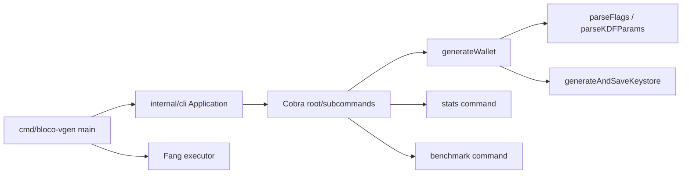
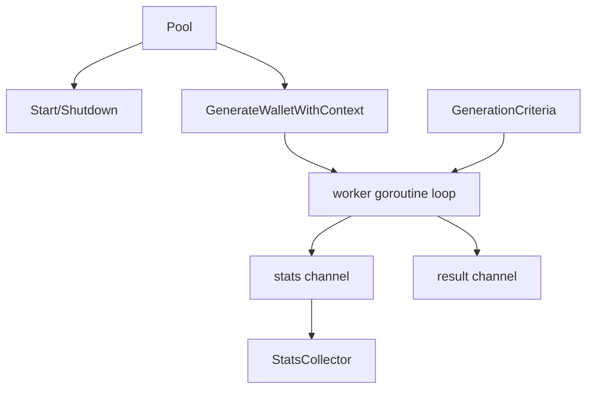
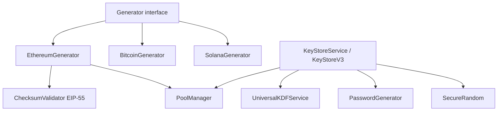
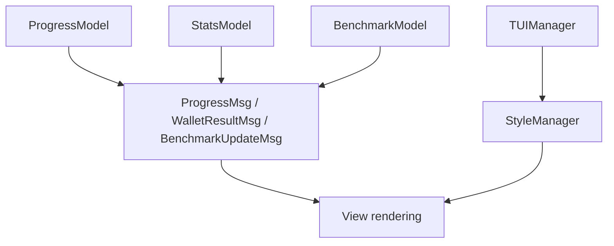
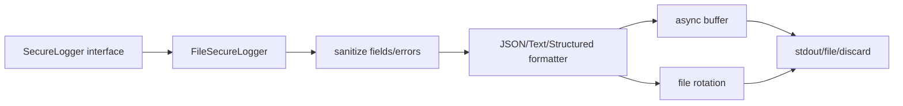

# C4 Components — Architect

## Container: CLI Runtime

| Componente | Papel | Confiança |
|---|---|---:|
| `main` | Bootstrap, graceful shutdown, config e execução. | 🟢 |
| `Application` | Agrega config, versão e comando raiz. | 🟢 |
| `setupCommands` | Declara comandos e flags. | 🟢 |
| `parseFlags` | Aplica flags à configuração. | 🟢 |
| `generateWallet` | Orquestra geração single/multiple. | 🟢 |
| `showStats` | Exibe análise de dificuldade. | 🟢 |
| `runBenchmark` | Executa benchmark e apresentação. | 🟢 |
| `generateAndSaveKeystoreWithVerbose` | Persistência de keystore/mnemonic por rede. | 🟢 |

## Container: Worker Engine

| Componente | Papel | Confiança |
|---|---|---:|
| `Pool` | Coordena gerador, threads e stats. | 🟢 |
| `GenerateWalletWithContext` | Dispara goroutines e retorna primeiro match. | 🟢 |
| `matchesCriteria` | Verifica prefix/suffix/checksum por rede. | 🟢 |
| `StatsCollector` | Agrega métricas e performance. | 🟢 |
| `WorkerStats` | Métricas por worker. | 🟢 |

## Container: Crypto Engine

| Componente | Papel | Confiança |
|---|---|---:|
| `Generator` | Contrato para redes blockchain. | 🟢 |
| `EthereumGenerator` | secp256k1, Keccak, endereço Ethereum. | 🟢 |
| `BitcoinGenerator` | btcec/btcutil e P2PKH. | 🟢 |
| `SolanaGenerator` | Ed25519 e base58. | 🟢 |
| `ChecksumValidator` | EIP-55 e validação de padrão checksum. | 🟢 |
| `KeyStoreV3` | Modelo JSON Ethereum KeyStore. | 🟢 |
| `UniversalKDFService` | KDF scrypt/PBKDF2, aliases e validação. | 🟢 |
| `KDFCompatibilityAnalyzer` | Segurança/compatibilidade e otimização. | 🟢 |
| `PasswordGenerator` | Senha segura com complexidade. | 🟢 |
| `PoolManager` | Reuso de buffers/objetos cripto. | 🟢 |

## Container: TUI Runtime

| Componente | Papel | Confiança |
|---|---|---:|
| `TUIManager` | Detecção de capacidades do terminal. | 🟢 |
| `StyleManager` | Cores, estilos e fallback monocromático. | 🟢 |
| `ProgressModel` | Progresso e tabela de wallets. | 🟢 |
| `StatsModel` | Análise de dificuldade. | 🟢 |
| `BenchmarkModel` | Estado e resultado do benchmark. | 🟢 |

## Container: Secure Logging Engine

| Componente | Papel | Confiança |
|---|---|---:|
| `SecureLogger` | Interface de logging seguro. | 🟢 |
| `FileSecureLogger` | Implementação com writer, buffer e rotação. | 🟢 |
| `sanitize*` | Whitelist/redaction de campos sensíveis. | 🟢 |
| `LogFormatter` | JSON, texto ou estruturado. | 🟢 |
| `LogEntry` | Evento de log sanitizado. | 🟢 |

## Acoplamentos de maior atenção

| Acoplamento | Risco | Confiança |
|---|---|---:|
| `internal/cli/commands.go` -> quase todos os módulos | Arquivo concentrador com alta responsabilidade. | 🟢 |
| `pkg/wallet.Wallet` -> múltiplas redes | Modelo/validação ainda assume Ethereum em partes. | 🟢 |
| KeyStore -> KDF -> Crypto | Fluxo seguro, mas complexo e sensível a params. | 🟢 |
| TUI/progress -> worker stats | Histórico de deadlock no progress manager texto. | 🟢 |
