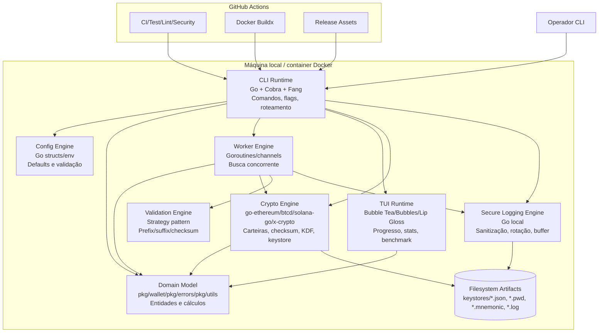

# C4 Containers — Architect

> Como a aplicação é um monólito CLI, os containers abaixo são containers lógicos e de deployment.

## Diagrama

## Containers lógicos

| Container | Tecnologia | Responsabilidades | Dados | Confiança |
|---|---|---|---|---:|
| CLI Runtime | Go, Cobra, Fang | Comandos `generate`, `stats`, `benchmark`, `version`; parsing de flags; orquestração. | `Config`, `GenerationCriteria`, `GenerationResult` | 🟢 |
| TUI Runtime | Bubble Tea, Bubbles, Lip Gloss | Exibição interativa de progresso, tabelas e benchmark. | `GenerationStats`, `BenchmarkResult` | 🟢 |
| Config Engine | Go structs/env | Defaults, variáveis `BLOCO_*`, validação de limites. | `Config` | 🟢 |
| Worker Engine | Goroutines, channels, sync | Execução concorrente, primeiro resultado vencedor, stats. | `WorkerStats`, `WorkResult` | 🟢 |
| Crypto Engine | go-ethereum, btcd, solana-go, x/crypto | Chaves, endereços, checksum, KDF, keystore. | `Wallet`, `KeyStoreV3`, `CryptoParams` | 🟢 |
| Validation Engine | Código local | Estratégias de match por padrão/checksum. | `GenerationCriteria` | 🟢 |
| Secure Logging | Código local | Logs sanitizados, rotação e async buffering. | `LogEntry` | 🟢 |
| Domain Model | `pkg/wallet`, `pkg/utils`, `pkg/errors` | Tipos de domínio, probabilidades, erros. | structs Go | 🟢 |
| Filesystem Artifacts | FS local | Persistência de artefatos gerados. | JSON/text/log | 🟢 |
| CI/CD | GitHub Actions, Docker Buildx | Build, teste, lint, scan e release. | binários, imagens, checksums | 🟢 |

## Ausências relevantes

| Item | Status | Confiança |
|---|---|---:|
| Banco de dados | Não identificado | 🟢 |
| API HTTP própria | Não identificada | 🟢 |
| Fila/cache | Não identificados | 🟢 |
| Serviço remoto runtime obrigatório | Não identificado | 🟢 |
