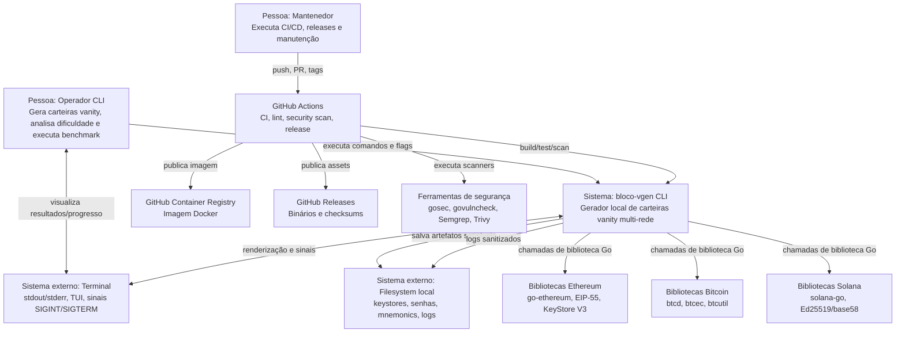

# C4 Context — Architect

> Escala: 🟢 CONFIRMADO | 🟡 INFERIDO | 🔴 LACUNA

## Diagrama

## Relacionamentos

| Origem | Destino | Relação | Protocolo/Formato | Confiança |
|---|---|---|---|---:|
| Operador CLI | `bloco-vgen` | Executa comandos | processo local + flags | 🟢 |
| `bloco-vgen` | Terminal | Exibe resultados/TUI | stdout/stderr/ANSI | 🟢 |
| Terminal | `bloco-vgen` | Envia sinais/cancelamento | SIGINT/SIGTERM, teclado TUI | 🟢 |
| `bloco-vgen` | Filesystem | Salva keystore, password, mnemonic e logs | JSON/texto | 🟢 |
| `bloco-vgen` | Bibliotecas blockchain | Gera chaves/endereço | chamadas Go locais | 🟢 |
| GitHub Actions | `bloco-vgen` | Testa/builda/scaneia | workflows YAML | 🟢 |
| GitHub Actions | GHCR/Releases | Publica artefatos | Docker/Release API | 🟢 |

## Observações

- Não há API externa obrigatória para gerar carteiras; integrações blockchain são bibliotecas locais.
- O principal limite de confiança é o filesystem local, onde ficam artefatos sensíveis.
- Logs legados devem ser tratados como possivelmente sensíveis.
