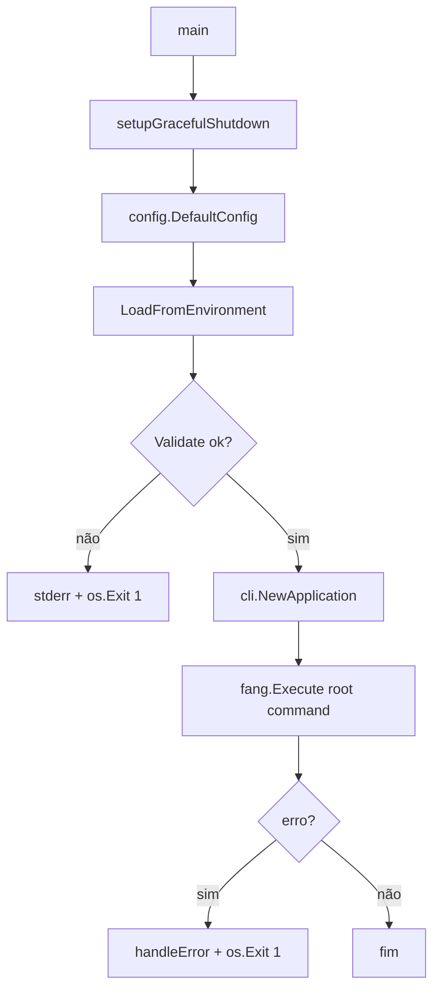

# Caso de Uso: Inicialização da CLI, Design Técnico

> Spec gerada pelo Reversa Writer.  
> Unit pai: `cmd/bloco-vgen`  
> Escala: 🟢 CONFIRMADO no código | 🟡 INFERIDO | 🔴 LACUNA

## Interface

A inicialização da CLI é acionada implicitamente pelo sistema operacional quando o binário `bloco-vgen` é executado. O caso de uso não expõe API HTTP, fila ou RPC; a interface é composta por variáveis de ambiente, sinais do processo, flags delegadas ao comando raiz e saídas em `stderr`. 🟢

| Símbolo | Assinatura | Retorno | Observação |
|---------|-----------|---------|------------|
| `main` | `func main()` | `void` | Executa o fluxo completo de bootstrap e delega o comando raiz ao Fang. 🟢 |
| `setupGracefulShutdown` | `func setupGracefulShutdown() (context.Context, context.CancelFunc)` | `context.Context`, `context.CancelFunc` | Fornece o contexto de cancelamento usado por `fang.Execute`. 🟢 |
| `config.DefaultConfig` | `func DefaultConfig() *Config` | `*config.Config` | Cria a configuração base da aplicação. 🟡 |
| `Config.LoadFromEnvironment` | `func (c *Config) LoadFromEnvironment()` | `void` | Aplica overrides vindos de variáveis de ambiente. 🟡 |
| `Config.Validate` | `func (c *Config) Validate() error` | `error` | Bloqueia a inicialização se a configuração for inválida. 🟡 |
| `cli.NewApplication` | `func NewApplication(cfg *config.Config, version string, gitCommit string, buildTime string) *Application` | `*cli.Application` | Constrói a aplicação CLI após a configuração estar válida. 🟡 |
| `Application.GetRootCommand` | `func (app *Application) GetRootCommand() *cobra.Command` | `*cobra.Command` | Retorna o comando raiz usado por Fang. 🟡 |
| `fang.Execute` | chamada externa | `error` | Executa o comando raiz com contexto e sinais. 🟢 |

## Entradas e Saídas

| Tipo | Item | Descrição | Confiança |
|---|---|---|---:|
| Entrada | Execução do processo | O usuário ou runtime executa o binário `bloco-vgen`. | 🟢 |
| Entrada | Variáveis de ambiente | Configuração é ajustada por `LoadFromEnvironment`; `BLOCO_DEBUG` afeta stack trace no tratamento de erro. | 🟢 |
| Entrada | Sinais | `os.Interrupt` e `syscall.SIGTERM` são registrados para cancelamento. | 🟢 |
| Entrada | Flags CLI | São processadas pelo comando raiz retornado por `app.GetRootCommand()`. | 🟢 |
| Saída | `stderr` | Erros de configuração e mensagem de interrupção são escritos diretamente. | 🟢 |
| Saída | Exit code | Falhas de configuração ou execução encerram com `os.Exit(1)`. | 🟢 |
| Saída | Contexto cancelado | Sinal recebido chama `cancel()` e propaga cancelamento para execução Fang/Cobra. | 🟢 |

## Fluxo Principal

1. `main()` chama `setupGracefulShutdown()` e recebe `ctx` e `cancel`. 🟢 `cmd/bloco-vgen/main.go:24-27`
2. `cancel` é registrado com `defer` para limpeza do contexto no fim do processo. 🟢 `cmd/bloco-vgen/main.go:26-27`
3. `config.DefaultConfig()` cria a configuração base. 🟢 `cmd/bloco-vgen/main.go:29-30`
4. `cfg.LoadFromEnvironment()` aplica overrides de ambiente. 🟢 `cmd/bloco-vgen/main.go:30-31`
5. `cfg.Validate()` valida a configuração antes de qualquer comando ser instanciado. 🟢 `cmd/bloco-vgen/main.go:33-37`
6. Se a configuração é válida, `cli.NewApplication(cfg, Version, GitCommit, BuildTime)` cria a aplicação. 🟢 `cmd/bloco-vgen/main.go:39-40`
7. `fang.Execute` executa `app.GetRootCommand()` com `ctx` e sinais notificados. 🟢 `cmd/bloco-vgen/main.go:42-47`
8. Sem erro, o processo finaliza naturalmente. 🟢 `cmd/bloco-vgen/main.go:47-50`

## Fluxos Alternativos

- **Configuração inválida:** `cfg.Validate()` retorna erro, `main()` escreve `Configuration error: <erro>` em `stderr` e chama `os.Exit(1)`. 🟢 `cmd/bloco-vgen/main.go:33-37`
- **Erro durante execução Fang/Cobra:** `fang.Execute` retorna erro, `main()` chama `handleError(err)` e encerra com `os.Exit(1)`. 🟢 `cmd/bloco-vgen/main.go:47-50`
- **Interrupção por sinal:** a goroutine criada por `setupGracefulShutdown()` recebe sinal, escreve mensagem em `stderr` e chama `cancel()`. 🟢 `cmd/bloco-vgen/main.go:57-64`
- **Encerramento sem erro:** quando `fang.Execute` retorna `nil`, não há chamada explícita a `os.Exit`; o processo termina pelo retorno natural de `main()`. 🟢 `cmd/bloco-vgen/main.go:47-51`

## Dependências

- `cmd/bloco-vgen/main.go` depende de `internal/config` para defaults, ambiente e validação. 🟢
- `cmd/bloco-vgen/main.go` depende de `internal/cli` para construir a aplicação e obter o comando raiz. 🟢
- `cmd/bloco-vgen/main.go` depende de `github.com/charmbracelet/fang` para executar o comando raiz com tratamento de sinais. 🟢
- `cmd/bloco-vgen/main.go` depende do pacote padrão `context` para propagar cancelamento. 🟢
- `cmd/bloco-vgen/main.go` depende dos pacotes padrão `os`, `os/signal` e `syscall` para sinais e exit code. 🟢
- `cmd/bloco-vgen/main.go` depende de `fmt` para escrita em `stderr`. 🟢

## Decisões de Design Identificadas

| Decisão | Evidência no código | Confiança |
|---------|---------------------|-----------|
| O bootstrap é síncrono e sequencial: contexto, configuração, validação, aplicação, execução. | `cmd/bloco-vgen/main.go:24-50`; `_reversa_sdd/flowcharts/cmd-bloco-vgen.md` | 🟢 |
| A aplicação CLI não é criada se a configuração falhar. | `cmd/bloco-vgen/main.go:33-40` | 🟢 |
| O contexto de cancelamento é criado no nível mais alto do processo. | `cmd/bloco-vgen/main.go:24-27` | 🟢 |
| A mesma lista de sinais aparece no handler local e na opção do Fang. | `cmd/bloco-vgen/main.go:57-58`; `cmd/bloco-vgen/main.go:46` | 🟢 |
| Metadados de build são acoplados ao bootstrap e passados para a aplicação CLI. | `cmd/bloco-vgen/main.go:17-22`; `cmd/bloco-vgen/main.go:39-40` | 🟢 |

## Estado Interno

| Estado | Local | Evolução | Confiança |
|---|---|---|---:|
| `ctx` | `main()` | Criado antes da configuração e usado por `fang.Execute`. | 🟢 |
| `cancel` | `main()` e goroutine de sinal | Deferido no `main`; chamado pela goroutine quando sinal chega. | 🟢 |
| `cfg` | `main()` | Criado com defaults, alterado por ambiente e validado antes da CLI. | 🟢 |
| `app` | `main()` | Criado somente após configuração válida. | 🟢 |
| `sigChan` | `setupGracefulShutdown()` | Recebe um sinal de interrupção ou término. | 🟢 |

## Observabilidade

- Falha de configuração é observável por `stderr` com prefixo `Configuration error`. 🟢 `cmd/bloco-vgen/main.go:35`
- Interrupção por sinal é observável por mensagem `Received interrupt signal, shutting down gracefully...`. 🟢 `cmd/bloco-vgen/main.go:62`
- Falhas de execução são encaminhadas para `handleError`, documentado na unit pai `cmd/bloco-vgen`. 🟢 `cmd/bloco-vgen/main.go:47-49`
- O fluxo de inicialização não usa `pkg/logging`; sua observabilidade é direta em `stderr`. 🟢

## Riscos e Lacunas

- 🟡 A dupla inscrição de sinais em `setupGracefulShutdown()` e `fang.WithNotifySignal(...)` pode gerar comportamento dependente da implementação do Fang; testes de integração devem validar cancelamento único e UX esperada.
- 🟡 O caso de uso assume que `LoadFromEnvironment()` não retorna erro porque a assinatura usada no legado não retorna valor; falhas de parsing precisam aparecer em `Validate()` ou serem tratadas internamente pelo config. 🟢
- 🔴 Não há contrato confirmado para exit codes diferentes por tipo de falha; o legado usa `1` para falha de configuração e falha de execução.

## Contratos de Integração Interna

| Contrato | Fornecedor | Consumidor | Condição | Confiança |
|---|---|---|---|---:|
| Configuração padrão válida para mutação por ambiente | `internal/config` | `cmd/bloco-vgen` | `DefaultConfig()` retorna ponteiro usado por `LoadFromEnvironment()`. | 🟢 |
| Validação bloqueante | `internal/config` | `cmd/bloco-vgen` | Erro de `Validate()` impede criação de `Application`. | 🟢 |
| Comando raiz executável | `internal/cli` | `cmd/bloco-vgen` | `GetRootCommand()` deve produzir comando aceito por `fang.Execute`. | 🟢 |
| Contexto cancelável | `cmd/bloco-vgen` | `fang` e comandos internos | `ctx` é passado como primeiro argumento de `fang.Execute`. | 🟢 |
