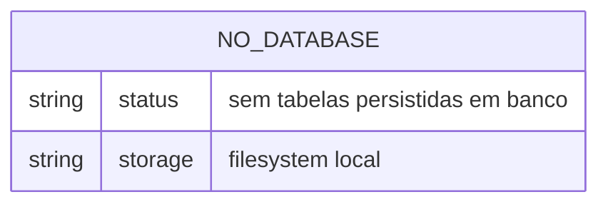
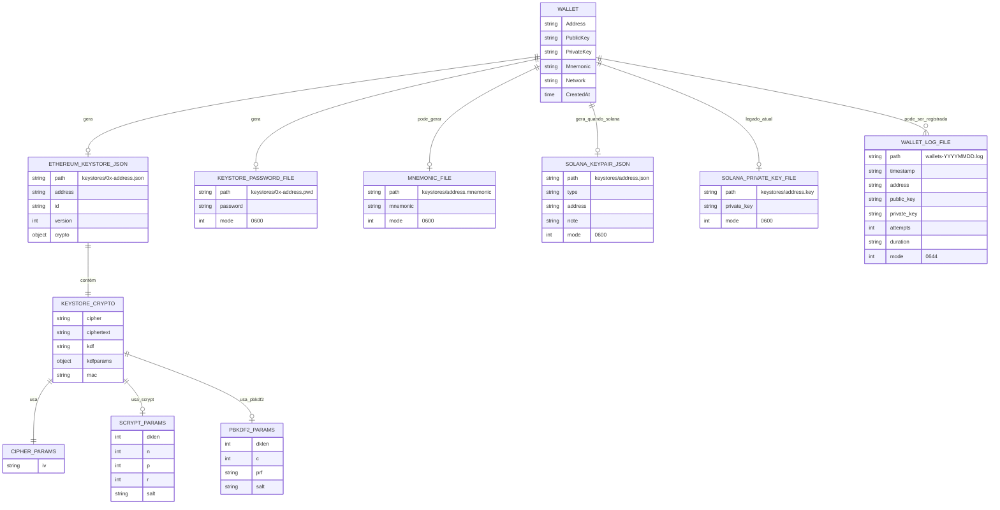

# ERD — Data Master

> Projeto: `bloco-wallet-generator`  
> Agente: `reversa-data-master`  
> Escala: 🟢 DDL/migration direto | 🟡 Inferido de código/artefatos | 🔴 Inacessível

## Conclusão sobre banco de dados

🟢 **CONFIRMADO** — O projeto não possui banco de dados relacional, NoSQL, schema ORM, migrations ou DDL aplicável.

Evidências usadas:

| Evidência | Resultado | Confiança |
|---|---|---:|
| Busca por `*.sql` | Nenhum arquivo encontrado | 🟢 |
| Busca por migrations/schemas | Nenhum arquivo encontrado | 🟢 |
| Busca por `CREATE TABLE`, `ALTER TABLE`, ORM e drivers de uso direto | Nenhum uso direto encontrado no produto | 🟢 |
| Inventário Reversa | `_reversa_sdd/inventory.md` confirma ausência de DDL, migrations, schema ORM ou diretório de banco | 🟢 |
| Código Go | Persistência implementada por arquivos locais em `internal/crypto/keystore.go` e `pkg/wallet/logger.go` | 🟢 |

## Tabelas documentadas

| Grupo | Quantidade | Observação | Confiança |
|---|---:|---|---:|
| Tabelas relacionais | 0 | Não há banco SQL | 🟢 |
| Coleções NoSQL | 0 | Não há uso direto de MongoDB ou outro banco documental | 🟢 |
| Views/materialized views | 0 | Não há DDL | 🟢 |
| Triggers/procedures/funções de banco | 0 | Não há banco | 🟢 |

## ERD de banco

Como não há tabelas, o ERD físico do banco é vazio.

## Modelo de persistência por arquivos

O diagrama abaixo não representa tabelas de banco. Ele documenta os artefatos persistidos em filesystem que cumprem o papel de armazenamento local.

## Observações de segurança

- **Solana `.key`:** o código atual grava chave privada bruta em arquivo `.key`; a decisão humana do Reviewer determina migrar para formato criptografado/seguro.
- **`WalletLogger`:** o logger legado grava `PrivateKey` em claro com permissão `0644`; a decisão humana do Reviewer determina migrar para logging seguro/sanitizado.
- **Arquivos sensíveis:** `*.json`, `*.pwd`, `*.mnemonic` e `*.key` devem ser tratados como material sensível ou derivado de material sensível.
