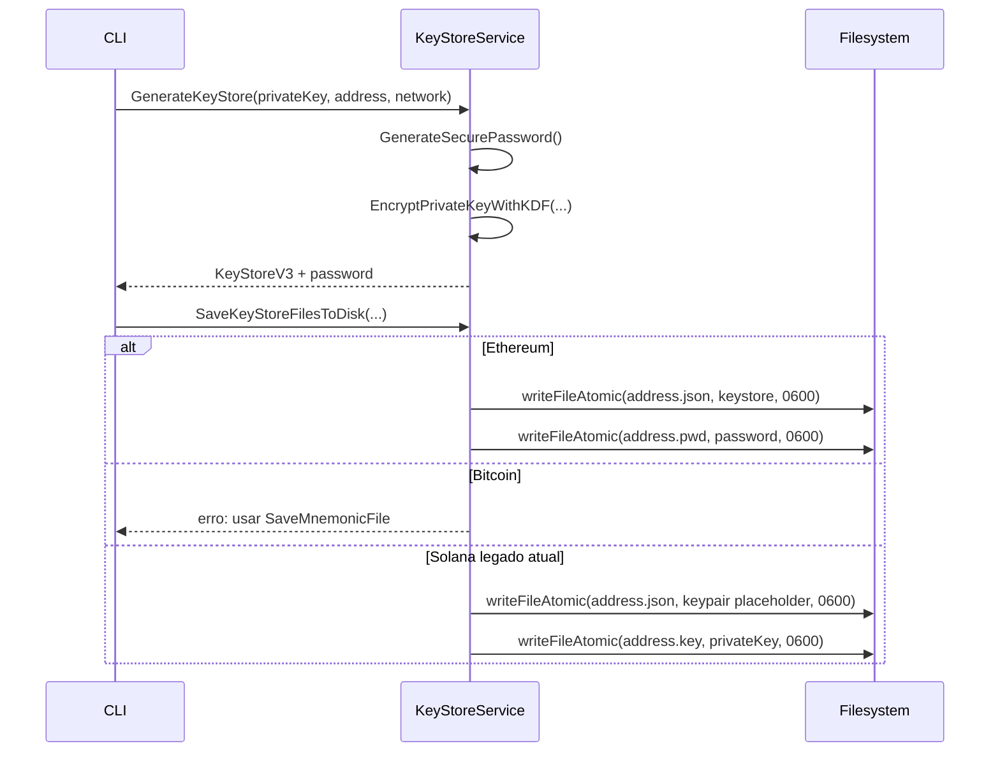

# Procedures e Funções de Banco — Data Master

> Projeto: `bloco-wallet-generator`  
> Escala: 🟢 DDL/migration direto | 🟡 Inferido de código/artefatos | 🔴 Inacessível

## Conclusão

🟢 **CONFIRMADO** — Não existem stored procedures, funções de banco, packages PL/SQL, functions PostgreSQL, triggers ou jobs de banco neste projeto.

## Inventário

| Tipo | Nome | Status | Evidência | Confiança |
|---|---|---|---|---:|
| Stored procedure | N/A | Não existe | Ausência de DDL/migrations/arquivos SQL | 🟢 |
| Function de banco | N/A | Não existe | Ausência de DDL/migrations/arquivos SQL | 🟢 |
| Trigger | N/A | Não existe | Ausência de DDL/migrations/arquivos SQL | 🟢 |
| View | N/A | Não existe | Ausência de DDL/migrations/arquivos SQL | 🟢 |
| Materialized view | N/A | Não existe | Ausência de DDL/migrations/arquivos SQL | 🟢 |
| Job/scheduler de banco | N/A | Não existe | Ausência de conexão e schema de banco | 🟢 |

## Rotinas de persistência equivalentes no código

As funções abaixo não são procedures de banco. Elas são rotinas Go que executam persistência local em filesystem.

| Função Go | Papel | Entrada principal | Saída/efeito | Confiança |
|---|---|---|---|---:|
| `KeyStoreService.GenerateKeyStore` | Gera estrutura KeyStore V3 e senha | private key, address, network | `KeyStoreV3`, password | 🟢 |
| `KeyStoreService.SaveKeyStoreFiles` | Orquestra geração e salvamento por rede | private key, address, network | arquivos em `keystores/` | 🟢 |
| `KeyStoreService.SaveKeyStoreFilesToDisk` | Roteia persistência por rede | address, keystore, password, network, private key | JSON/PWD/KEY conforme rede | 🟢 |
| `KeyStoreService.saveEthereumKeyStore` | Salva KeyStore V3 Ethereum e senha | address, keystore, password | `<address>.json`, `<address>.pwd` | 🟢 |
| `KeyStoreService.saveSolanaKeypair` | Salva JSON de keypair Solana simplificado | address, keystore | `<address>.json` | 🟢 |
| `KeyStoreService.SaveMnemonicFile` | Salva mnemonic | address, mnemonic, network | `<address>.mnemonic` | 🟢 |
| `KeyStoreService.SavePrivateKeyFile` | Salva private key Solana bruta no legado atual | address, privateKeyHex, network | `<address>.key` | 🟢 |
| `KeyStoreService.writeFileAtomic` | Escrita atômica de arquivo | path, bytes, permissão | arquivo final renomeado | 🟢 |
| `WalletLogger.LogWallet` | Append em log legado | `GenerationResult` | linha em `wallets-YYYYMMDD.log` | 🟢 |

## Pseudofluxo da persistência de keystore

## Ausências relevantes

| Ausência | Consequência | Confiança |
|---|---|---:|
| Sem transações de banco | Atomicidade limitada a arquivo individual; pares de arquivos dependem de compensação em código | 🟢 |
| Sem migrations | Evolução do formato depende de mudanças em código/documentação, não versionamento de schema | 🟢 |
| Sem procedures | Regras de negócio são auditáveis em Go, não em motor de banco | 🟢 |
| Sem conexão de banco | Não há credenciais, pools de conexão ou DSNs a documentar | 🟢 |
