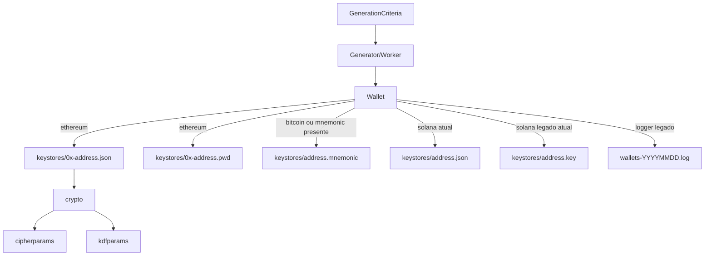

# Relacionamentos — Data Master

> Projeto: `bloco-wallet-generator`  
> Escala: 🟢 DDL/migration direto | 🟡 Inferido de código/artefatos | 🔴 Inacessível

## Conclusão

🟢 **CONFIRMADO** — Não há relacionamentos de banco porque não existem tabelas, coleções, FKs ou modelos ORM.

Este documento descreve os relacionamentos lógicos entre entidades de domínio em memória e artefatos persistidos em filesystem.

## Relacionamentos físicos de banco

| Origem | Destino | Cardinalidade | Tipo | Status | Confiança |
|---|---|---|---|---|---:|
| N/A | N/A | N/A | FK | Não aplicável | 🟢 |
| N/A | N/A | N/A | tabela de junção | Não aplicável | 🟢 |
| N/A | N/A | N/A | relação polimórfica | Não aplicável | 🟢 |

## Relacionamentos lógicos de persistência local

| Origem | Destino | Cardinalidade | Como é materializado | Evidência | Confiança |
|---|---|---|---|---|---:|
| `Wallet` | `keystores/<address>.json` | 1:0..1 | Arquivo JSON gerado quando keystore está habilitado e rede suporta o fluxo | `SaveKeyStoreFilesToDisk`, `saveEthereumKeyStore`, `saveSolanaKeypair` | 🟢 |
| `Wallet` | `keystores/<address>.pwd` | 1:0..1 | Arquivo de senha criado junto ao KeyStore Ethereum | `saveEthereumKeyStore` | 🟢 |
| `Wallet` | `keystores/<address>.mnemonic` | 1:0..1 | Arquivo mnemonic quando a carteira possui `Mnemonic` | `SaveMnemonicFile` | 🟢 |
| `Wallet` | `keystores/<address>.key` | 1:0..1 | Arquivo com chave privada bruta para Solana no comportamento legado atual | `SavePrivateKeyFile` | 🟢 |
| `Wallet` | `wallets-YYYYMMDD.log` | N:1 | Linha append-only em log diário legado | `WalletLogger.LogWallet` | 🟢 |
| `KeyStoreV3` | `KeyStoreCrypto` | 1:1 | Objeto JSON aninhado | `KeyStoreV3` | 🟢 |
| `KeyStoreCrypto` | `CipherParams` | 1:1 | Objeto JSON aninhado | `KeyStoreCrypto` | 🟢 |
| `KeyStoreCrypto` | `ScryptParams` | 1:0..1 | `kdfparams` quando KDF é `scrypt` | `ScryptParams`, validação KDF | 🟢 |
| `KeyStoreCrypto` | `PBKDF2Params` | 1:0..1 | `kdfparams` quando KDF é PBKDF2 | `PBKDF2Params`, validação KDF | 🟢 |

## Regras de cardinalidade por rede

### Ethereum

| Origem | Destino | Cardinalidade | Observação | Confiança |
|---|---|---|---|---:|
| `Wallet(network=ethereum)` | KeyStore V3 JSON | 1:0..1 | Criado quando `KeyStore.Enabled=true` | 🟢 |
| `Wallet(network=ethereum)` | `.pwd` | 1:0..1 | Criado junto ao JSON | 🟢 |
| `Wallet(network=ethereum, Mnemonic!="")` | `.mnemonic` | 1:0..1 | Criado se houver mnemonic | 🟢 |

### Bitcoin

| Origem | Destino | Cardinalidade | Observação | Confiança |
|---|---|---|---|---:|
| `Wallet(network=bitcoin)` | KeyStore V3 JSON | 1:0 | Código não usa KeyStore V3 para Bitcoin | 🟢 |
| `Wallet(network=bitcoin, Mnemonic!="")` | `.mnemonic` | 1:0..1 | Backup por mnemonic | 🟢 |

### Solana

| Origem | Destino | Cardinalidade | Observação | Confiança |
|---|---|---|---|---:|
| `Wallet(network=solana)` | Solana keypair JSON | 1:0..1 | JSON simplificado/placeholder no comportamento atual | 🟢 |
| `Wallet(network=solana)` | `.key` | 1:0..1 | Chave privada bruta no comportamento atual; decisão humana manda substituir por formato seguro | 🟢 |

## Diagrama de relacionamentos lógicos

## Lacunas e riscos de relacionamento

| Item | Descrição | Impacto | Confiança |
|---|---|---|---:|
| Ausência de chave única persistida | A identidade persistida depende do path derivado do endereço; não há índice/constraint de unicidade | Pode sobrescrever arquivos para mesmo endereço | 🟡 |
| Integridade entre `.json` e `.pwd` | A aplicação tenta limpar o JSON se a escrita do `.pwd` falhar | Mitiga par parcial em Ethereum | 🟢 |
| Integridade entre `.json` e `.key` Solana | Solana salva keypair JSON e depois `.key`; falha parcial pode deixar JSON sem `.key` | Relevante até a migração segura | 🟢 |
| Log legado sem vínculo transacional | `wallets-YYYYMMDD.log` é append-only e independente dos artefatos em `keystores/` | Pode existir log sem keystore correspondente | 🟢 |
