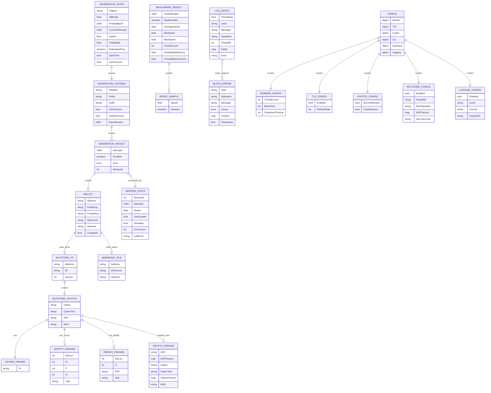

# ERD Complete — Architect

> O sistema não possui banco de dados. Este ERD representa entidades de domínio em memória e artefatos persistidos em filesystem.

## Diagrama ERD

## Entidades e persistência

| Entidade | Natureza | Persistida? | Local/Formato | Confiança |
|---|---|---:|---|---:|
| `Wallet` | Domínio | parcialmente | stdout/TUI, keystore/mnemonic/logs | 🟢 |
| `GenerationCriteria` | Entrada/controle | não | memória | 🟢 |
| `GenerationResult` | Resultado | não diretamente | memória/stdout | 🟢 |
| `GenerationStats` | Métrica runtime | não | memória/TUI | 🟢 |
| `BenchmarkResult` | Métrica runtime | não diretamente | stdout/TUI | 🟢 |
| `WorkerStats` | Métrica runtime | não diretamente | memória/log sanitizado | 🟢 |
| `KeyStoreV3` | Artefato seguro | sim | `keystores/*.json` | 🟢 |
| password file | Artefato sensível | sim | `keystores/*.pwd` | 🟢 |
| mnemonic file | Artefato sensível | sim | `keystores/*.mnemonic` | 🟢 |
| `LogEntry` | Observabilidade | sim | arquivo log/stdout/discard | 🟢 |
| `Config` | Config runtime | não como arquivo app | defaults/env/flags | 🟢 |

## Cardinalidades relevantes

| Relação | Cardinalidade | Observação | Confiança |
|---|---|---|---:|
| `GenerationCriteria` -> `GenerationResult` | 1:N | Um critério pode gerar uma ou várias carteiras (`--count`). | 🟢 |
| `GenerationResult` -> `Wallet` | 1:0..1 | Pode falhar e conter `Error` sem wallet. | 🟢 |
| `Wallet` -> `KeyStoreV3` | 1:0..1 | Depende de `KeyStore.Enabled` e rede. | 🟢 |
| `Wallet` -> mnemonic file | 1:0..1 | Só quando mnemonic existe/salvamento aplicável. | 🟢 |
| `KeyStoreCrypto` -> KDF params | 1:1 | Scrypt ou PBKDF2, mutuamente alternativos. | 🟢 |
| `BenchmarkResult` -> samples | 1:N | Várias amostras de velocidade/duração. | 🟢 |
| `Config` -> subconfigs | 1:1 | Config agregada. | 🟢 |

## Lacunas de modelo

| ID | Lacuna | Confiança |
|---|---|---:|
| ERD-GAP-001 | Não há identificador persistente para geração/execução além de timestamps/logs. | 🟢 |
| ERD-GAP-002 | `Wallet.IsValid()` ainda não modela adequadamente formatos multi-rede. | 🟢 |
| ERD-GAP-003 | Artefatos sensíveis em filesystem não têm lifecycle/expiração modelados. | 🟡 |
