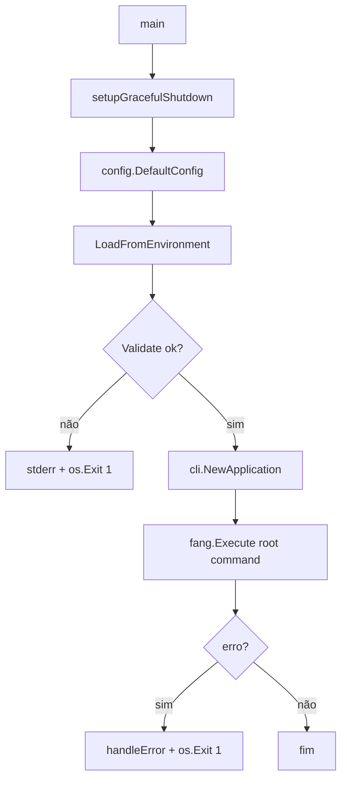

# Flowchart — cmd/bloco-eth

```mermaid
flowchart TD
  A[main] --> B[setupGracefulShutdown]
  B --> C[config.DefaultConfig]
  C --> D[LoadFromEnvironment]
  D --> E{Validate ok?}
  E -- não --> F[stderr + os.Exit 1]
  E -- sim --> G[cli.NewApplication]
  G --> H[fang.Execute root command]
  H --> I{erro?}
  I -- sim --> J[handleError + os.Exit 1]
  I -- não --> K[fim]
```
