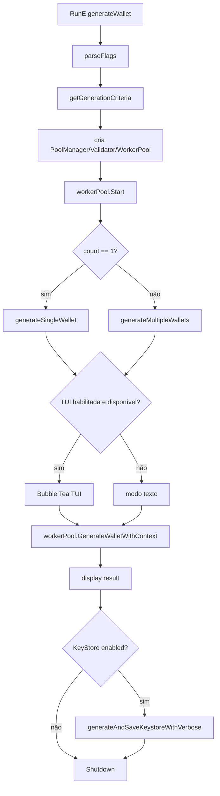

# Flowchart — internal/cli

```mermaid
flowchart TD
  A[RunE generateWallet] --> B[parseFlags]
  B --> C[getGenerationCriteria]
  C --> D[cria PoolManager/Validator/WorkerPool]
  D --> E[workerPool.Start]
  E --> F{count == 1?}
  F -- sim --> G[generateSingleWallet]
  F -- não --> H[generateMultipleWallets]
  G --> I{TUI habilitada e disponível?}
  H --> I
  I -- sim --> J[Bubble Tea TUI]
  I -- não --> K[modo texto]
  J --> L[workerPool.GenerateWalletWithContext]
  K --> L
  L --> M[display result]
  M --> N{KeyStore enabled?}
  N -- sim --> O[generateAndSaveKeystoreWithVerbose]
  N -- não --> P[Shutdown]
  O --> P
```
