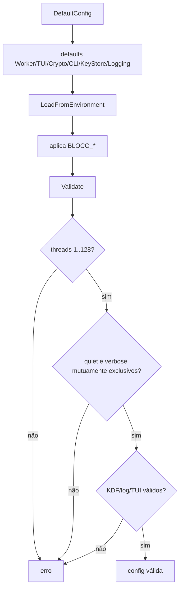

# Flowchart — internal/config

```mermaid
flowchart TD
  A[DefaultConfig] --> B[defaults Worker/TUI/Crypto/CLI/KeyStore/Logging]
  B --> C[LoadFromEnvironment]
  C --> D[aplica BLOCO_*]
  D --> E[Validate]
  E --> F{threads 1..128?}
  F -- não --> X[erro]
  F -- sim --> G{quiet e verbose mutuamente exclusivos?}
  G -- não --> X
  G -- sim --> H{KDF/log/TUI válidos?}
  H -- não --> X
  H -- sim --> I[config válida]
```
