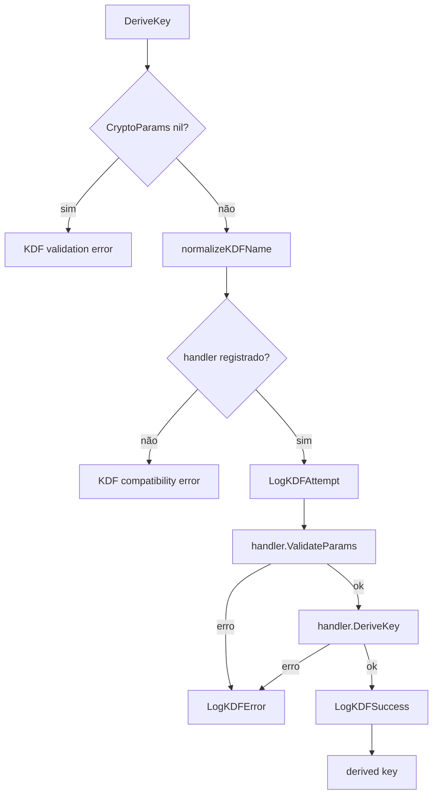

# Flowchart — internal/crypto/kdf

```mermaid
flowchart TD
  A[DeriveKey] --> B{CryptoParams nil?}
  B -- sim --> X[KDF validation error]
  B -- não --> C[normalizeKDFName]
  C --> D{handler registrado?}
  D -- não --> Y[KDF compatibility error]
  D -- sim --> E[LogKDFAttempt]
  E --> F[handler.ValidateParams]
  F -- erro --> G[LogKDFError]
  F -- ok --> H[handler.DeriveKey]
  H -- erro --> G
  H -- ok --> I[LogKDFSuccess]
  I --> J[derived key]
```
