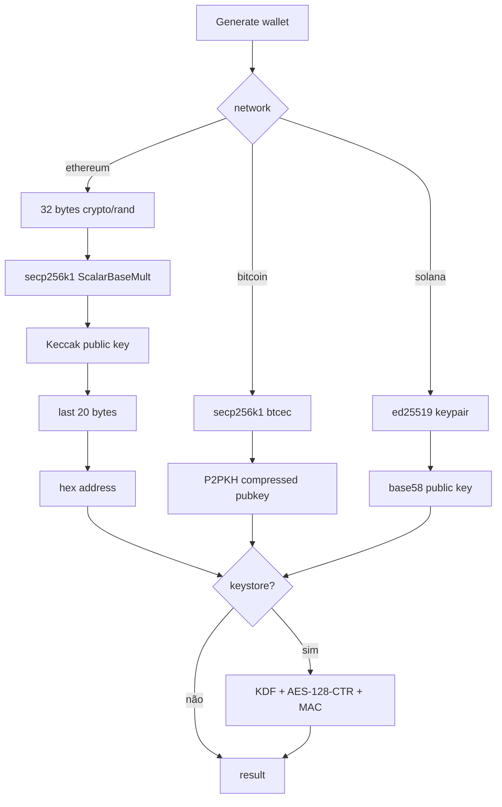

# Flowchart — internal/crypto

```mermaid
flowchart TD
  A[Generate wallet] --> B{network}
  B -- ethereum --> C[32 bytes crypto/rand]
  C --> D[secp256k1 ScalarBaseMult]
  D --> E[Keccak public key]
  E --> F[last 20 bytes]
  F --> G[hex address]
  B -- bitcoin --> H[secp256k1 btcec]
  H --> I[P2PKH compressed pubkey]
  B -- solana --> J[ed25519 keypair]
  J --> K[base58 public key]
  G --> L{keystore?}
  I --> L
  K --> L
  L -- sim --> M[KDF + AES-128-CTR + MAC]
  L -- não --> N[result]
  M --> N
```
