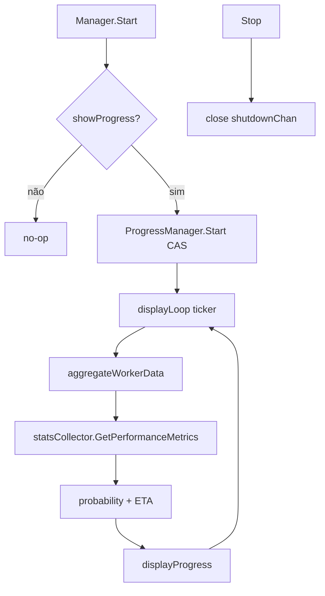

# Flowchart — internal/progress

```mermaid
flowchart TD
  A[Manager.Start] --> B{showProgress?}
  B -- não --> Z[no-op]
  B -- sim --> C[ProgressManager.Start CAS]
  C --> D[displayLoop ticker]
  D --> E[aggregateWorkerData]
  E --> F[statsCollector.GetPerformanceMetrics]
  F --> G[probability + ETA]
  G --> H[displayProgress]
  H --> D
  I[Stop] --> J[close shutdownChan]
```
