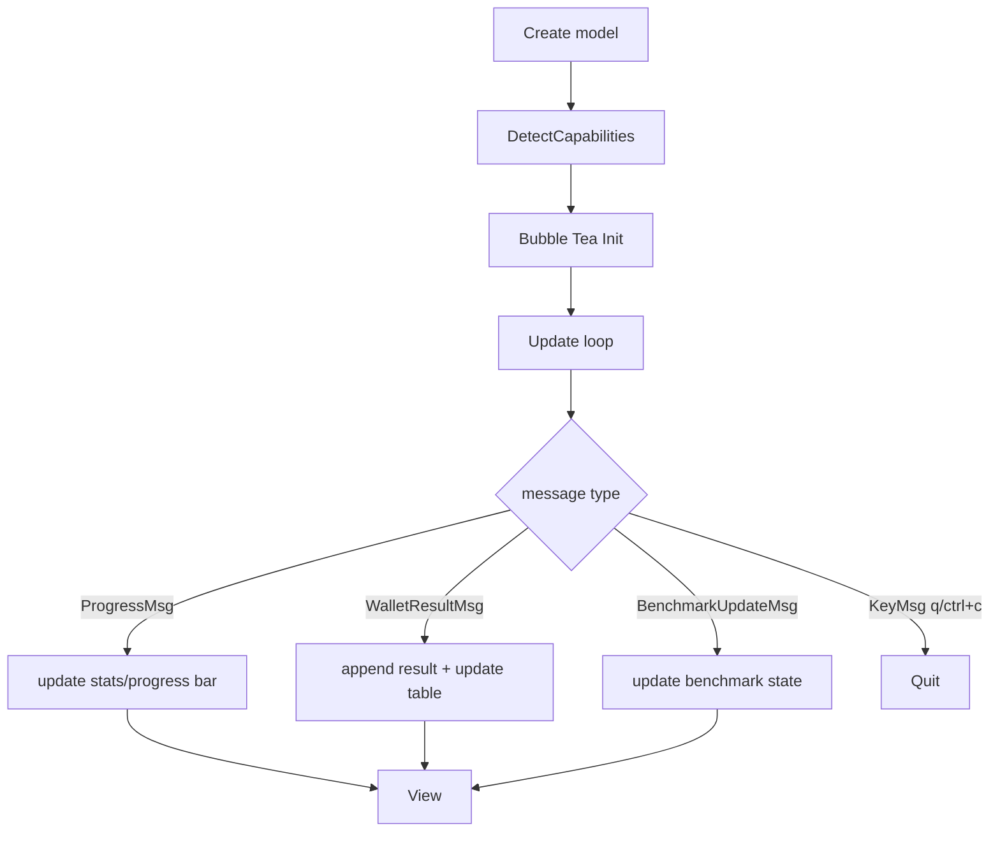

# Flowchart — internal/tui

```mermaid
flowchart TD
  A[Create model] --> B[DetectCapabilities]
  B --> C[Bubble Tea Init]
  C --> D[Update loop]
  D --> E{message type}
  E -- ProgressMsg --> F[update stats/progress bar]
  E -- WalletResultMsg --> G[append result + update table]
  E -- BenchmarkUpdateMsg --> H[update benchmark state]
  E -- KeyMsg q/ctrl+c --> I[Quit]
  F --> J[View]
  G --> J
  H --> J
```
