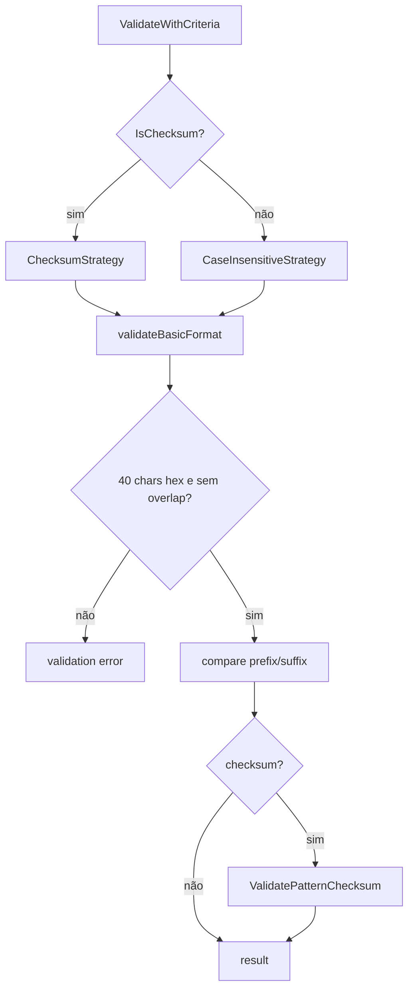

# Flowchart — internal/validation

```mermaid
flowchart TD
  A[ValidateWithCriteria] --> B{IsChecksum?}
  B -- sim --> C[ChecksumStrategy]
  B -- não --> D[CaseInsensitiveStrategy]
  C --> E[validateBasicFormat]
  D --> E
  E --> F{40 chars hex e sem overlap?}
  F -- não --> X[validation error]
  F -- sim --> G[compare prefix/suffix]
  G --> H{checksum?}
  H -- sim --> I[ValidatePatternChecksum]
  H -- não --> J[result]
  I --> J
```
