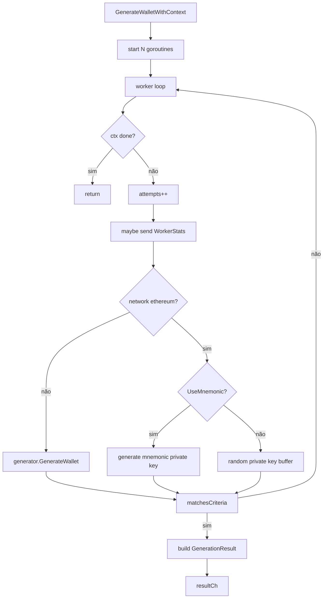

# Flowchart — internal/worker

```mermaid
flowchart TD
  A[GenerateWalletWithContext] --> B[start N goroutines]
  B --> C[worker loop]
  C --> D{ctx done?}
  D -- sim --> X[return]
  D -- não --> E[attempts++]
  E --> F[maybe send WorkerStats]
  F --> G{network ethereum?}
  G -- não --> H[generator.GenerateWallet]
  G -- sim --> I{UseMnemonic?}
  I -- sim --> J[generate mnemonic private key]
  I -- não --> K[random private key buffer]
  H --> L[matchesCriteria]
  J --> L
  K --> L
  L -- não --> C
  L -- sim --> M[build GenerationResult]
  M --> N[resultCh]
```
