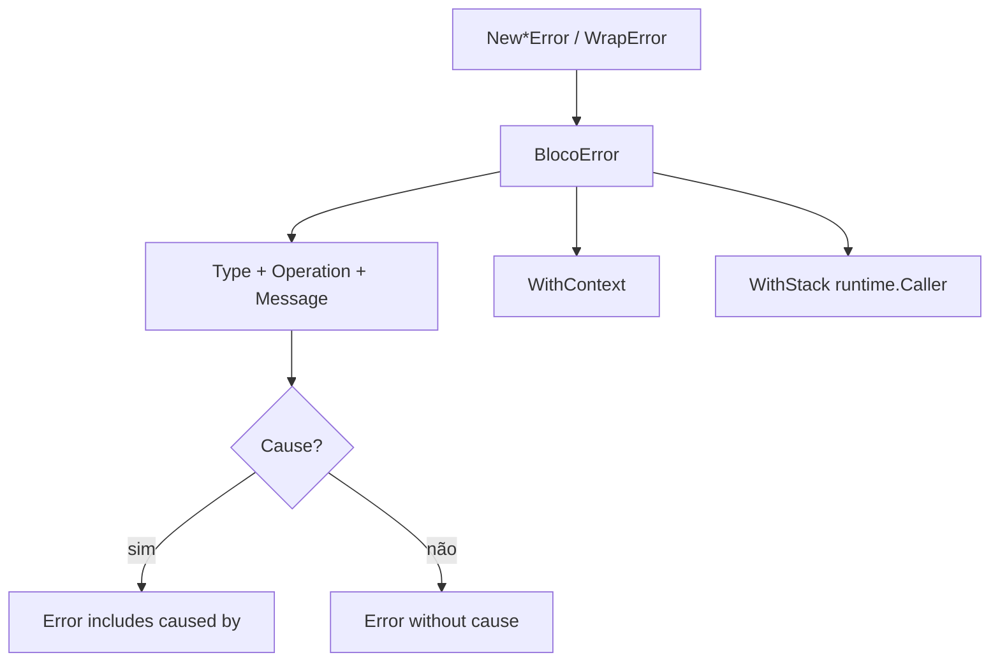

# Flowchart — pkg/errors

```mermaid
flowchart TD
  A[New*Error / WrapError] --> B[BlocoError]
  B --> C[Type + Operation + Message]
  C --> D{Cause?}
  D -- sim --> E[Error includes caused by]
  D -- não --> F[Error without cause]
  B --> G[WithContext]
  B --> H[WithStack runtime.Caller]
```
