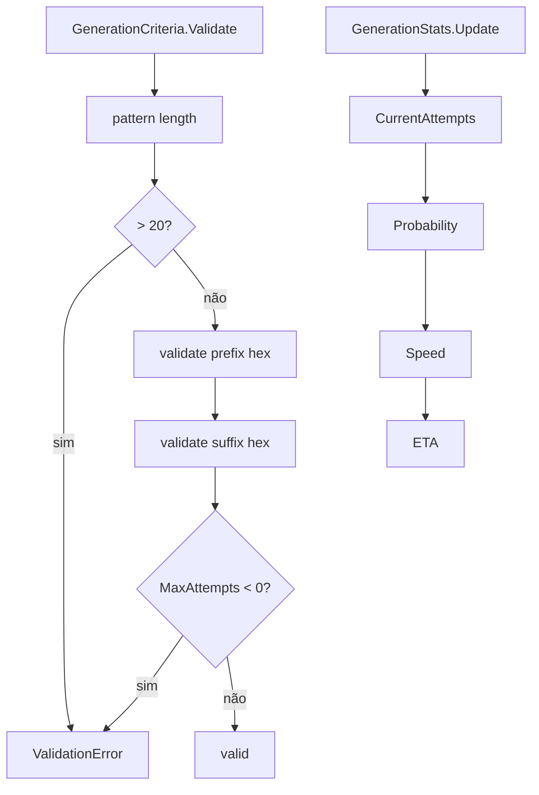

# Flowchart — pkg/wallet

```mermaid
flowchart TD
  A[GenerationCriteria.Validate] --> B[pattern length]
  B --> C{> 20?}
  C -- sim --> X[ValidationError]
  C -- não --> D[validate prefix hex]
  D --> E[validate suffix hex]
  E --> F{MaxAttempts < 0?}
  F -- sim --> X
  F -- não --> G[valid]
  H[GenerationStats.Update] --> I[CurrentAttempts]
  I --> J[Probability]
  J --> K[Speed]
  K --> L[ETA]
```
