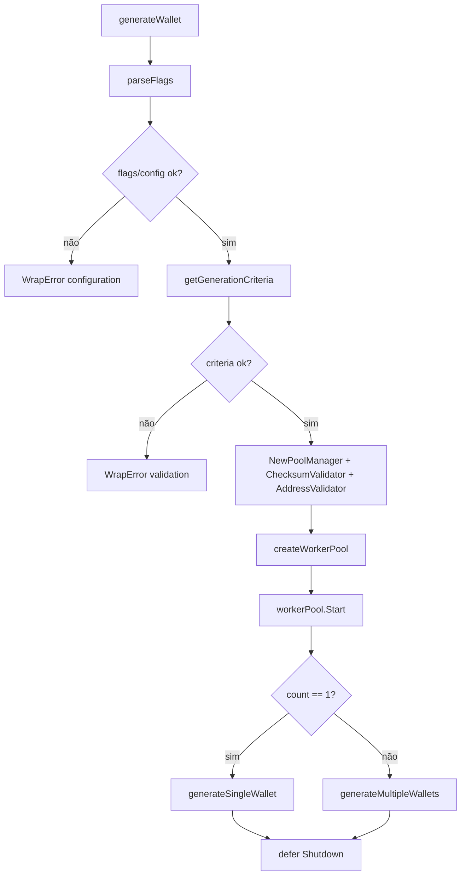
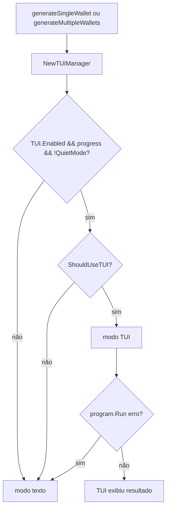
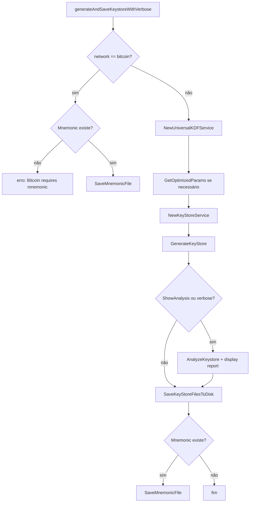

# Módulo internal/cli, Design Técnico

> Spec gerada pelo Reversa Writer.  
> Escala: 🟢 CONFIRMADO no código | 🟡 INFERIDO | 🔴 LACUNA

## Interface

O módulo `internal/cli` expõe uma aplicação CLI baseada em Cobra, executada externamente pelo Fang através do comando raiz retornado por `GetRootCommand()`. O módulo não expõe API HTTP/RPC; sua interface pública principal é o construtor `NewApplication`, o executor contextual `ExecuteContext` e o comando raiz Cobra. 🟢

| Símbolo | Assinatura | Retorno | Observação |
|---------|-----------|---------|------------|
| `NewApplication` | `func NewApplication(cfg *config.Config, version, gitCommit, buildTime string) *Application` | `*Application` | Cria a aplicação, armazena config/metadados e chama `setupCommands()`. 🟢 |
| `Application.ExecuteContext` | `func (app *Application) ExecuteContext(ctx context.Context) error` | `error` | Executa diretamente `rootCmd.ExecuteContext(ctx)`. 🟢 |
| `Application.GetRootCommand` | `func (app *Application) GetRootCommand() *cobra.Command` | `*cobra.Command` | Integração com Fang no entrypoint. 🟢 |
| `Application.generateWallet` | `func (app *Application) generateWallet(cmd *cobra.Command, args []string) error` | `error` | Handler do comando raiz para geração de carteira. 🟢 |
| `Application.showStats` | `func (app *Application) showStats(cmd *cobra.Command, args []string) error` | `error` | Handler do subcomando `stats`. 🟢 |
| `Application.runBenchmark` | `func (app *Application) runBenchmark(cmd *cobra.Command, args []string) error` | `error` | Handler do subcomando `benchmark`. 🟢 |
| `Application.parseFlags` | `func (app *Application) parseFlags(cmd *cobra.Command) error` | `error` | Aplica flags Cobra à configuração runtime e revalida config. 🟢 |
| `Application.getGenerationCriteria` | `func (app *Application) getGenerationCriteria(cmd *cobra.Command) (wallet.GenerationCriteria, error)` | `wallet.GenerationCriteria`, `error` | Converte flags de geração em critérios validados. 🟢 |
| `Application.generateAndSaveKeystoreWithVerbose` | `func (app *Application) generateAndSaveKeystoreWithVerbose(w *wallet.Wallet, verbose bool) error` | `error` | Persistência de keystore/mnemonic por rede. 🟢 |

## Entradas e Saídas

| Tipo | Item | Descrição | Confiança |
|---|---|---|---:|
| Entrada | Flags globais | Prefixo, sufixo, checksum, count, mnemonic, rede, threads, progress, TUI, output, keystore, KDF e logging. | 🟢 |
| Entrada | Subcomandos | `stats`, `benchmark` e `version`. | 🟢 |
| Entrada | `context.Context` | Propagado pelo Cobra/Fang para geração e benchmark. | 🟢 |
| Entrada | `config.Config` | Configuração mutável que recebe overrides por flags. | 🟢 |
| Saída | stdout | Resultados de carteira, stats, benchmark, versão e warnings não fatais. | 🟢 |
| Saída | stderr | Warnings de shutdown do worker pool em alguns fluxos. | 🟢 |
| Saída | Filesystem | Keystores, passwords e mnemonics quando persistência está habilitada. | 🟢 |
| Saída | TUI | Mensagens Bubble Tea de progresso, resultado e benchmark. | 🟢 |
| Saída | Erros estruturados | `errors.WrapError` para configuração, validação, worker e geração. | 🟢 |

## Fluxo Principal: comando raiz de geração

1. `generateWallet()` obtém `ctx` do Cobra com `cmd.Context()`. 🟢 `internal/cli/commands.go:127-129`
2. O módulo aplica flags à configuração com `app.parseFlags(cmd)`. 🟢 `internal/cli/commands.go:130-134`
3. Critérios de geração são extraídos por `app.getGenerationCriteria(cmd)`. 🟢 `internal/cli/commands.go:136-141`
4. O comando lê `count` e `progress` das flags. 🟢 `internal/cli/commands.go:143-145`
5. O comando cria `PoolManager`, `ChecksumValidator` e `AddressValidator`. 🟢 `internal/cli/commands.go:146-149`
6. O comando cria o `workerPool` para a rede dos critérios. 🟢 `internal/cli/commands.go:151-155`
7. O `workerPool` é iniciado e seu `Shutdown()` é deferido. 🟢 `internal/cli/commands.go:157-167`
8. Se `count == 1`, a execução segue para geração single; caso contrário, segue para geração múltipla. 🟢 `internal/cli/commands.go:169-174`

## Fluxo: seleção TUI ou texto

- Geração single usa TUI se `app.config.TUI.Enabled`, `showProgress`, `!app.config.CLI.QuietMode` e `tuiManager.ShouldUseTUI()` forem verdadeiros. 🟢 `internal/cli/commands.go:177-199`
- Geração múltipla usa a mesma regra de seleção TUI/texto. 🟢 `internal/cli/commands.go:420-443`
- Se `program.Run()` falha em TUI single, o fluxo cai para `generateSingleWalletText(...)`. 🟢 `internal/cli/commands.go:363-367`
- Se `program.Run()` falha em TUI múltipla, o fluxo cai para `generateMultipleWalletsText(...)`. 🟢 `internal/cli/commands.go:666-670`
- O modo texto reconhece `showProgress`, mas o progress manager foi explicitamente desabilitado para evitar deadlocks. 🟢 `internal/cli/commands.go:396-398`, `internal/cli/commands.go:700-701`

## Fluxo: stats

1. `createStatsCommand()` cria o subcomando `stats` com flags `prefix`, `suffix` e `checksum`. 🟢 `internal/cli/commands.go:736-750`
2. `showStats()` extrai critérios de geração e calcula dificuldade e probabilidade de 50%. 🟢 `internal/cli/commands.go:753-764`
3. Se `--tui` e terminal suportam TUI, o fluxo usa `showStatsTUI`. 🟢 `internal/cli/commands.go:765-771`
4. Caso contrário, o fluxo usa `showStatsText`. 🟢 `internal/cli/commands.go:773-774`
5. `showStatsText()` imprime pattern, tamanho, checksum, dificuldade, probabilidade e estimativas por velocidades fixas. 🟢 `internal/cli/commands.go:810-833`

## Fluxo: benchmark

1. `createBenchmarkCommand()` cria o subcomando `benchmark` com flags `attempts`, `duration` e `detailed`. 🟢 `internal/cli/commands.go:836-850`
2. `runBenchmark()` lê flags, decide TUI/texto e delega ao fluxo correspondente. 🟢 `internal/cli/commands.go:853-870`
3. `runBenchmarkTUI()` cria worker pool Ethereum, inicia pool, cria modelo TUI e executa benchmark em goroutine. 🟢 `internal/cli/commands.go:873-910`
4. Se TUI falha, `runBenchmarkTUI()` cai para `runBenchmarkText()`. 🟢 `internal/cli/commands.go:912-917`
5. `runBenchmarkText()` cria worker pool Ethereum, inicia, executa benchmark e exibe resultados. 🟢 `internal/cli/commands.go:922-951`
6. `executeBenchmarkWithTUI()` e `executeBenchmark()` amostram stats por ticker e retornam `BenchmarkResult`. 🟢 `internal/cli/commands.go:1507-1680`, `internal/cli/commands.go:1683-1807`
7. Os loops de benchmark criam `WorkItem`, mas deixam TODO para implementação real com ants pool. 🟢 `internal/cli/commands.go:1629-1630`, `internal/cli/commands.go:1753-1754`

## Fluxo: persistência de keystore e mnemonic

- Bitcoin salva apenas mnemonic e falha se mnemonic estiver vazio. 🟢 `internal/cli/commands.go:1951-1977`
- Ethereum e Solana criam `UniversalKDFService`, analyzer, parâmetros KDF e `KeyStoreService`. 🟢 `internal/cli/commands.go:1979-2011`
- Parâmetros KDF default são otimizados por nível de segurança quando a configuração não fornece parâmetros. 🟢 `internal/cli/commands.go:1986-1996`
- O keystore é gerado com private key, address e network. 🟢 `internal/cli/commands.go:2013-2017`
- A análise de compatibilidade é exibida quando `ShowAnalysis` ou `verbose` estão ativos. 🟢 `internal/cli/commands.go:2019-2037`
- Arquivos de keystore/password são salvos em disco, e mnemonic é salvo quando existe. 🟢 `internal/cli/commands.go:2039-2063`

## Fluxos Alternativos

- **Erro ao parsear flags:** `generateWallet()` envolve o erro como `ErrorTypeConfiguration`. 🟢 `internal/cli/commands.go:130-134`
- **Critérios inválidos:** `generateWallet()` envolve o erro como `ErrorTypeValidation`. 🟢 `internal/cli/commands.go:136-141`
- **Falha ao iniciar worker pool:** `generateWallet()` envolve como `ErrorTypeWorker`; benchmark usa comportamento equivalente. 🟢 `internal/cli/commands.go:157-161`, `internal/cli/commands.go:878-882`
- **Falha em geração single texto:** erro é envolvido como `ErrorTypeGeneration`. 🟢 `internal/cli/commands.go:400-408`
- **Falha em uma carteira no fluxo múltiplo texto:** o erro é impresso quando aplicável e o loop continua para a próxima carteira. 🟢 `internal/cli/commands.go:703-713`
- **Nenhum resultado múltiplo:** `displayMultipleWalletResults()` imprime que nenhuma carteira foi gerada com sucesso e retorna `nil`. 🟢 `internal/cli/commands.go:1421-1425`
- **Falha de keystore ao exibir resultado:** a falha vira warning e não impede a exibição da carteira. 🟢 `internal/cli/commands.go:1406-1415`, `internal/cli/commands.go:1453-1463`
- **Logging desabilitado:** `parseLoggingFlags()` desativa logging e ignora demais flags de logging. 🟢 `internal/cli/commands.go:1044-1050`

## Dependências

- `internal/config`: fonte de `Config` mutada por flags e validada após parsing. 🟢
- `internal/crypto`: fornece pool cripto, checksum validator e keystore service. 🟢
- `internal/crypto/kdf`: fornece KDF universal, analyzer e enum de segurança. 🟢
- `internal/tui`: fornece modelos, manager e mensagens Bubble Tea. 🟢
- `internal/validation`: fornece `AddressValidator` para critérios de endereço. 🟢
- `internal/worker`: fornece worker pool, stats collector e work items. 🟢
- `pkg/wallet`: fornece critérios, resultados, stats e benchmark result. 🟢
- `pkg/utils`: fornece cálculo de dificuldade, probabilidade e formatação. 🟢
- `pkg/errors`: fornece wrapping e categorias de erro. 🟢
- `github.com/spf13/cobra`: framework de comandos e flags. 🟢
- `github.com/charmbracelet/bubbletea`: runtime TUI. 🟢

## Decisões de Design Identificadas

| Decisão | Evidência no código | Confiança |
|---------|---------------------|-----------|
| Comando raiz executa geração por padrão. | `internal/cli/commands.go:55-66` | 🟢 |
| Flags globais concentram geração, performance, saída, keystore e logging. | `internal/cli/commands.go:77-117` | 🟢 |
| Configuração é revalidada após flags para evitar estado inválido. | `internal/cli/commands.go:969-1041` | 🟢 |
| TUI é opcional e tem fallback para texto em geração, stats e benchmark. | `internal/cli/commands.go:177-199`, `internal/cli/commands.go:765-774`, `internal/cli/commands.go:912-917` | 🟢 |
| Progress manager em modo texto foi desabilitado por deadlocks conhecidos. | `internal/cli/commands.go:396-398`, `internal/cli/commands.go:700-701` | 🟢 |
| Keystore é tratado como responsabilidade da CLI após obter resultado de wallet. | `internal/cli/commands.go:1406-1415`, `internal/cli/commands.go:1943-2063` | 🟢 |
| Bitcoin tem regra especial de persistência, salvando apenas mnemonic. | `internal/cli/commands.go:1948-1977` | 🟢 |
| Benchmark ainda possui TODO de execução real de work items com pool. | `internal/cli/commands.go:1629-1630`, `internal/cli/commands.go:1753-1754` | 🟢 |

## Estado Interno

| Estado | Local | Evolução | Confiança |
|---|---|---|---:|
| `Application.config` | struct `Application` | Recebido no construtor e mutado por flags. | 🟢 |
| `Application.rootCmd` | struct `Application` | Criado em `setupCommands()` e retornado por `GetRootCommand()`. | 🟢 |
| `Application.version/gitCommit/buildTime` | struct `Application` | Recebidos do entrypoint e usados no comando root/version. | 🟢 |
| `config.Worker.ThreadCount` | config mutável | Alterado por `--threads`, com `0` virando `runtime.NumCPU()`. | 🟢 |
| `config.CLI.VerboseOutput` | config mutável | Ativado por `--verbose`. | 🟢 |
| `config.CLI.QuietMode` | config mutável | Ativado por `--quiet`. | 🟢 |
| `config.TUI.Enabled` | config mutável | Desativado por `--tui=false`. | 🟢 |
| `config.KeyStore` | config mutável | Atualizado por flags de keystore/KDF/análise/segurança. | 🟢 |
| `config.Logging` | config mutável | Atualizado por flags de logging ou desabilitado por `--no-logging`. | 🟢 |
| `completedWallets` | fluxo TUI múltiplo | Atualizado com mutex para progresso e encerramento. | 🟢 |
| `results` | fluxos múltiplos | Acumula resultados bem-sucedidos. | 🟢 |
| `speedSamples` e `durationSamples` | benchmark | Coletam amostras periódicas para `BenchmarkResult`. | 🟢 |

## Observabilidade

- O módulo imprime debug de decisão TUI quando `BLOCO_DEBUG` está definido. 🟢 `internal/cli/commands.go:188-192`, `internal/cli/commands.go:432-436`
- Resultados single exibem endereço, private key, mnemonic opcional, tentativas e duração. 🟢 `internal/cli/commands.go:1395-1418`
- Resultados múltiplos exibem totals, velocidade média, estatísticas por carteira e resumo de keystore. 🟢 `internal/cli/commands.go:1421-1504`
- `stats` texto exibe dificuldade, 50% probability e estimativas por velocidades fixas. 🟢 `internal/cli/commands.go:810-833`
- Benchmark exibe métricas de velocidade, eficiência de threads, amostras detalhadas e recomendações. 🟢 `internal/cli/commands.go:1809-1914`
- KDF compatibility analysis é exibida quando verbose ou `ShowAnalysis` estão ativos. 🟢 `internal/cli/commands.go:1274-1334`
- Warnings de shutdown do worker pool são enviados para `stderr`. 🟢 `internal/cli/commands.go:162-166`, `internal/cli/commands.go:883-886`, `internal/cli/commands.go:937-940`

## Riscos e Lacunas

- 🟢 O próprio código marca `displayWalletResult` como placeholder, apesar de estar funcional para impressão e keystore. `internal/cli/commands.go:1395`
- 🟢 O progress manager texto está desabilitado por deadlocks, então `--progress` em modo texto não entrega progresso contínuo. `internal/cli/commands.go:396-398`, `internal/cli/commands.go:700-701`
- 🟢 Benchmark cria `WorkItem`, mas não submete trabalho real ao pool por TODO, o que pode tornar métricas incompletas. `internal/cli/commands.go:1629-1630`, `internal/cli/commands.go:1753-1754`
- 🟡 A flag `case-sensitive` é registrada, mas a extração de critérios lida apenas `checksum`, `with-mnemonic`, `network`, `prefix` e `suffix`; não foi confirmado uso direto dessa flag no trecho analisado. `internal/cli/commands.go:85`, `internal/cli/commands.go:1352-1368`
- 🟡 As flags `output` e `format` são registradas, mas não foram confirmadas no fluxo de parsing e saída lido. `internal/cli/commands.go:95-99`, `internal/cli/commands.go:981-989`
- 🟡 O README documenta benchmark com `--pattern`, mas o subcomando benchmark lido declara apenas `attempts`, `duration` e `detailed`. `internal/cli/commands.go:836-850`
- 🟢 O fluxo single imprime private key e mnemonic em stdout quando disponíveis; isso é comportamento funcional, mas sensível operacionalmente. `internal/cli/commands.go:1397-1402`

## Contratos de Integração Interna

| Contrato | Fornecedor | Consumidor | Condição | Confiança |
|---|---|---|---|---:|
| `Config.Validate()` deve aceitar estado após flags ou retornar erro. | `internal/config` | `internal/cli.parseFlags` | Chamado ao final de `parseFlags()`. | 🟢 |
| `GenerationCriteria.Validate()` deve validar prefix/suffix/checksum/rede. | `pkg/wallet` | `internal/cli.getGenerationCriteria` | Retorno propagado para `generateWallet()` e `showStats()`. | 🟢 |
| `WorkerPool.Start/Shutdown/GenerateWalletWithContext` devem controlar lifecycle de geração. | `internal/worker` | `internal/cli.generateWallet` | Start antes da geração, shutdown deferido. | 🟢 |
| `StatsCollector.GetAggregatedStats()` deve fornecer tentativas e velocidade para TUI/benchmark. | `internal/worker` | `internal/cli` e `internal/tui` | Usado em tickers de progresso e benchmark. | 🟢 |
| `TUIManager.ShouldUseTUI()` deve indicar suporte real do terminal. | `internal/tui` | `internal/cli` | Usado antes de iniciar TUI. | 🟢 |
| `KeyStoreService.GenerateKeyStore` deve retornar keystore e password. | `internal/crypto` | `internal/cli.generateAndSaveKeystoreWithVerbose` | Chamado para Ethereum/Solana. | 🟢 |
| `KDFCompatibilityAnalyzer.GetOptimizedParams` deve retornar params quando config não fornece KDF params. | `internal/crypto/kdf` | `internal/cli.generateAndSaveKeystoreWithVerbose` | Usa nível de segurança e limite de 512MB. | 🟢 |
