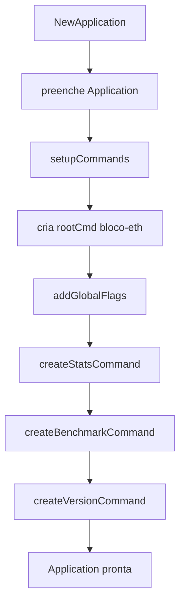
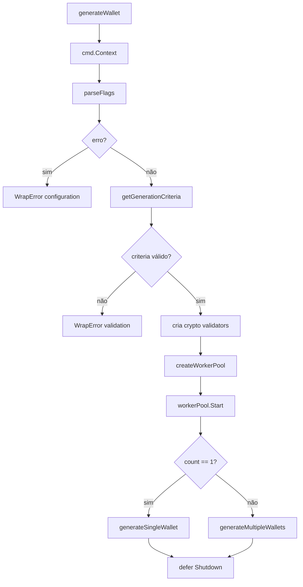
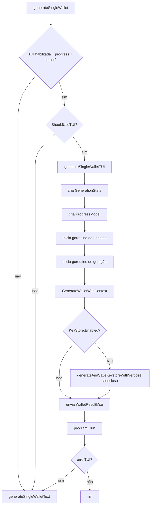
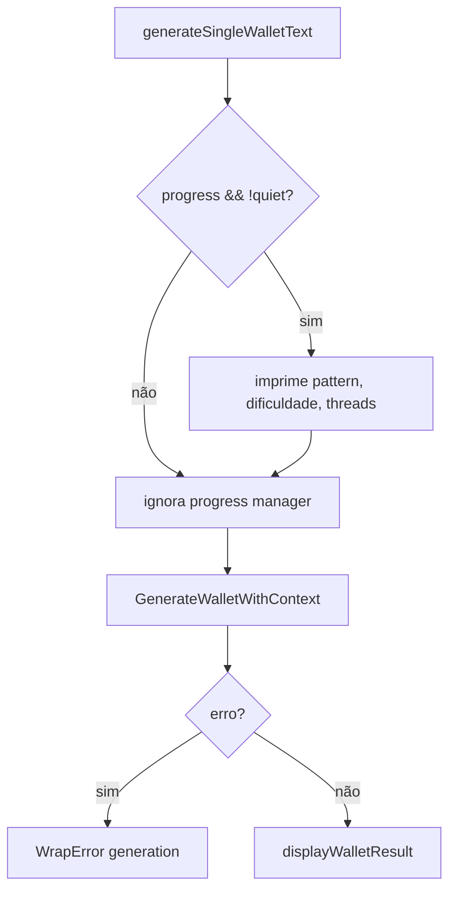
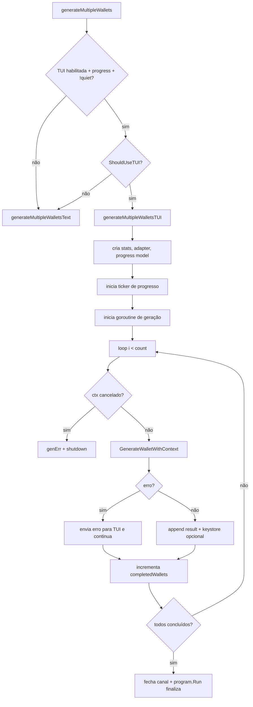
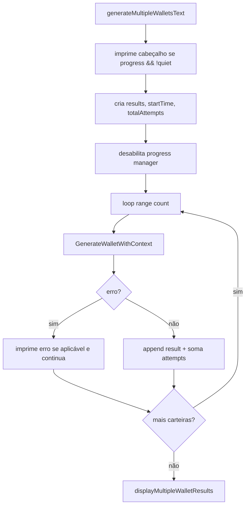
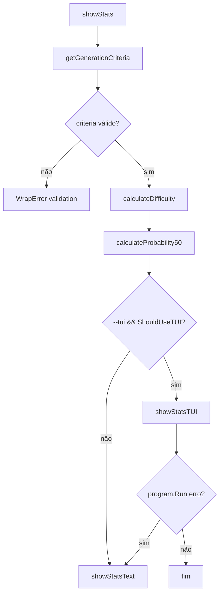
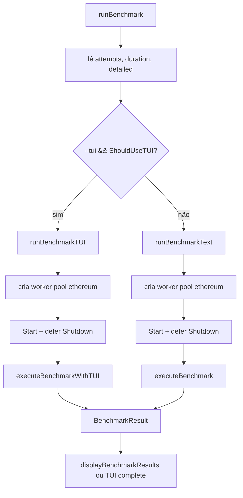
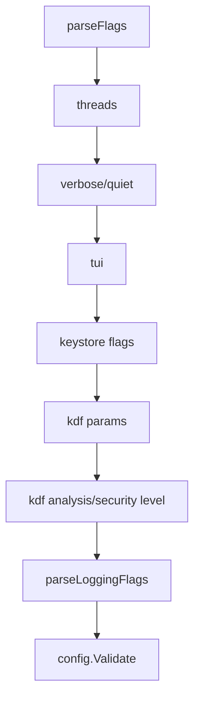
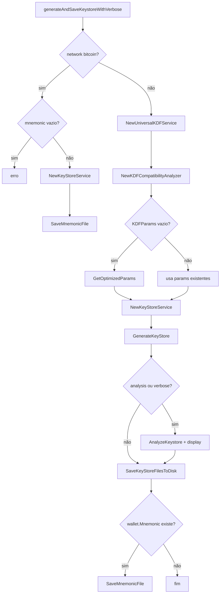

# Módulo internal/cli, Fluxos Operacionais

> Spec gerada pelo Reversa Writer.  
> Escala: 🟢 CONFIRMADO no código | 🟡 INFERIDO | 🔴 LACUNA

## Visão Geral

O módulo `internal/cli` possui múltiplos fluxos distintos: construção da aplicação, geração de carteira single, geração múltipla, análise estatística, benchmark, parsing de flags, parsing KDF/logging, exibição de resultados e persistência de keystore/mnemonic. 🟢

## Fluxo 1: Construção da Aplicação CLI

| Passo | Descrição | Evidência | Confiança |
|---|---|---|---:|
| 1 | O construtor recebe `Config`, `version`, `gitCommit` e `buildTime`. | `internal/cli/commands.go:37-44` | 🟢 |
| 2 | O construtor chama `setupCommands()`. | `internal/cli/commands.go:46` | 🟢 |
| 3 | `setupCommands()` cria o comando raiz `bloco-eth` com `RunE: app.generateWallet`. | `internal/cli/commands.go:55-66` | 🟢 |
| 4 | Flags globais são adicionadas ao comando raiz. | `internal/cli/commands.go:68-69` | 🟢 |
| 5 | Subcomandos `stats`, `benchmark` e `version` são adicionados. | `internal/cli/commands.go:71-74` | 🟢 |

## Fluxo 2: Geração pelo Comando Raiz

| Passo | Descrição | Evidência | Confiança |
|---|---|---|---:|
| 1 | O contexto é obtido do comando Cobra. | `internal/cli/commands.go:127-129` | 🟢 |
| 2 | Flags são aplicadas à configuração e revalidadas. | `internal/cli/commands.go:130-134`, `internal/cli/commands.go:969-1041` | 🟢 |
| 3 | Critérios de geração são extraídos e validados. | `internal/cli/commands.go:136-141`, `internal/cli/commands.go:1352-1368` | 🟢 |
| 4 | Componentes cripto e validadores são criados. | `internal/cli/commands.go:146-149` | 🟢 |
| 5 | Worker pool é criado para a rede dos critérios. | `internal/cli/commands.go:151-155` | 🟢 |
| 6 | Worker pool é iniciado e seu shutdown é deferido. | `internal/cli/commands.go:157-167` | 🟢 |
| 7 | `count` roteia geração single ou múltipla. | `internal/cli/commands.go:169-174` | 🟢 |

## Fluxo 3: Geração Single com TUI

| Passo | Descrição | Evidência | Confiança |
|---|---|---|---:|
| 1 | TUI só é considerada quando habilitada, progress está ativo e quiet está desligado. | `internal/cli/commands.go:184-195` | 🟢 |
| 2 | Stats iniciais usam dificuldade, probabilidade 50%, pattern e checksum. | `internal/cli/commands.go:208-223` | 🟢 |
| 3 | O progress model é criado pelo `TUIManager`. | `internal/cli/commands.go:225-234` | 🟢 |
| 4 | Uma goroutine envia updates periódicos de progresso a cada 100ms. | `internal/cli/commands.go:243-283` | 🟢 |
| 5 | Uma goroutine gera a carteira e salva keystore em modo silencioso quando habilitado. | `internal/cli/commands.go:320-344` | 🟢 |
| 6 | O resultado é enviado para a TUI e o canal é fechado. | `internal/cli/commands.go:346-360` | 🟢 |
| 7 | Falha da TUI cai para modo texto. | `internal/cli/commands.go:363-367` | 🟢 |

## Fluxo 4: Geração Single em Texto

| Passo | Descrição | Evidência | Confiança |
|---|---|---|---:|
| 1 | Cabeçalho textual é impresso apenas quando progress está ativo e quiet está desligado. | `internal/cli/commands.go:390-394` | 🟢 |
| 2 | Progress manager é explicitamente desabilitado para evitar deadlocks. | `internal/cli/commands.go:396-398` | 🟢 |
| 3 | A geração chama `GenerateWalletWithContext`. | `internal/cli/commands.go:400-408` | 🟢 |
| 4 | Sucesso exibe o resultado por `displayWalletResult`. | `internal/cli/commands.go:416-417` | 🟢 |

## Fluxo 5: Geração Múltipla com TUI

| Passo | Descrição | Evidência | Confiança |
|---|---|---|---:|
| 1 | A seleção TUI/texto segue regra equivalente ao fluxo single. | `internal/cli/commands.go:428-443` | 🟢 |
| 2 | Canais, mutex e contador protegem progresso em múltiplas carteiras. | `internal/cli/commands.go:481-489` | 🟢 |
| 3 | Ticker envia progresso com wallets concluídas, velocidade e ETA. | `internal/cli/commands.go:491-548` | 🟢 |
| 4 | Erro individual é enviado à TUI e a geração continua. | `internal/cli/commands.go:611-627` | 🟢 |
| 5 | Resultado bem-sucedido é acumulado, persiste keystore opcional e envia `WalletResult`. | `internal/cli/commands.go:630-658` | 🟢 |
| 6 | Falha de TUI cai para modo texto. | `internal/cli/commands.go:666-670` | 🟢 |

## Fluxo 6: Geração Múltipla em Texto

| Passo | Descrição | Evidência | Confiança |
|---|---|---|---:|
| 1 | O fluxo imprime cabeçalho quando progress está ativo e quiet está desligado. | `internal/cli/commands.go:690-694` | 🟢 |
| 2 | O progress manager é desabilitado também no fluxo múltiplo texto. | `internal/cli/commands.go:700-701` | 🟢 |
| 3 | Erros individuais não abortam toda a geração múltipla. | `internal/cli/commands.go:703-713` | 🟢 |
| 4 | Sucessos acumulam resultado e tentativas. | `internal/cli/commands.go:715-716` | 🟢 |
| 5 | O resumo final é exibido por `displayMultipleWalletResults`. | `internal/cli/commands.go:732-733` | 🟢 |

## Fluxo 7: Análise Estatística (`stats`)

| Passo | Descrição | Evidência | Confiança |
|---|---|---|---:|
| 1 | O subcomando `stats` cria flags próprias de prefixo, sufixo e checksum. | `internal/cli/commands.go:736-750` | 🟢 |
| 2 | Critérios inválidos são envolvidos como erro de validação. | `internal/cli/commands.go:753-759` | 🟢 |
| 3 | Dificuldade e probabilidade 50% são calculadas por helpers. | `internal/cli/commands.go:761-764` | 🟢 |
| 4 | TUI é usada quando flag `tui` e terminal permitem. | `internal/cli/commands.go:765-771` | 🟢 |
| 5 | Falha de TUI cai para texto. | `internal/cli/commands.go:800-805` | 🟢 |
| 6 | Texto exibe pattern, tamanho, checksum, dificuldade, probability50 e time estimates. | `internal/cli/commands.go:810-833` | 🟢 |

## Fluxo 8: Benchmark

| Passo | Descrição | Evidência | Confiança |
|---|---|---|---:|
| 1 | O subcomando `benchmark` aceita `attempts`, `duration` e `detailed`. | `internal/cli/commands.go:836-850` | 🟢 |
| 2 | O handler decide TUI/texto com base em `--tui` e suporte do terminal. | `internal/cli/commands.go:853-870` | 🟢 |
| 3 | Ambos os fluxos criam worker pool Ethereum e garantem shutdown. | `internal/cli/commands.go:873-887`, `internal/cli/commands.go:922-941` | 🟢 |
| 4 | Benchmark amostra stats por ticker e monta `BenchmarkResult`. | `internal/cli/commands.go:1507-1680`, `internal/cli/commands.go:1683-1807` | 🟢 |
| 5 | Resultados texto exibem métricas básicas, eficiência e recomendações. | `internal/cli/commands.go:1809-1914` | 🟢 |
| 6 | A execução real dos `WorkItem` no pool está marcada como TODO. | `internal/cli/commands.go:1629-1630`, `internal/cli/commands.go:1753-1754` | 🟢 |

## Fluxo 9: Parsing de Flags e Configuração

| Passo | Descrição | Evidência | Confiança |
|---|---|---|---:|
| 1 | `--threads=0` usa `runtime.NumCPU()`; positivo sobrescreve thread count. | `internal/cli/commands.go:971-978` | 🟢 |
| 2 | `--verbose` e `--quiet` alteram estado CLI. | `internal/cli/commands.go:981-988` | 🟢 |
| 3 | `--tui=false` desabilita TUI. | `internal/cli/commands.go:990-993` | 🟢 |
| 4 | Flags de keystore/KDF só alteram config quando explicitamente modificadas. | `internal/cli/commands.go:995-1033` | 🟢 |
| 5 | Logging flags são delegadas para `parseLoggingFlags()`. | `internal/cli/commands.go:1035-1038` | 🟢 |
| 6 | A configuração é validada depois das alterações. | `internal/cli/commands.go:1040-1041` | 🟢 |

## Fluxo 10: Persistência de Keystore e Mnemonic

| Passo | Descrição | Evidência | Confiança |
|---|---|---|---:|
| 1 | Bitcoin exige mnemonic para backup e salva apenas mnemonic. | `internal/cli/commands.go:1951-1977` | 🟢 |
| 2 | Ethereum/Solana usam KDF universal e analyzer. | `internal/cli/commands.go:1979-1985` | 🟢 |
| 3 | Parâmetros KDF default são otimizados por nível de segurança quando ausentes. | `internal/cli/commands.go:1986-1996` | 🟢 |
| 4 | O keystore service é configurado com KDF, cipher, retries e delay. | `internal/cli/commands.go:1998-2007` | 🟢 |
| 5 | Keystore é gerado com private key, address e network. | `internal/cli/commands.go:2013-2017` | 🟢 |
| 6 | Compatibilidade KDF é analisada quando análise ou verbose estão ativos. | `internal/cli/commands.go:2019-2037` | 🟢 |
| 7 | Keystore/password e mnemonic opcional são salvos em disco. | `internal/cli/commands.go:2039-2063` | 🟢 |

## Fluxos com comportamento parcial ou lacuna

| Fluxo | Comportamento confirmado | Lacuna | Confiança |
|---|---|---|---:|
| Progresso texto | Cabeçalho inicial é impresso, mas progress manager contínuo é desabilitado. | Resolver deadlock ou preservar comportamento. | 🟢 |
| Benchmark | Amostras e resultados são montados. | `WorkItem` não é submetido ao pool por TODO. | 🟢 |
| Flags `output`/`format` | Flags são declaradas. | Uso efetivo não confirmado no fluxo de saída. | 🟡 |
| Flag `case-sensitive` | Flag é declarada. | Não confirmada em `GenerationCriteria`. | 🟡 |
| Solana persistence | Fluxo Ethereum/Solana é compartilhado. | Persistência Solana tem risco documentado como simplificação/placeholder. | 🟡 |
