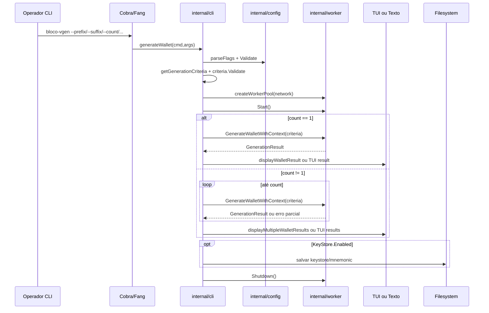
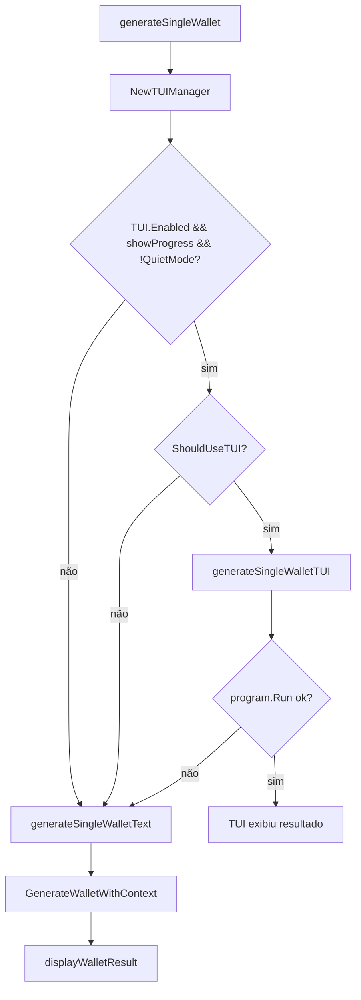
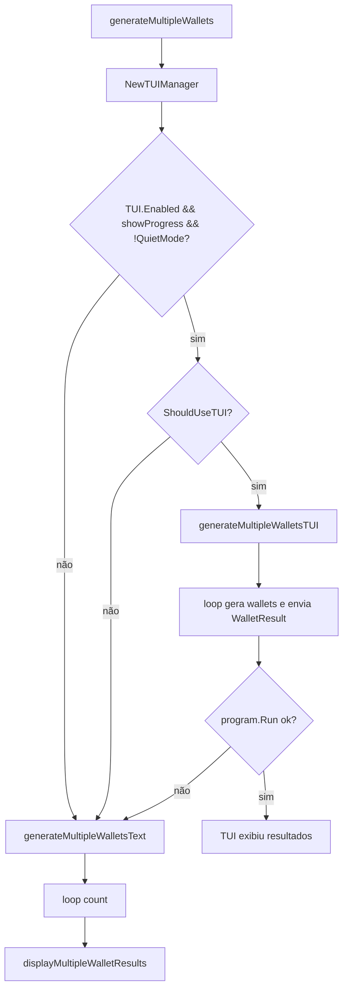

# Caso de Uso: Gerar Carteiras Vanity, Design Técnico

> Spec gerada pelo Reversa Writer.  
> Unit pai: `internal/cli`  
> Escala: 🟢 CONFIRMADO no código | 🟡 INFERIDO | 🔴 LACUNA

## Interface

O caso de uso é exposto pelo comando raiz Cobra `bloco-vgen`, configurado em `Application.setupCommands()` com `RunE: app.generateWallet`. O operador interage por flags CLI; o fluxo retorna `error` para o runtime Cobra/Fang e escreve resultados no terminal ou na TUI. 🟢

| Símbolo | Assinatura | Retorno | Papel |
|---------|-----------|---------|------|
| `Application.generateWallet` | `func (app *Application) generateWallet(cmd *cobra.Command, args []string) error` | `error` | Handler orquestrador do caso de uso. 🟢 |
| `Application.parseFlags` | `func (app *Application) parseFlags(cmd *cobra.Command) error` | `error` | Aplica flags à configuração e revalida `Config`. 🟢 |
| `Application.getGenerationCriteria` | `func (app *Application) getGenerationCriteria(cmd *cobra.Command) (wallet.GenerationCriteria, error)` | `GenerationCriteria`, `error` | Extrai critérios de vanity generation. 🟢 |
| `Application.createWorkerPool` | `func (app *Application) createWorkerPool(poolManager *crypto.PoolManager, validator *validation.AddressValidator, network string) (worker.WorkerPool, error)` | `WorkerPool`, `error` | Cria pool concorrente para a rede alvo. 🟢 |
| `Application.generateSingleWallet` | `func (...) error` | `error` | Roteia geração single para TUI ou texto. 🟢 |
| `Application.generateMultipleWallets` | `func (...) error` | `error` | Roteia geração múltipla para TUI ou texto. 🟢 |
| `Application.displayWalletResult` | `func (app *Application) displayWalletResult(result *wallet.GenerationResult, showProgress bool) error` | `error` | Exibe resultado single e aciona keystore. 🟢 |
| `Application.displayMultipleWalletResults` | `func (app *Application) displayMultipleWalletResults(results []*wallet.GenerationResult, totalAttempts int64, totalDuration time.Duration, showProgress bool) error` | `error` | Exibe lote e estatísticas agregadas. 🟢 |

## Entradas e Saídas

| Tipo | Item | Descrição | Confiança |
|---|---|---|---:|
| Entrada | `cmd.Context()` | Contexto cancelável propagado pelo Cobra/Fang. | 🟢 |
| Entrada | Flags de geração | `prefix`, `suffix`, `checksum`, `count`, `with-mnemonic`, `network`. | 🟢 |
| Entrada | Flags de runtime | `threads`, `progress`, `tui`, `verbose`, `quiet`, keystore, KDF e logging. | 🟢 |
| Entrada | `app.config` | Configuração base mutada por flags antes da geração. | 🟢 |
| Saída | `wallet.GenerationResult` | Resultado produzido pelo worker pool e consumido pela CLI. | 🟢 |
| Saída | Terminal/TUI | Endereço, credenciais, tentativas, duração, progresso e estatísticas. | 🟢 |
| Saída | Filesystem | Keystore/password/mnemonic quando habilitado. | 🟢 |
| Saída | `error` | Erros de configuração, validação, worker ou geração. | 🟢 |

## Fluxo Principal

1. O operador executa o comando raiz `bloco-vgen` com flags de geração. 🟢
2. Cobra chama `app.generateWallet(cmd, args)` porque o root command usa `RunE: app.generateWallet`. 🟢 `internal/cli/commands.go:55-66`
3. `generateWallet()` lê o contexto do comando. 🟢 `internal/cli/commands.go:127-129`
4. `parseFlags()` aplica flags à configuração, incluindo threads, TUI, keystore, KDF e logging. 🟢 `internal/cli/commands.go:130-134`, `internal/cli/commands.go:969-1041`
5. `getGenerationCriteria()` extrai `prefix`, `suffix`, `checksum`, `with-mnemonic` e `network`, então chama `criteria.Validate()`. 🟢 `internal/cli/commands.go:1352-1368`
6. O fluxo cria `PoolManager`, `ChecksumValidator` e `AddressValidator`. 🟢 `internal/cli/commands.go:146-149`
7. O worker pool é criado com thread count configurado, config completa e rede dos critérios. 🟢 `internal/cli/commands.go:119-124`, `internal/cli/commands.go:151-155`
8. `workerPool.Start()` inicia o pool e `Shutdown()` é deferido. 🟢 `internal/cli/commands.go:157-167`
9. `count == 1` seleciona fluxo single; caso contrário seleciona fluxo múltiplo. 🟢 `internal/cli/commands.go:169-174`

## Fluxo Single

- O fluxo single decide TUI usando configuração, flag `--progress`, quiet mode e suporte do terminal. 🟢 `internal/cli/commands.go:177-199`
- O modo TUI cria stats, adapter, progress model, canais e goroutines para geração/progresso. 🟢 `internal/cli/commands.go:202-361`
- No modo TUI, keystore é salvo em modo silencioso antes do envio do resultado à interface. 🟢 `internal/cli/commands.go:337-344`
- Falha da TUI retorna ao modo texto com `showProgress=true`. 🟢 `internal/cli/commands.go:363-367`
- O modo texto imprime cabeçalho opcional, desabilita progress manager e chama `GenerateWalletWithContext`. 🟢 `internal/cli/commands.go:383-417`

## Fluxo Múltiplo

- A seleção TUI/texto segue a mesma regra do fluxo single. 🟢 `internal/cli/commands.go:420-443`
- O fluxo múltiplo TUI usa canais, `sync.Once` e mutex para coordenar encerramento e contagem de wallets concluídas. 🟢 `internal/cli/commands.go:481-489`
- Erros individuais são enviados à TUI e incrementam o contador de concluídas. 🟢 `internal/cli/commands.go:611-627`
- Sucessos são acumulados em `results`, podem gerar keystore e são enviados como `tui.WalletResult`. 🟢 `internal/cli/commands.go:630-658`
- O fluxo múltiplo texto continua após erro individual e exibe resumo final. 🟢 `internal/cli/commands.go:703-733`

## Fluxos Alternativos e Erros

| Situação | Comportamento | Evidência | Confiança |
|---|---|---|---:|
| `parseFlags()` falha | Retorna erro embrulhado como `ErrorTypeConfiguration`. | `internal/cli/commands.go:130-134` | 🟢 |
| `getGenerationCriteria()` falha | Retorna erro embrulhado como `ErrorTypeValidation`. | `internal/cli/commands.go:136-141` | 🟢 |
| `createWorkerPool()` falha | Erro é retornado diretamente pelo handler. | `internal/cli/commands.go:151-155` | 🟢 |
| `workerPool.Start()` falha | Retorna erro embrulhado como `ErrorTypeWorker`. | `internal/cli/commands.go:157-161` | 🟢 |
| `workerPool.Shutdown()` falha | Warning é escrito em `stderr` sem sobrescrever retorno principal. | `internal/cli/commands.go:162-166` | 🟢 |
| TUI single falha | Cai para `generateSingleWalletText`. | `internal/cli/commands.go:363-367` | 🟢 |
| TUI múltipla falha | Cai para `generateMultipleWalletsText`. | `internal/cli/commands.go:666-670` | 🟢 |
| Geração single texto falha | Retorna erro embrulhado como `ErrorTypeGeneration`. | `internal/cli/commands.go:400-408` | 🟢 |
| Uma geração do lote texto falha | Imprime erro opcional e continua. | `internal/cli/commands.go:703-713` | 🟢 |
| Nenhuma carteira do lote foi gerada | Imprime `No wallets were generated successfully` e retorna `nil`. | `internal/cli/commands.go:1421-1425` | 🟢 |
| Keystore falha no display | Exibe warning e mantém resultado da carteira. | `internal/cli/commands.go:1406-1415`, `internal/cli/commands.go:1453-1464` | 🟢 |

## Dependências

- `internal/config`: estado runtime mutado por flags e validado antes da geração. 🟢
- `internal/crypto`: pool manager, checksum validator e serviço de keystore. 🟢
- `internal/validation`: validator usado para regras de endereço. 🟢
- `internal/worker`: execução concorrente e stats de geração. 🟢
- `internal/tui`: seleção e renderização de progresso/resultados em terminal. 🟢
- `pkg/wallet`: critérios, resultados, estatísticas e entidades de carteira. 🟢
- `pkg/errors`: categorização de erros para configuração, validação, worker e geração. 🟢
- `pkg/utils`: cálculo de dificuldade/probabilidade e formatação de números/duração. 🟢

## Decisões de Design Identificadas

| Decisão | Evidência no código | Confiança |
|---------|---------------------|-----------|
| O comando raiz é também o caso de uso de geração de carteiras. | `internal/cli/commands.go:55-66` | 🟢 |
| Flags são aplicadas à configuração antes da montagem dos critérios. | `internal/cli/commands.go:130-141` | 🟢 |
| Validação de config e critérios ocorre antes do worker pool iniciar. | `internal/cli/commands.go:130-158` | 🟢 |
| Worker pool é criado por rede, mas recebe a configuração completa. | `internal/cli/commands.go:119-124` | 🟢 |
| TUI é progressiva e opcional, não substitui o modo texto. | `internal/cli/commands.go:177-199`, `internal/cli/commands.go:420-443` | 🟢 |
| Modo texto preserva operação mesmo com progresso contínuo desabilitado. | `internal/cli/commands.go:396-398`, `internal/cli/commands.go:700-701` | 🟢 |
| Lote texto privilegia sucesso parcial em vez de fail-fast. | `internal/cli/commands.go:703-713` | 🟢 |
| Persistência de keystore é acionada pela camada CLI após geração. | `internal/cli/commands.go:1406-1415`, `internal/cli/commands.go:1453-1464` | 🟢 |

## Estado Interno

| Estado | Local | Evolução | Confiança |
|---|---|---|---:|
| `ctx` | `generateWallet` e subfluxos | Vem de Cobra e é passado ao worker pool. | 🟢 |
| `app.config` | `Application` | Mutado por `parseFlags()` antes da geração. | 🟢 |
| `criteria` | `generateWallet` | Criado a partir das flags e validado. | 🟢 |
| `workerPool` | `generateWallet` | Criado, iniciado, usado e finalizado com defer. | 🟢 |
| `showProgress` | `generateWallet` | Determina cabeçalho texto e elegibilidade TUI. | 🟢 |
| `count` | `generateWallet` | Define fluxo single/múltiplo. | 🟢 |
| `results` | fluxos múltiplos | Acumula wallets bem-sucedidas. | 🟢 |
| `completedWallets` | TUI múltipla | Contador protegido por mutex para progresso. | 🟢 |
| `walletResultsChan` | fluxos TUI | Entrega resultados para modelo Bubble Tea. | 🟢 |
| `shutdownChan` | fluxos TUI | Sinaliza encerramento do loop de atualização. | 🟢 |

## Observabilidade

- Com `BLOCO_DEBUG`, o fluxo imprime decisão TUI single/múltipla com flags e suporte detectado. 🟢 `internal/cli/commands.go:188-192`, `internal/cli/commands.go:432-436`
- Em texto single com progress, imprime pattern, dificuldade e threads. 🟢 `internal/cli/commands.go:390-394`
- Em texto múltiplo com progress, imprime quantidade, pattern, dificuldade e threads. 🟢 `internal/cli/commands.go:690-694`
- Resultado single imprime endereço, private key, mnemonic opcional, attempts e duration. 🟢 `internal/cli/commands.go:1395-1404`
- Resultado múltiplo imprime resumo, dados por carteira, status de keystore e estatísticas agregadas. 🟢 `internal/cli/commands.go:1421-1504`
- Warnings de keystore são exibidos sem abortar o resultado principal. 🟢 `internal/cli/commands.go:1406-1415`, `internal/cli/commands.go:1453-1464`

## Riscos e Lacunas

- 🟢 O progress manager contínuo em texto está desabilitado por deadlock; manter ou corrigir esse comportamento exige decisão de produto/engenharia.
- 🟡 `--case-sensitive` é registrado no comando raiz, mas não aparece em `GenerationCriteria` no trecho confirmado.
- 🟡 `--output` e `--format` existem como flags, mas o fluxo de resultado confirmado imprime em stdout.
- 🟢 O fluxo single texto expõe private key e mnemonic em stdout; isso é comportamento legado confirmado e risco operacional.
- 🟡 Quiet mode oculta segredos em múltiplos resultados, mas não foi confirmado como aplicado ao single texto.
- 🟢 Falha de keystore não aborta o resultado, o que favorece UX mas pode surpreender automações que exigem backup obrigatório.

## Contratos Internos

| Contrato | Fornecedor | Consumidor | Condição | Confiança |
|---|---|---|---|---:|
| Configuração válida após flags | `internal/config` | `generateWallet` | `parseFlags()` deve retornar `nil`. | 🟢 |
| Critérios válidos | `pkg/wallet` | `generateWallet` | `criteria.Validate()` deve retornar `nil`. | 🟢 |
| Pool iniciado antes de gerar | `internal/worker` | `generateSingleWallet*` e `generateMultipleWallets*` | `Start()` é chamado no handler principal. | 🟢 |
| Geração contextual | `internal/worker` | fluxos single/múltiplo | `GenerateWalletWithContext(ctx, criteria)` respeita contexto. | 🟢 |
| Stats agregados | `internal/worker` | fluxos TUI | `GetStatsCollector().GetAggregatedStats()` alimenta progresso. | 🟢 |
| Resultado renderizável | `internal/tui` | fluxos TUI | `tui.WalletResult` contém índice, endereço, private key, attempts e tempo. | 🟢 |
| Persistência por rede | `internal/crypto` | display e TUI | `generateAndSaveKeystore*` salva artefatos conforme rede. | 🟢 |
