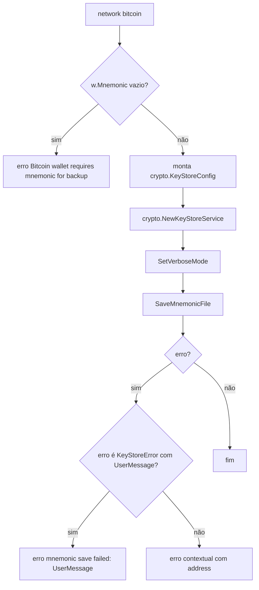
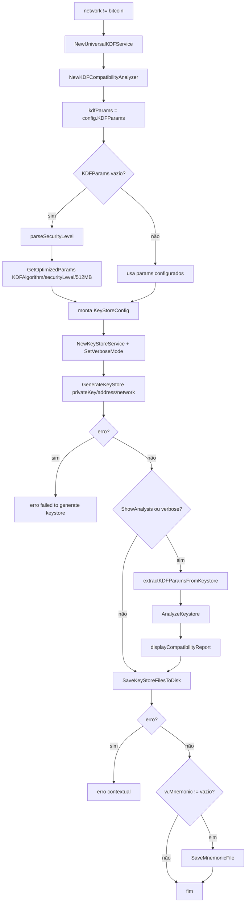

# Caso de Uso: Salvar Keystore, Design Técnico

> Spec gerada pelo Reversa Writer.  
> Unit pai: `internal/cli`  
> Escala: 🟢 CONFIRMADO no código | 🟡 INFERIDO | 🔴 LACUNA

## Interface

O caso de uso é acionado internamente pela camada CLI após uma carteira ser gerada com sucesso. Ele não é um comando Cobra próprio; é um subfluxo chamado pelos displays de resultado e pelos fluxos TUI. A interface principal recebe `*wallet.Wallet` e usa `app.config` para decidir KDF, diretório, verbose, análise e comportamento por rede. 🟢

| Símbolo | Assinatura | Retorno | Papel |
|---------|-----------|---------|------|
| `Application.generateAndSaveKeystore` | `func (app *Application) generateAndSaveKeystore(w *wallet.Wallet) error` | `error` | Wrapper que usa `app.config.CLI.VerboseOutput`. 🟢 |
| `Application.generateAndSaveKeystoreWithVerbose` | `func (app *Application) generateAndSaveKeystoreWithVerbose(w *wallet.Wallet, verbose bool) error` | `error` | Fluxo principal de persistência por rede. 🟢 |
| `Application.parseSecurityLevel` | `func (app *Application) parseSecurityLevel(level string) kdf.SecurityLevel` | `kdf.SecurityLevel` | Converte string de segurança para enum KDF. 🟢 |
| `Application.extractKDFParamsFromKeystore` | `func (app *Application) extractKDFParamsFromKeystore(keystore *crypto.KeyStoreV3) map[string]interface{}` | `map[string]interface{}` | Extrai parâmetros completos para análise KDF. 🟢 |
| `Application.displayCompatibilityReport` | `func (app *Application) displayCompatibilityReport(report *kdf.CompatibilityReport, verbose bool)` | `void` | Exibe relatório KDF quando análise/verbose estão ativos. 🟢 |
| `crypto.NewKeyStoreService` | chamada externa ao módulo | `*KeyStoreService` | Serviço efetivo de geração/salvamento. 🟡 |
| `kdf.NewUniversalKDFService` | chamada externa ao módulo | `*UniversalKDFService` | Serviço KDF universal usado por Ethereum/Solana. 🟡 |
| `kdf.NewKDFCompatibilityAnalyzer` | chamada externa ao módulo | `*KDFCompatibilityAnalyzer` | Analyzer usado para params default e relatório. 🟡 |

## Entradas e Saídas

| Tipo | Item | Descrição | Confiança |
|---|---|---|---:|
| Entrada | `w *wallet.Wallet` | Carteira gerada com `Address`, `PrivateKey`, `Network` e `Mnemonic` opcional. | 🟢 |
| Entrada | `verbose bool` | Controla mensagens detalhadas e exibição de análise KDF. | 🟢 |
| Entrada | `app.config.KeyStore.Enabled` | Indica se o fluxo deve ser chamado pelos displays. | 🟢 |
| Entrada | `app.config.KeyStore.OutputDir` | Diretório de saída de keystore/mnemonic. | 🟢 |
| Entrada | `app.config.KeyStore.KDFAlgorithm` | Algoritmo KDF para Ethereum/Solana. | 🟢 |
| Entrada | `app.config.KeyStore.KDFParams` | Parâmetros KDF explícitos ou vazio para defaults otimizados. | 🟢 |
| Entrada | `app.config.KeyStore.SecurityLevel` | Nível de segurança usado para defaults KDF. | 🟢 |
| Entrada | `app.config.KeyStore.ShowAnalysis` | Controla exibição de análise de compatibilidade. | 🟢 |
| Saída | Arquivo mnemonic | Backup textual para Bitcoin e mnemonic opcional em outras redes. | 🟢 |
| Saída | Arquivos keystore/password | Artefatos salvos para Ethereum/Solana pelo `KeyStoreService`. | 🟢 |
| Saída | stdout | Mensagens de warning/análise/sucesso disparadas por CLI e service. | 🟢 |
| Saída | `error` | Erros de validação, geração, análise ou salvamento. | 🟢 |

## Fluxo Principal: dispatch por rede

```mermaid
flowchart TD
  A[generateAndSaveKeystoreWithVerbose] --> B{strings.ToLower(w.Network) == bitcoin?}
  B -- sim --> C[fluxo Bitcoin mnemonic-only]
  B -- não --> D[fluxo Ethereum/Solana keystore]
  C --> E{erro?}
  D --> E
  E -- sim --> X[retorna erro contextual]
  E -- não --> F[fim]
```

1. `generateAndSaveKeystore(w)` chama `generateAndSaveKeystoreWithVerbose(w, app.config.CLI.VerboseOutput)`. 🟢 `internal/cli/commands.go:1943-1946`
2. `generateAndSaveKeystoreWithVerbose()` normaliza `w.Network` com `strings.ToLower`. 🟢 `internal/cli/commands.go:1951-1953`
3. Se a rede é `bitcoin`, o fluxo segue para persistência somente de mnemonic. 🟢 `internal/cli/commands.go:1952-1977`
4. Caso contrário, o fluxo segue para geração de keystore para Ethereum/Solana. 🟢 `internal/cli/commands.go:1979-2063`

## Fluxo Bitcoin: mnemonic-only



- Bitcoin não gera KeyStore V3 no fluxo CLI. 🟢 `internal/cli/commands.go:1948-1952`
- Se `w.Mnemonic == ""`, o fluxo retorna erro antes de criar o service. 🟢 `internal/cli/commands.go:1953-1956`
- A configuração do service para Bitcoin usa `Enabled` e `OutputDirectory`. 🟢 `internal/cli/commands.go:1958-1963`
- O modo verbose é aplicado ao `KeyStoreService`. 🟢 `internal/cli/commands.go:1963-1964`
- A CLI chama `SaveMnemonicFile(w.Address, w.Mnemonic, w.Network)`. 🟢 `internal/cli/commands.go:1966-1967`
- Erros `*crypto.KeyStoreError` preferem `UserMessage` se disponível. 🟢 `internal/cli/commands.go:1967-1975`

## Fluxo Ethereum/Solana: KeyStore com KDF universal



- O fluxo cria `kdf.NewUniversalKDFService()` e `kdf.NewKDFCompatibilityAnalyzer(kdfService)`. 🟢 `internal/cli/commands.go:1979-1985`
- `kdfParams` começa em `app.config.KeyStore.KDFParams`. 🟢 `internal/cli/commands.go:1986-1987`
- Quando `kdfParams` está vazio, a CLI calcula `securityLevel` e chama `GetOptimizedParams(app.config.KeyStore.KDFAlgorithm, securityLevel, 512)`. 🟢 `internal/cli/commands.go:1988-1996`
- O `crypto.KeyStoreConfig` usa `Enabled`, `OutputDirectory`, `KDF`, `KDFParams`, cipher `aes-128-ctr`, `MaxRetries=3`, `RetryDelay=100`. 🟢 `internal/cli/commands.go:1998-2007`
- O service é criado e recebe `SetVerboseMode(verbose)`. 🟢 `internal/cli/commands.go:2009-2011`
- `GenerateKeyStore(w.PrivateKey, w.Address, w.Network)` retorna `keystore`, `password` e `error`. 🟢 `internal/cli/commands.go:2013-2017`
- Se `ShowAnalysis` ou `verbose`, a CLI extrai parâmetros completos e analisa compatibilidade. 🟢 `internal/cli/commands.go:2019-2037`
- O salvamento final usa `SaveKeyStoreFilesToDisk(w.Address, keystore, password, w.Network, w.PrivateKey)`. 🟢 `internal/cli/commands.go:2039-2049`
- Se `w.Mnemonic != ""`, a CLI também chama `SaveMnemonicFile`. 🟢 `internal/cli/commands.go:2051-2060`

## Fluxos de Acionamento

| Origem | Condição | Chamada | Tratamento de erro | Confiança |
|---|---|---|---|---:|
| `displayWalletResult` | `app.config.KeyStore.Enabled` | `app.generateAndSaveKeystore(result.Wallet)` | Warning e continua. | 🟢 |
| `displayMultipleWalletResults` | `app.config.KeyStore.Enabled` por carteira | `app.generateAndSaveKeystore(result.Wallet)` | Acumula erro, imprime status e continua. | 🟢 |
| `generateSingleWalletTUI` | `app.config.KeyStore.Enabled` após gerar wallet | `app.generateAndSaveKeystoreWithVerbose(genResult.Wallet, false)` | Warning se `!QuietMode`; continua. | 🟢 |
| `generateMultipleWalletsTUI` | `app.config.KeyStore.Enabled` por resultado | `app.generateAndSaveKeystoreWithVerbose(result.Wallet, false)` | Warning por wallet se `!QuietMode`; continua. | 🟢 |

## Fluxos Alternativos e Erros

| Situação | Comportamento | Evidência | Confiança |
|---|---|---|---:|
| Bitcoin sem mnemonic | Retorna erro `Bitcoin wallet requires mnemonic for backup`. | `internal/cli/commands.go:1953-1956` | 🟢 |
| Falha em `SaveMnemonicFile` Bitcoin | Retorna erro com `UserMessage` se existir ou contexto com address. | `internal/cli/commands.go:1967-1975` | 🟢 |
| Falha em `GetOptimizedParams` | Retorna `failed to get default KDF parameters`. | `internal/cli/commands.go:1988-1994` | 🟢 |
| Falha em `GenerateKeyStore` | Retorna `failed to generate keystore for address`. | `internal/cli/commands.go:2013-2017` | 🟢 |
| Falha em `AnalyzeKeystore` | Em verbose, imprime warning; não aborta salvamento. | `internal/cli/commands.go:2029-2036` | 🟢 |
| Falha em `SaveKeyStoreFilesToDisk` | Retorna erro contextual, preferindo `KeyStoreError.UserMessage`. | `internal/cli/commands.go:2039-2049` | 🟢 |
| Falha em salvar mnemonic pós-keystore | Retorna erro contextual, preferindo `KeyStoreError.UserMessage`. | `internal/cli/commands.go:2051-2060` | 🟢 |
| Falha chamada por display | Convertida em warning/status e geração permanece visível. | `internal/cli/commands.go:1406-1415`, `internal/cli/commands.go:1453-1464` | 🟢 |

## Dependências

- `pkg/wallet.Wallet`: fornece `Address`, `PrivateKey`, `Network` e `Mnemonic`. 🟢
- `internal/config.KeyStore`: fornece `Enabled`, `OutputDir`, `KDFAlgorithm`, `KDFParams`, `SecurityLevel`, `ShowAnalysis`. 🟢
- `internal/config.CLI`: fornece `VerboseOutput` e `QuietMode`. 🟢
- `internal/crypto.KeyStoreService`: gera keystore, salva arquivos, salva mnemonic e aplica verbose. 🟡
- `internal/crypto.KeyStoreConfig`: estrutura de configuração para o service. 🟡
- `internal/crypto.KeyStoreError`: erro tipado com `UserMessage`. 🟡
- `internal/crypto/kdf.UniversalKDFService`: serviço base para derivação/análise KDF. 🟡
- `internal/crypto/kdf.KDFCompatibilityAnalyzer`: gera params otimizados e relatórios de compatibilidade. 🟡

## Decisões de Design Identificadas

| Decisão | Evidência no código | Confiança |
|---------|---------------------|-----------|
| O salvamento é responsabilidade da CLI após geração, não do worker. | `internal/cli/commands.go:1406-1415`, `internal/cli/commands.go:1453-1464` | 🟢 |
| Bitcoin não usa KeyStore V3, apenas mnemonic. | `internal/cli/commands.go:1948-1977` | 🟢 |
| Ethereum e Solana compartilham o mesmo fluxo de KDF/keystore. | `internal/cli/commands.go:1979-2063` | 🟢 |
| Defaults KDF são calculados por nível de segurança quando ausentes. | `internal/cli/commands.go:1986-1996` | 🟢 |
| Análise KDF é pós-geração para usar parâmetros completos extraídos do keystore. | `internal/cli/commands.go:2019-2029` | 🟢 |
| Erros de análise KDF não bloqueiam salvamento se o keystore foi gerado. | `internal/cli/commands.go:2029-2036` | 🟢 |
| Falha de salvamento é warning em display, mas erro no helper. | `internal/cli/commands.go:1406-1415`, `internal/cli/commands.go:2039-2049` | 🟢 |

## Estado Interno

| Estado | Local | Evolução | Confiança |
|---|---|---|---:|
| `w.Network` | `wallet.Wallet` | Normalizado para decisão Bitcoin vs não-Bitcoin. | 🟢 |
| `w.Mnemonic` | `wallet.Wallet` | Obrigatório para Bitcoin; opcional para salvar após keystore em outras redes. | 🟢 |
| `kdfParams` | `generateAndSaveKeystoreWithVerbose` | Vem da config ou é preenchido por `GetOptimizedParams`. | 🟢 |
| `securityLevel` | `generateAndSaveKeystoreWithVerbose` | Derivado de string por `parseSecurityLevel`. | 🟢 |
| `keystoreConfig` | `generateAndSaveKeystoreWithVerbose` | Montado de forma diferente para Bitcoin e Ethereum/Solana. | 🟢 |
| `keystore` | fluxo Ethereum/Solana | Gerado pelo service e usado para análise e salvamento. | 🟢 |
| `password` | fluxo Ethereum/Solana | Gerado junto ao keystore e salvo pelo service. | 🟢 |
| `completeParams` | análise KDF | Extraído do keystore gerado para relatório. | 🟢 |

## Observabilidade

- `displayWalletResult()` imprime sucesso de salvamento com diretório de saída quando keystore é salvo. 🟢 `internal/cli/commands.go:1406-1415`
- `displayMultipleWalletResults()` imprime status por carteira e resumo `Keystores saved`. 🟢 `internal/cli/commands.go:1453-1477`
- `displayCompatibilityReport()` imprime KDF, nível de segurança, compatibilidade, parâmetros, issues, warnings e sugestões. 🟢 `internal/cli/commands.go:1274-1334`
- Warnings de análise KDF aparecem apenas em verbose quando a análise falha. 🟢 `internal/cli/commands.go:2029-2033`
- Warnings de persistência em TUI são silenciados pelo parâmetro `verbose=false`, exceto quando quiet mode permite mensagem externa nos fluxos TUI. 🟢 `internal/cli/commands.go:337-344`, `internal/cli/commands.go:632-638`

## Riscos e Lacunas

- 🟢 Falha de keystore como warning pode deixar o operador com carteira gerada mas sem backup seguro persistido.
- 🟡 Solana usa o mesmo ramo Ethereum/Solana; artefatos anteriores marcam persistência Solana como simplificação/placeholder.
- 🟢 A private key é passada para `GenerateKeyStore` e `SaveKeyStoreFilesToDisk`; segurança depende do service e do ambiente de filesystem.
- 🟡 O formato exato dos arquivos e nomes gerados não é definido na CLI; pertence ao `KeyStoreService`.
- 🟢 `parseSecurityLevel()` faz fallback para medium em valor desconhecido, o que pode mascarar erro de configuração.
- 🟢 `AnalyzeKeystore` falhar não aborta o salvamento, priorizando geração/persistência sobre relatório.

## Contratos Internos

| Contrato | Fornecedor | Consumidor | Condição | Confiança |
|---|---|---|---|---:|
| `Wallet.Network` identifica regra de persistência. | `pkg/wallet` | `internal/cli` | Comparação case-insensitive com `bitcoin`. | 🟢 |
| `Wallet.Mnemonic` é obrigatório para Bitcoin. | `pkg/wallet` | `internal/cli` | Vazio retorna erro antes de salvar. | 🟢 |
| `GetOptimizedParams` retorna params compatíveis com KDF e security level. | `internal/crypto/kdf` | `internal/cli` | Usado quando config não tem params explícitos. | 🟡 |
| `GenerateKeyStore` retorna keystore e password persistíveis. | `internal/crypto` | `internal/cli` | Usado no ramo Ethereum/Solana. | 🟡 |
| `SaveKeyStoreFilesToDisk` salva artefatos e pode receber private key. | `internal/crypto` | `internal/cli` | Erro é propagado ao helper. | 🟡 |
| `SaveMnemonicFile` salva mnemonic por address/rede. | `internal/crypto` | `internal/cli` | Usado em Bitcoin e mnemonic opcional. | 🟡 |
| `KeyStoreError.UserMessage` fornece mensagem amigável. | `internal/crypto` | `internal/cli` | Preferido nos erros retornados. | 🟢 |
