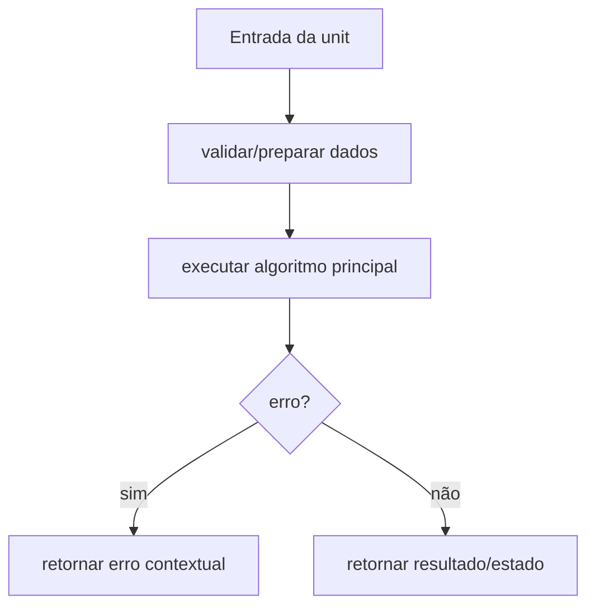

# Módulo internal/config, Design Técnico

> Spec gerada pelo Reversa Writer.  
> Escala: 🟢 CONFIRMADO no código | 🟡 INFERIDO | 🔴 LACUNA

## Interface

A unit `internal/config` é implementada no legado principalmente em `internal/config/config.go`. Sua interface é formada por funções, structs e contratos internos consumidos pelos demais módulos do monólito CLI. 🟢

| Símbolo | Assinatura / Entrada | Retorno | Observação |
|---------|----------------------|---------|------------|
| `DefaultConfig` | parâmetros: nenhum | `*Config` | 🟢 |
| `LoadFromEnvironment` | parâmetros: nenhum | `void` | 🟢 |
| `Validate` | parâmetros: nenhum | `error` | 🟢 |

## Fluxo Principal

1. A unit recebe dados do módulo consumidor ou da configuração runtime. 🟢
2. Entradas são normalizadas ou validadas conforme regras documentadas em `requirements.md`. 🟢
3. O algoritmo principal executa: Merge simples de defaults com variáveis BLOCO_*. 🟢
4. Em erro, a unit retorna erro estruturado, erro contextual ou valor de falha conforme contrato do legado. 🟢
5. Em sucesso, a unit entrega resultado para o próximo componente arquitetural. 🟢

## Fluxos Alternativos

- **Entrada inválida:** validação interrompe o processamento e retorna erro compatível com o legado. 🟢
- **Configuração ausente ou default:** a unit aplica defaults quando o código legado confirma fallback. 🟢
- **Integração indisponível:** erros de dependências são propagados ou convertidos em warning conforme contrato local. 🟡

## Dependências

- `runtime`: dependência usada pela unit conforme análise do legado. 🟢
- `os`: dependência usada pela unit conforme análise do legado. 🟢
- `strconv`: dependência usada pela unit conforme análise do legado. 🟢
- `time`: dependência usada pela unit conforme análise do legado. 🟢

## Decisões de Design Identificadas

| Decisão | Evidência no código | Confiança |
|---------|---------------------|-----------|
| A unit permanece encapsulada em `internal/config` e é consumida por contratos internos. | `internal/config/config.go` | 🟢 |
| Regras de validação são explícitas e devem ser preservadas na reimplementação. | `.reversa/context/modules.json` | 🟢 |
| Lacunas conhecidas não devem ser corrigidas sem decisão humana quando alteram comportamento. | `_reversa_sdd/domain.md` | 🟡 |

## Estado Interno

| Estado | Campo | Papel | Confiança |
|---|---|---|---:|
| `Config` | `Worker: WorkerConfig` | obrigatório no contrato legado | 🟢 |
| `Config` | `TUI: TUIConfig` | obrigatório no contrato legado | 🟢 |
| `Config` | `Crypto: CryptoConfig` | obrigatório no contrato legado | 🟢 |
| `Config` | `CLI: CLIConfig` | obrigatório no contrato legado | 🟢 |
| `Config` | `KeyStore: KeyStoreConfig` | obrigatório no contrato legado | 🟢 |
| `Config` | `Logging: LoggingConfig` | obrigatório no contrato legado | 🟢 |

## Observabilidade

- Eventos, erros ou warnings devem manter mensagens e categorias equivalentes quando existentes no legado. 🟢
- Quando a unit opera com dados sensíveis, logs devem permanecer sanitizados e sem segredos. 🟢
- Métricas de performance devem ser preservadas quando a unit expõe stats ou collectors. 🟡

## Riscos e Lacunas

- 🟡 BLOCO_* inválido pode ser ignorado silenciosamente quando parsing falha.
- 🟡 Fallbacks e defaults devem ser mantidos para compatibilidade.
