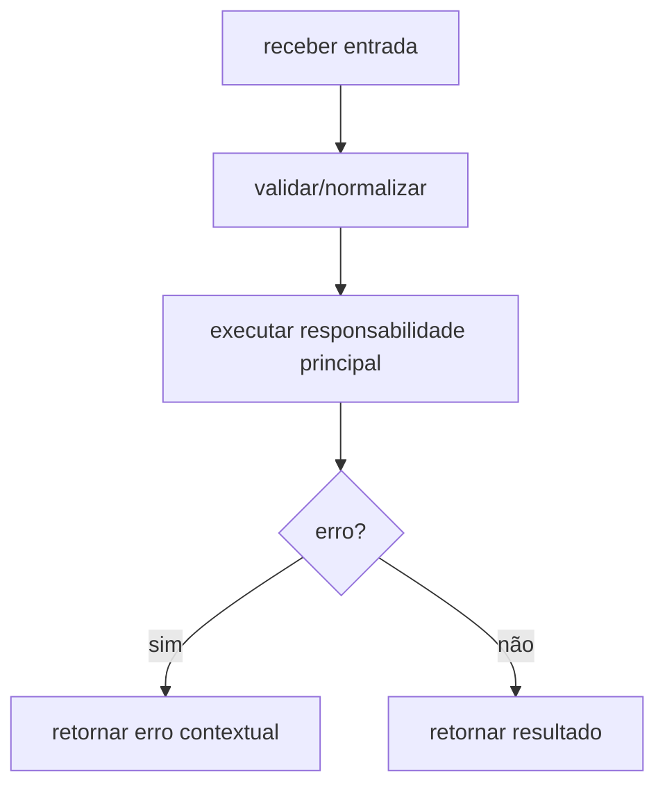

# Módulo internal/crypto, Fluxos Operacionais

> Spec gerada pelo Reversa Writer.  
> Escala: 🟢 CONFIRMADO no código | 🟡 INFERIDO | 🔴 LACUNA

## Fluxo Principal

## Fluxos Técnicos Confirmados

- Ethereum address = últimos 20 bytes do Keccak256 da chave pública secp256k1 🟢
- EIP-55 checksum por hash Keccak do endereço lowercase 🟢
- AES-128-CTR + MAC Keccak(derivedKey[16:32] + ciphertext) 🟢
- Fisher-Yates para embaralhar senha 🟢
- Object pooling com sync.Pool e limpeza de buffers 🟢

## Fluxos Alternativos

- **Entrada inválida:** retornar erro conforme contrato da unit. 🟢
- **Dependência falha:** propagar erro ou warning conforme `design.md`. 🟡
- **Dados sensíveis:** aplicar sanitização/ocultação quando a unit manipula chaves, mnemonic, password ou salt. 🟢
