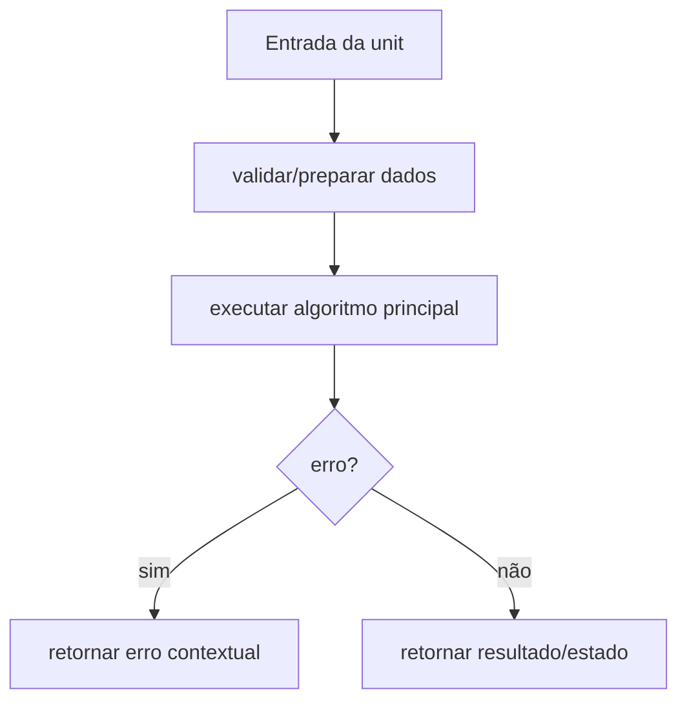

# Caso de Uso: Gerar Carteira Multirede, Design Técnico

> Spec gerada pelo Reversa Writer.  
> Escala: 🟢 CONFIRMADO no código | 🟡 INFERIDO | 🔴 LACUNA

## Interface

A unit `internal/crypto/gerar-carteira-multirede` é implementada no legado principalmente em `internal/crypto/ethereum.go`, `internal/crypto/bitcoin.go`, `internal/crypto/solana.go`, `internal/crypto/checksum.go`, `internal/crypto/keystore.go`, `internal/crypto/password.go`, `internal/crypto/pools.go`, `internal/crypto/random.go`, `internal/crypto/validation.go`, `internal/crypto/generator.go`. Sua interface é formada por funções, structs e contratos internos consumidos pelos demais módulos do monólito CLI. 🟢

| Símbolo | Assinatura / Entrada | Retorno | Observação |
|---------|----------------------|---------|------------|
| `GenerateAddressFromPrivateKey` | parâmetros: privateKey []byte | `string, error` | 🟢 |
| `OptimizedAddressGeneration` | parâmetros: privateKey []byte | `string, error` | 🟢 |
| `ToChecksumAddress` | parâmetros: address string | `string, error` | 🟢 |
| `EncryptPrivateKeyWithKDF` | parâmetros: privateKeyHex string, password string, kdfType string, network string | `*KeyStoreV3, error` | 🟢 |
| `GenerateSecurePassword` | parâmetros: nenhum | `string, error` | 🟢 |

## Fluxo Principal

1. A unit recebe dados do módulo consumidor ou da configuração runtime. 🟢
2. Entradas são normalizadas ou validadas conforme regras documentadas em `requirements.md`. 🟢
3. O algoritmo principal executa: Ethereum address = últimos 20 bytes do Keccak256 da chave pública secp256k1, EIP-55 checksum por hash Keccak do endereço lowercase, AES-128-CTR + MAC Keccak(derivedKey[16:32] + ciphertext), Fisher-Yates para embaralhar senha. 🟢
4. Em erro, a unit retorna erro estruturado, erro contextual ou valor de falha conforme contrato do legado. 🟢
5. Em sucesso, a unit entrega resultado para o próximo componente arquitetural. 🟢

## Fluxos Alternativos

- **Entrada inválida:** validação interrompe o processamento e retorna erro compatível com o legado. 🟢
- **Configuração ausente ou default:** a unit aplica defaults quando o código legado confirma fallback. 🟢
- **Integração indisponível:** erros de dependências são propagados ou convertidos em warning conforme contrato local. 🟡

## Dependências

- `go-ethereum`: dependência usada pela unit conforme análise do legado. 🟢
- `btcsuite/btcd`: dependência usada pela unit conforme análise do legado. 🟢
- `solana-go`: dependência usada pela unit conforme análise do legado. 🟢
- `x/crypto/scrypt`: dependência usada pela unit conforme análise do legado. 🟢
- `x/crypto/pbkdf2`: dependência usada pela unit conforme análise do legado. 🟢
- `google/uuid`: dependência usada pela unit conforme análise do legado. 🟢

## Decisões de Design Identificadas

| Decisão | Evidência no código | Confiança |
|---------|---------------------|-----------|
| A unit permanece encapsulada em `internal/crypto` e é consumida por contratos internos. | `internal/crypto/ethereum.go`, `internal/crypto/bitcoin.go`, `internal/crypto/solana.go`, `internal/crypto/checksum.go`, `internal/crypto/keystore.go`, `internal/crypto/password.go`, `internal/crypto/pools.go`, `internal/crypto/random.go`, `internal/crypto/validation.go`, `internal/crypto/generator.go` | 🟢 |
| Regras de validação são explícitas e devem ser preservadas na reimplementação. | `.reversa/context/modules.json` | 🟢 |
| Lacunas conhecidas não devem ser corrigidas sem decisão humana quando alteram comportamento. | `_reversa_sdd/domain.md` | 🟡 |

## Estado Interno

| Estado | Campo | Papel | Confiança |
|---|---|---|---:|
| `KeyStoreV3` | `Address: string` | obrigatório no contrato legado | 🟢 |
| `KeyStoreV3` | `Crypto: KeyStoreCrypto` | obrigatório no contrato legado | 🟢 |
| `KeyStoreV3` | `ID: string` | obrigatório no contrato legado | 🟢 |
| `KeyStoreV3` | `Version: int` | obrigatório no contrato legado | 🟢 |
| `PoolManager` | `cryptoPool: *CryptoPool` | obrigatório no contrato legado | 🟢 |
| `PoolManager` | `hasherPool: *HasherPool` | obrigatório no contrato legado | 🟢 |
| `PoolManager` | `bufferPool: *BufferPool` | obrigatório no contrato legado | 🟢 |

## Observabilidade

- Eventos, erros ou warnings devem manter mensagens e categorias equivalentes quando existentes no legado. 🟢
- Quando a unit opera com dados sensíveis, logs devem permanecer sanitizados e sem segredos. 🟢
- Métricas de performance devem ser preservadas quando a unit expõe stats ou collectors. 🟡

## Riscos e Lacunas

- 🟡 Há placeholder de endereço em fluxo específico de EncryptPrivateKeyWithKDF.
- 🟡 Persistência Solana foi marcada como simplificação/placeholder.
