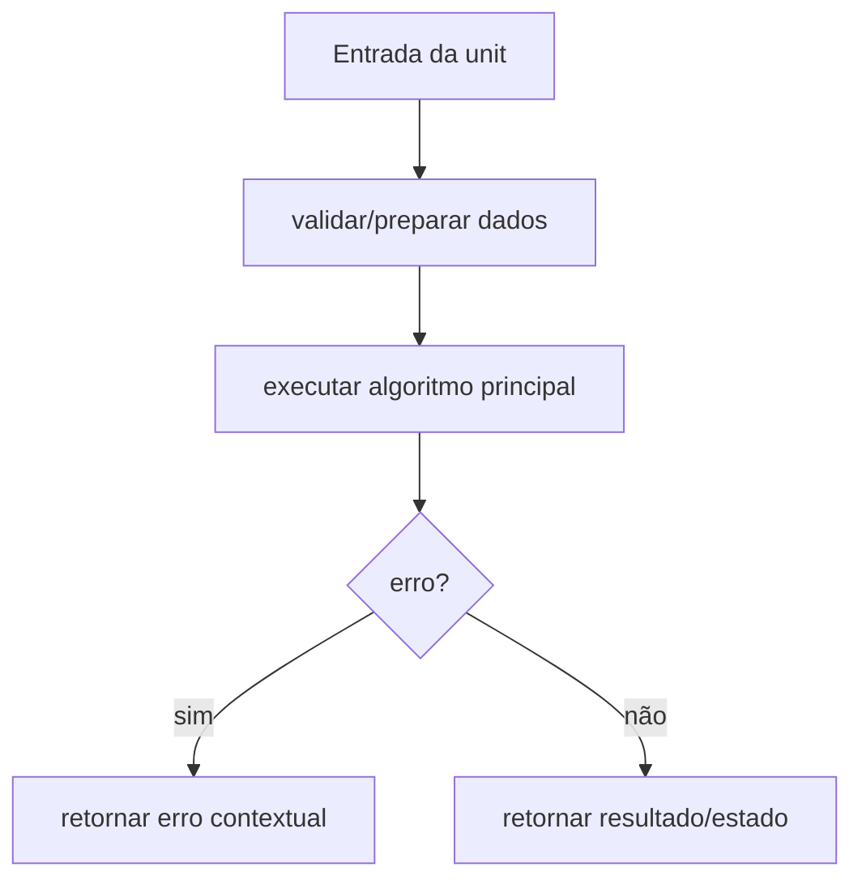

# Módulo internal/crypto/kdf, Design Técnico

> Spec gerada pelo Reversa Writer.  
> Escala: 🟢 CONFIRMADO no código | 🟡 INFERIDO | 🔴 LACUNA

## Interface

A unit `internal/crypto/kdf` é implementada no legado principalmente em `internal/crypto/kdf/service.go`, `internal/crypto/kdf/scrypt.go`, `internal/crypto/kdf/pbkdf2.go`, `internal/crypto/kdf/analyzer.go`, `internal/crypto/kdf/types.go`, `internal/crypto/kdf/interfaces.go`. Sua interface é formada por funções, structs e contratos internos consumidos pelos demais módulos do monólito CLI. 🟢

| Símbolo | Assinatura / Entrada | Retorno | Observação |
|---------|----------------------|---------|------------|
| `DeriveKey` | parâmetros: password string, crypto *CryptoParams | `[]byte, error` | 🟢 |
| `ValidateParams` | parâmetros: kdfType string, params map[string]interface{} | `error` | 🟢 |
| `AnalyzeKeystore` | parâmetros: crypto *CryptoParams | `*CompatibilityReport, error` | 🟢 |

## Fluxo Principal

1. A unit recebe dados do módulo consumidor ou da configuração runtime. 🟢
2. Entradas são normalizadas ou validadas conforme regras documentadas em `requirements.md`. 🟢
3. O algoritmo principal executa: Normalização de aliases KDF, Validação por ranges, Estimativa de segurança e compatibilidade por cliente, Otimização de parâmetros por nível de segurança e memória máxima. 🟢
4. Em erro, a unit retorna erro estruturado, erro contextual ou valor de falha conforme contrato do legado. 🟢
5. Em sucesso, a unit entrega resultado para o próximo componente arquitetural. 🟢

## Fluxos Alternativos

- **Entrada inválida:** validação interrompe o processamento e retorna erro compatível com o legado. 🟢
- **Configuração ausente ou default:** a unit aplica defaults quando o código legado confirma fallback. 🟢
- **Integração indisponível:** erros de dependências são propagados ou convertidos em warning conforme contrato local. 🟡

## Dependências

- `x/crypto/scrypt`: dependência usada pela unit conforme análise do legado. 🟢
- `x/crypto/pbkdf2`: dependência usada pela unit conforme análise do legado. 🟢
- `crypto/sha256`: dependência usada pela unit conforme análise do legado. 🟢
- `crypto/sha512`: dependência usada pela unit conforme análise do legado. 🟢
- `pkg/logging`: dependência usada pela unit conforme análise do legado. 🟢

## Decisões de Design Identificadas

| Decisão | Evidência no código | Confiança |
|---------|---------------------|-----------|
| A unit permanece encapsulada em `internal/crypto/kdf` e é consumida por contratos internos. | `internal/crypto/kdf/service.go`, `internal/crypto/kdf/scrypt.go`, `internal/crypto/kdf/pbkdf2.go`, `internal/crypto/kdf/analyzer.go`, `internal/crypto/kdf/types.go`, `internal/crypto/kdf/interfaces.go` | 🟢 |
| Regras de validação são explícitas e devem ser preservadas na reimplementação. | `.reversa/context/modules.json` | 🟢 |
| Lacunas conhecidas não devem ser corrigidas sem decisão humana quando alteram comportamento. | `_reversa_sdd/domain.md` | 🟡 |

## Estado Interno

| Estado | Campo | Papel | Confiança |
|---|---|---|---:|
| `CryptoParams` | `KDF: string` | obrigatório no contrato legado | 🟢 |
| `CryptoParams` | `KDFParams: map[string]interface{}` | obrigatório no contrato legado | 🟢 |
| `CryptoParams` | `Cipher: string` | opcional no contrato legado | 🟢 |
| `CryptoParams` | `CipherText: string` | opcional no contrato legado | 🟢 |
| `CryptoParams` | `MAC: string` | opcional no contrato legado | 🟢 |
| `CompatibilityReport` | `Compatible: bool` | obrigatório no contrato legado | 🟢 |
| `CompatibilityReport` | `KDFType: string` | obrigatório no contrato legado | 🟢 |
| `CompatibilityReport` | `SecurityLevel: SecurityLevel` | obrigatório no contrato legado | 🟢 |
| `CompatibilityReport` | `Issues: []string` | obrigatório no contrato legado | 🟢 |
| `CompatibilityReport` | `Warnings: []string` | obrigatório no contrato legado | 🟢 |

## Observabilidade

- Eventos, erros ou warnings devem manter mensagens e categorias equivalentes quando existentes no legado. 🟢
- Quando a unit opera com dados sensíveis, logs devem permanecer sanitizados e sem segredos. 🟢
- Métricas de performance devem ser preservadas quando a unit expõe stats ou collectors. 🟡

## Riscos e Lacunas

- 🟡 Ranges da CLI e do KDF podem divergir em alguns parâmetros.
- 🟡 Compatibilidade depende dos clientes Ethereum alvo.
