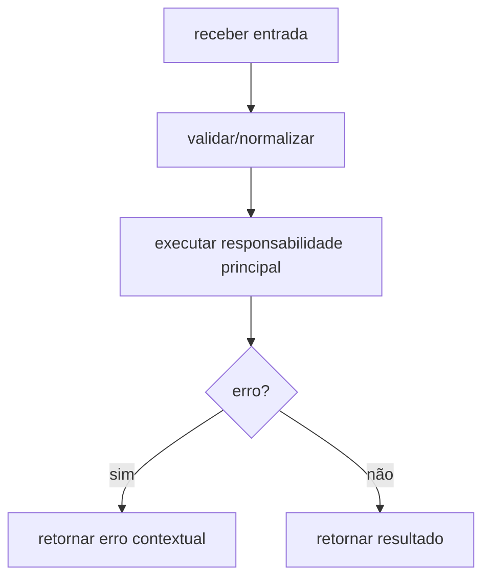

# Módulo internal/crypto/kdf, Fluxos Operacionais

> Spec gerada pelo Reversa Writer.  
> Escala: 🟢 CONFIRMADO no código | 🟡 INFERIDO | 🔴 LACUNA

## Fluxo Principal

## Fluxos Técnicos Confirmados

- Normalização de aliases KDF 🟢
- Validação por ranges 🟢
- Estimativa de segurança e compatibilidade por cliente 🟢
- Otimização de parâmetros por nível de segurança e memória máxima 🟢

## Fluxos Alternativos

- **Entrada inválida:** retornar erro conforme contrato da unit. 🟢
- **Dependência falha:** propagar erro ou warning conforme `design.md`. 🟡
- **Dados sensíveis:** aplicar sanitização/ocultação quando a unit manipula chaves, mnemonic, password ou salt. 🟢
