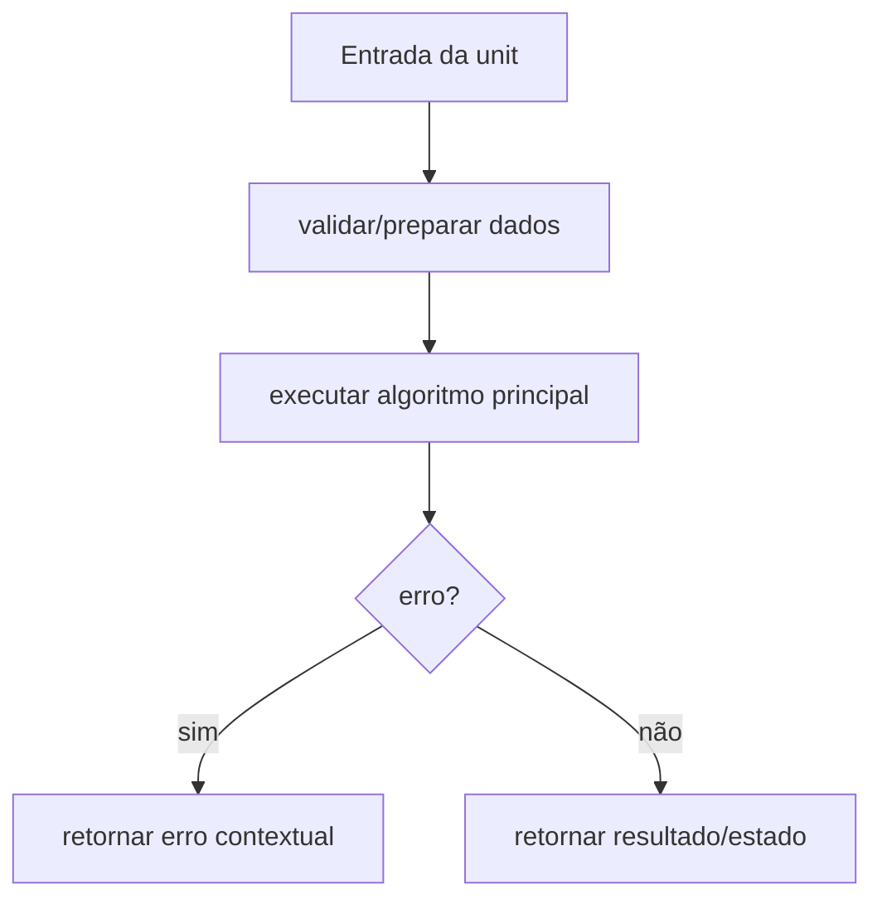

# Módulo internal/tui, Design Técnico

> Spec gerada pelo Reversa Writer.  
> Escala: 🟢 CONFIRMADO no código | 🟡 INFERIDO | 🔴 LACUNA

## Interface

A unit `internal/tui` é implementada no legado principalmente em `internal/tui/manager.go`, `internal/tui/progress.go`, `internal/tui/stats.go`, `internal/tui/benchmark.go`, `internal/tui/styles.go`, `internal/tui/logo.go`, `internal/tui/utils.go`. Sua interface é formada por funções, structs e contratos internos consumidos pelos demais módulos do monólito CLI. 🟢

| Símbolo | Assinatura / Entrada | Retorno | Observação |
|---------|----------------------|---------|------------|
| `DetectCapabilities` | parâmetros: nenhum | `TUICapabilities` | 🟢 |
| `Update` | parâmetros: tea.Msg | `tea.Model, tea.Cmd` | 🟢 |
| `View` | parâmetros: nenhum | `string` | 🟢 |

## Fluxo Principal

1. A unit recebe dados do módulo consumidor ou da configuração runtime. 🟢
2. Entradas são normalizadas ou validadas conforme regras documentadas em `requirements.md`. 🟢
3. O algoritmo principal executa: State machine Bubble Tea por mensagens, Renderização adaptativa por tamanho de terminal, Tabela rolável de resultados. 🟢
4. Em erro, a unit retorna erro estruturado, erro contextual ou valor de falha conforme contrato do legado. 🟢
5. Em sucesso, a unit entrega resultado para o próximo componente arquitetural. 🟢

## Fluxos Alternativos

- **Entrada inválida:** validação interrompe o processamento e retorna erro compatível com o legado. 🟢
- **Configuração ausente ou default:** a unit aplica defaults quando o código legado confirma fallback. 🟢
- **Integração indisponível:** erros de dependências são propagados ou convertidos em warning conforme contrato local. 🟡

## Dependências

- `bubbletea`: dependência usada pela unit conforme análise do legado. 🟢
- `bubbles/progress`: dependência usada pela unit conforme análise do legado. 🟢
- `bubbles/table`: dependência usada pela unit conforme análise do legado. 🟢
- `lipgloss`: dependência usada pela unit conforme análise do legado. 🟢
- `x/term`: dependência usada pela unit conforme análise do legado. 🟢

## Decisões de Design Identificadas

| Decisão | Evidência no código | Confiança |
|---------|---------------------|-----------|
| A unit permanece encapsulada em `internal/tui` e é consumida por contratos internos. | `internal/tui/manager.go`, `internal/tui/progress.go`, `internal/tui/stats.go`, `internal/tui/benchmark.go`, `internal/tui/styles.go`, `internal/tui/logo.go`, `internal/tui/utils.go` | 🟢 |
| Regras de validação são explícitas e devem ser preservadas na reimplementação. | `.reversa/context/modules.json` | 🟢 |
| Lacunas conhecidas não devem ser corrigidas sem decisão humana quando alteram comportamento. | `_reversa_sdd/domain.md` | 🟡 |

## Estado Interno

| Estado | Campo | Papel | Confiança |
|---|---|---|---:|
| `ProgressModel` | `stats: *wallet.GenerationStats` | obrigatório no contrato legado | 🟢 |
| `ProgressModel` | `walletResults: []WalletResult` | opcional no contrato legado | 🟢 |
| `ProgressModel` | `completedWallets: int` | obrigatório no contrato legado | 🟢 |

## Observabilidade

- Eventos, erros ou warnings devem manter mensagens e categorias equivalentes quando existentes no legado. 🟢
- Quando a unit opera com dados sensíveis, logs devem permanecer sanitizados e sem segredos. 🟢
- Métricas de performance devem ser preservadas quando a unit expõe stats ou collectors. 🟡

## Riscos e Lacunas

- 🟡 TUI depende de capacidades do terminal e tem fallback para texto.
