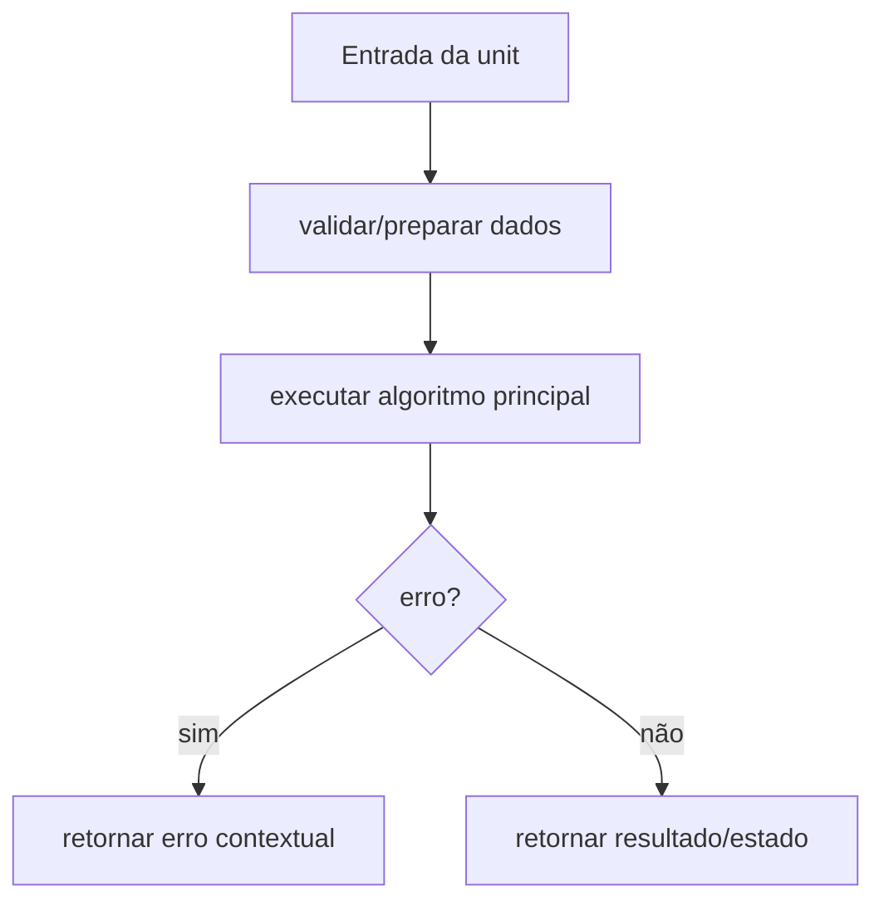

# Caso de Uso: Coletar Métricas, Design Técnico

> Spec gerada pelo Reversa Writer.  
> Escala: 🟢 CONFIRMADO no código | 🟡 INFERIDO | 🔴 LACUNA

## Interface

A unit `internal/worker/coletar-metricas` é implementada no legado principalmente em `internal/worker/pool.go`, `internal/worker/stats.go`, `internal/worker/interface.go`. Sua interface é formada por funções, structs e contratos internos consumidos pelos demais módulos do monólito CLI. 🟢

| Símbolo | Assinatura / Entrada | Retorno | Observação |
|---------|----------------------|---------|------------|
| `NewPoolWithConfig` | parâmetros: threadCount int, cfg *config.Config, network string | `*Pool` | 🟢 |
| `GenerateWalletWithContext` | parâmetros: ctx context.Context, criteria wallet.GenerationCriteria | `*wallet.GenerationResult, error` | 🟢 |
| `Start` | parâmetros: statsChan <-chan WorkerStats, ctx context.Context | `void` | 🟢 |
| `GetPerformanceMetrics` | parâmetros: nenhum | `PerformanceMetrics` | 🟢 |

## Fluxo Principal

1. A unit recebe dados do módulo consumidor ou da configuração runtime. 🟢
2. Entradas são normalizadas ou validadas conforme regras documentadas em `requirements.md`. 🟢
3. O algoritmo principal executa: Fan-out de goroutines por thread, Primeiro resultado vence via resultCh bufferizado, Stats não-bloqueantes a cada 100ms ou 1000 tentativas, Reconstrução de chave privada apenas após match para otimização. 🟢
4. Em erro, a unit retorna erro estruturado, erro contextual ou valor de falha conforme contrato do legado. 🟢
5. Em sucesso, a unit entrega resultado para o próximo componente arquitetural. 🟢

## Fluxos Alternativos

- **Entrada inválida:** validação interrompe o processamento e retorna erro compatível com o legado. 🟢
- **Configuração ausente ou default:** a unit aplica defaults quando o código legado confirma fallback. 🟢
- **Integração indisponível:** erros de dependências são propagados ou convertidos em warning conforme contrato local. 🟡

## Dependências

- `internal/config`: dependência usada pela unit conforme análise do legado. 🟢
- `internal/crypto`: dependência usada pela unit conforme análise do legado. 🟢
- `pkg/wallet`: dependência usada pela unit conforme análise do legado. 🟢
- `pkg/logging`: dependência usada pela unit conforme análise do legado. 🟢
- `pkg/errors`: dependência usada pela unit conforme análise do legado. 🟢

## Decisões de Design Identificadas

| Decisão | Evidência no código | Confiança |
|---------|---------------------|-----------|
| A unit permanece encapsulada em `internal/worker` e é consumida por contratos internos. | `internal/worker/pool.go`, `internal/worker/stats.go`, `internal/worker/interface.go` | 🟢 |
| Regras de validação são explícitas e devem ser preservadas na reimplementação. | `.reversa/context/modules.json` | 🟢 |
| Lacunas conhecidas não devem ser corrigidas sem decisão humana quando alteram comportamento. | `_reversa_sdd/domain.md` | 🟡 |

## Estado Interno

| Estado | Campo | Papel | Confiança |
|---|---|---|---:|
| `Pool` | `threadCount: int` | obrigatório no contrato legado | 🟢 |
| `Pool` | `statsCollector: *StatsCollector` | obrigatório no contrato legado | 🟢 |
| `Pool` | `generator: crypto.Generator` | obrigatório no contrato legado | 🟢 |

## Observabilidade

- Eventos, erros ou warnings devem manter mensagens e categorias equivalentes quando existentes no legado. 🟢
- Quando a unit opera com dados sensíveis, logs devem permanecer sanitizados e sem segredos. 🟢
- Métricas de performance devem ser preservadas quando a unit expõe stats ou collectors. 🟡

## Riscos e Lacunas

- 🟡 Cancelamento e fechamento de canais exigem cuidado para evitar goroutine leak.
- 🟡 Benchmark CLI ainda não submete WorkItem real ao pool.
