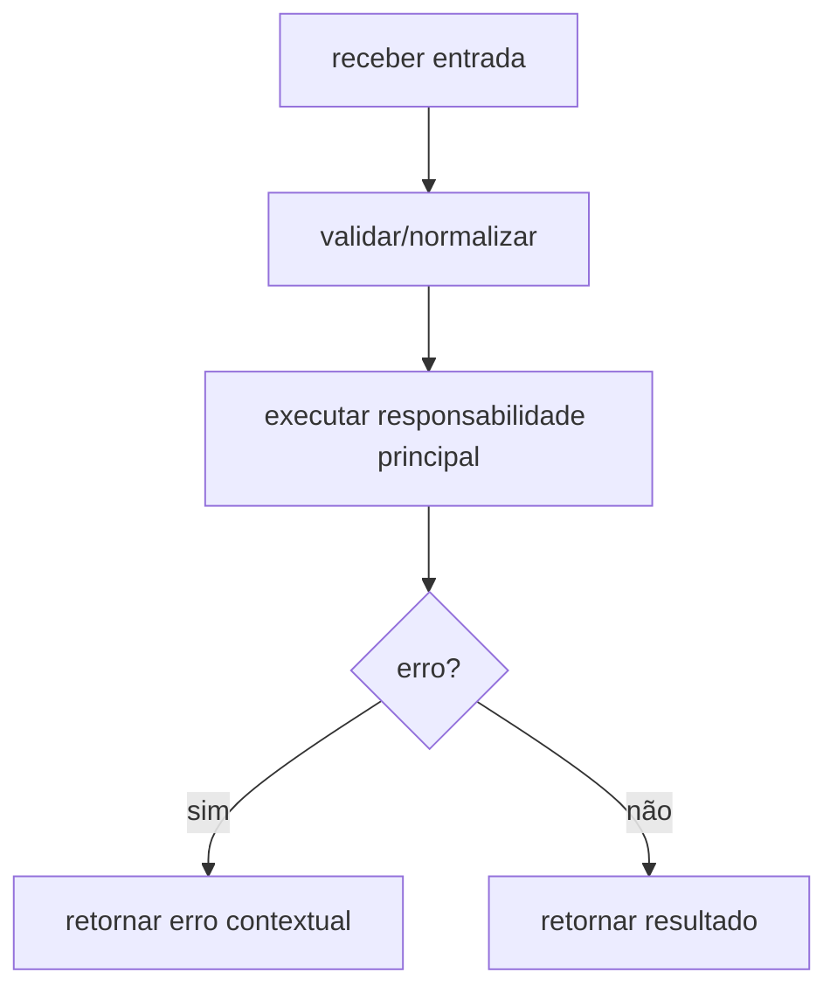

# Módulo internal/worker, Fluxos Operacionais

> Spec gerada pelo Reversa Writer.  
> Escala: 🟢 CONFIRMADO no código | 🟡 INFERIDO | 🔴 LACUNA

## Fluxo Principal

## Fluxos Técnicos Confirmados

- Fan-out de goroutines por thread 🟢
- Primeiro resultado vence via resultCh bufferizado 🟢
- Stats não-bloqueantes a cada 100ms ou 1000 tentativas 🟢
- Reconstrução de chave privada apenas após match para otimização 🟢

## Fluxos Alternativos

- **Entrada inválida:** retornar erro conforme contrato da unit. 🟢
- **Dependência falha:** propagar erro ou warning conforme `design.md`. 🟡
- **Dados sensíveis:** aplicar sanitização/ocultação quando a unit manipula chaves, mnemonic, password ou salt. 🟢
