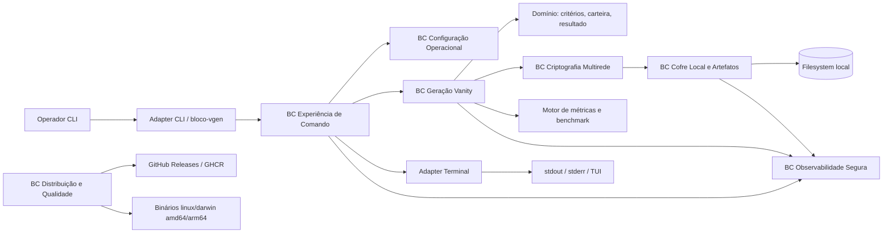

# Target Architecture

> Arquitetura alvo do sistema novo, respeitando `paradigm_decision.md`, `migration_strategy.md` e `topology_decision.md`.

## Visão geral

`bloco-vanity-generator` continua sendo uma aplicação CLI local em Go, distribuída como binário `bloco-vgen`, imagem Docker e release assets. A arquitetura alvo é um monólito modular por capability, com hexagonal leve nas bordas críticas: CLI/terminal, filesystem, logging, crypto e CI/CD. O fluxo principal permanece local e síncrono na perspectiva do usuário, mas a geração mantém worker pool com goroutines, `context.Context` e métricas concorrentes.

A estratégia confirmada é Big Bang controlado com Parallel Run offline obrigatório. Portanto, a arquitetura privilegia redesign interno Go idiomático sem copiar a topologia legada 1-para-1, mas expõe contratos testáveis para paridade de CLI, crypto, arquivos, logs, TUI/fallback e performance.

## Diagrama (Mermaid)



## Componentes

| Componente | Tipo | Responsabilidade | Origem (legado / novo / fundido) |
|---|---|---|---|
| `cmd/bloco-vgen` | CLI | Bootstrap, carregamento de configuração, sinais e execução do comando raiz. | Renomeado de `cmd/bloco-eth`; BR-MIGRAR-002. |
| Adapter CLI | Adapter | Parse de flags, binding para casos de uso e tradução de erros para códigos de saída. | Dividido de `internal/cli`; BR-MIGRAR-003..006. |
| Casos de uso `generate`, `stats`, `benchmark`, `version` | Serviço | Orquestrar comandos sem conhecer detalhes de Cobra, filesystem ou TUI. | Dividido de `internal/cli`; comandos confirmados em `inventory.md`. |
| Domínio de critérios e carteira | Serviço | Value objects, invariantes por rede e validação de carteira. | Fundido de `pkg/wallet`, `internal/validation`, `domain.md`; BR-MIGRAR-008..010. |
| Motor de geração vanity | Worker | Worker pool concorrente, cancelamento, primeiro resultado vencedor, stats e geração múltipla resiliente. | Preservado conceitualmente de `internal/worker`; BR-MIGRAR-011..013. |
| Criptografia multirede | Serviço | Geração Ethereum, Bitcoin, Solana, checksums, mnemonic e chaves. | Dividido de `internal/crypto`; BR-MIGRAR-014..016. |
| Cofre local e KDF | Serviço / Adapter | KeyStore V3, KDF, senha segura, mnemonic, persistência segura e formato Solana criptografado. | Fundido de `internal/crypto/kdf`, keystore e filesystem; BR-MIGRAR-017..023. |
| Adapter filesystem | Adapter | Escrita atômica, permissões, paths, não sobrescrita e validação de artefatos. | Extraído da persistência legada; Data Master. |
| Adapter logging seguro | Adapter | Logs operacionais sanitizados com whitelist e testes contra vazamento. | Preservado conceitualmente de `pkg/logging`; BR-MIGRAR-024..025. |
| Adapter terminal | Adapter | TUI, fallback texto, detecção de ambiente e progress manager textual corrigido. | Fundido de `internal/tui` e `internal/progress`; BR-MIGRAR-026..028. |
| Métricas e benchmark | Serviço | Dificuldade, probabilidade, ETA, throughput, benchmark e amostras de velocidade. | Fundido de `pkg/utils`, TUI e worker stats; BR-MIGRAR-029. |
| Distribuição e qualidade | CI/CD | Testes, race, lint, scans, builds, Docker, checksums, release e GHCR. | Preservado/modernizado de `.github`, Dockerfile e Makefile; BR-MIGRAR-030. |
| Filesystem local | Filesystem | Armazenar keystores, senhas, mnemonics, logs e artefatos locais. | Persistência real documentada em `_reversa_sdd/database/*`. |

## Bounded contexts

### BC-01: Experiência de Comando

- **Responsabilidade**: receber comandos/flags/env, exibir resultados, warnings e erros, e manter compatibilidade operacional do binário `bloco-vgen`.
- **Justificativa do agrupamento / separação**: separa UX CLI/TUI da geração, crypto e persistência. No legado, `internal/cli` acumula orquestração; no alvo, CLI vira adapter + casos de uso.
- **Componentes internos**: adapter CLI, command router, mapeadores de flags, formatter de saída, códigos de saída.
- **Eventos publicados**: eventos internos/logáveis como `operation_start`, `operation_complete`, `secret_display_warning_shown`.
- **Eventos consumidos**: progresso, resultado de geração, falha de persistência e métricas.

### BC-02: Configuração Operacional

- **Responsabilidade**: construir configuração padrão, aplicar env/flags explícitas, validar incompatibilidades e limites operacionais.
- **Justificativa do agrupamento / separação**: configurações mudam junto com UX e operação, mas devem ser validadas antes de acionar crypto/worker.
- **Componentes internos**: config loader, flag overrides, validators de threads/KDF/quiet/verbose/TUI.
- **Eventos publicados**: `config_validated` como evento interno opcional de observabilidade.
- **Eventos consumidos**: nenhum externo; recebe env/flags do CLI.

### BC-03: Geração Vanity

- **Responsabilidade**: executar busca probabilística por prefixo/sufixo, controlar workers, cancelar por contexto, agregar stats e lidar com geração single/múltipla.
- **Justificativa do agrupamento / separação**: reúne invariantes que falham juntas: critérios, tentativas, worker pool, cancelamento, métricas e primeiro resultado vencedor.
- **Componentes internos**: engine concorrente, worker supervisor, matcher, stats collector, benchmark runner.
- **Eventos publicados**: `generation_started`, `generation_progressed`, `wallet_generated`, `generation_completed`, `generation_cancelled`.
- **Eventos consumidos**: critérios validados, geradores por rede, terminal progress sink.

### BC-04: Criptografia Multirede

- **Responsabilidade**: gerar chaves/endereço por rede e validar formatos Ethereum, Bitcoin e Solana.
- **Justificativa do agrupamento / separação**: crypto tem alto risco e regras por rede; separar de worker e CLI permite vetores determinísticos e auditoria.
- **Componentes internos**: provider Ethereum, provider Bitcoin, provider Solana, registry de redes, validadores de endereço.
- **Eventos publicados**: nenhum evento distribuído; retorna candidatos e validações ao motor de geração.
- **Eventos consumidos**: solicitações de geração por rede.

### BC-05: Cofre Local e Artefatos

- **Responsabilidade**: produzir e persistir KeyStore V3, senha, mnemonic e formato seguro Solana, com permissões restritas.
- **Justificativa do agrupamento / separação**: segredos, KDF, filesystem e formatos persistidos precisam de threat model e testes próprios; não devem vazar para CLI/worker.
- **Componentes internos**: keystore service, KDF service, password generator, mnemonic writer, Solana secure artifact writer, filesystem port.
- **Eventos publicados**: `artifact_persisted`, `artifact_persistence_failed`, `kdf_analyzed`.
- **Eventos consumidos**: carteira gerada e configuração de persistência.

### BC-06: Observabilidade Segura

- **Responsabilidade**: registrar eventos operacionais sem private key, public key, mnemonic, password, salt ou material criptográfico.
- **Justificativa do agrupamento / separação**: logging seguro é uma política transversal, mas deve ser tratado como capability auditável e testável contra vazamento.
- **Componentes internos**: sanitizer, whitelist de campos, logger estruturado, policy de stdout/stderr em TUI.
- **Eventos publicados**: logs sanitizados em arquivo/stdout quando permitido.
- **Eventos consumidos**: eventos internos dos demais contexts.

### BC-07: Distribuição e Qualidade

- **Responsabilidade**: garantir build, testes, race, lint, scans, Docker, checksums, releases e permissões operacionais de CI.
- **Justificativa do agrupamento / separação**: CI/CD não participa do runtime local, mas é parte do contrato de distribuição do produto.
- **Componentes internos**: workflows, release pipeline, Dockerfile, checksums, policy de permissões.
- **Eventos publicados**: release assets, imagem Docker, relatórios de qualidade.
- **Eventos consumidos**: código fonte, tags, secrets e permissões GitHub.

## Decisões arquiteturais (ADR-style resumido)

### AD-01: Manter produto como CLI local

- **Decisão**: não introduzir backend, banco, fila, API HTTP/RPC ou serviço remoto obrigatório.
- **Alternativas descartadas**: backend web, API remota, job queue, banco centralizado.
- **Justificativa**: `migration_brief.md`, `architecture.md` e BR-MIGRAR-001 confirmam CLI local como restrição e contrato de produto.
- **Rastreabilidade**: BR-MIGRAR-001; `discard_log.md` BR-DESCARTAR-009 para não copiar estrutura interna acidental, não para mudar topologia operacional.

### AD-02: Usar monólito modular por capability com hexagonal leve

- **Decisão**: organizar `internal/app`, `internal/domain`, `internal/generation`, `internal/crypto`, `internal/adapters`, `internal/ui` e `internal/config`.
- **Alternativas descartadas**: preservação integral de `internal/cli` como centro; microserviços; DDD pesado com muitos layers.
- **Justificativa**: topologia moderna aprovada, apetite transformacional e estratégia Big Bang com gates de paridade.
- **Rastreabilidade**: `topology_decision.md`; `paradigm_decision.md` linhas de implicação para Designer.

### AD-03: Isolar geração concorrente como motor testável

- **Decisão**: worker pool permanece com goroutines, channels/context e stats, mas atrás de interfaces pequenas.
- **Alternativas descartadas**: geração síncrona simples; depender diretamente de `internal/cli`; actor framework externo.
- **Justificativa**: performance é driver arquitetural e regra central; Go idiomático favorece CSP leve.
- **Rastreabilidade**: BR-MIGRAR-004, BR-MIGRAR-013, RISK-004.

### AD-04: Validar por rede e não por regra global hex-only

- **Decisão**: critérios, endereço e wallet usam validadores por rede.
- **Alternativas descartadas**: validação hex global do legado; `Wallet.IsValid()` centrado em Ethereum.
- **Justificativa**: decisões humanas do Revisor corrigem multirede real.
- **Rastreabilidade**: BR-MIGRAR-009, BR-MIGRAR-010; `discard_log.md` BR-DESCARTAR-003 e BR-DESCARTAR-004.

### AD-05: Tratar segredos por portas explícitas de cofre local e logging seguro

- **Decisão**: secrets só atravessam tipos marcados/sensíveis e adapters de cofre; logs usam whitelist e testes negativos.
- **Alternativas descartadas**: `WalletLogger` legado com private key; Solana `.key` bruto; salt em logs.
- **Justificativa**: segurança de segredos é driver crítico e risco CRITICAL.
- **Rastreabilidade**: BR-MIGRAR-016, BR-MIGRAR-023..025; `discard_log.md` BR-DESCARTAR-005 e BR-DESCARTAR-006; RISK-002.

### AD-06: Usar Parallel Run offline como gate, não como coexistência runtime

- **Decisão**: paridade compara legado e alvo antes do release; não há roteamento gradual em produção.
- **Alternativas descartadas**: Strangler Fig, dual-run runtime remoto, migração com banco compartilhado.
- **Justificativa**: sistema é binário local sem tráfego remoto; risco principal é regressão comportamental.
- **Rastreabilidade**: `migration_strategy.md`; `cutover_plan.md`.

### AD-07: Persistência permanece filesystem local

- **Decisão**: não criar banco; dados persistidos continuam como arquivos locais com schemas documentados.
- **Alternativas descartadas**: SQLite/Postgres/NoSQL para histórico ou configuração.
- **Justificativa**: Data Master confirmou ausência de banco e brief não autoriza backend/banco.
- **Rastreabilidade**: `_reversa_sdd/database/data-dictionary.md`; BR-MIGRAR-021..023.

## Honra ao paradigma escolhido

- **Paradigma alvo**: CSP/goroutines Go com procedural estruturado e interfaces leves.
- **Como a arquitetura honra esse paradigma**:
  - Mantém CLI local e fluxo procedural de alto nível: flags/env → config → caso de uso → geração → apresentação/persistência.
  - Mantém concorrência com `context.Context`, goroutines, channels e stats collector no motor de geração.
  - Usa structs e value objects simples para domínio, sem DDD pesado nem DI container externo.
  - Usa interfaces pequenas em bordas instáveis: crypto por rede, filesystem, logging, terminal e clock/random quando necessário para testes.
  - Coloca side effects em adapters; validação, cálculo de dificuldade/probabilidade e matching ficam o mais puros possível.
  - Preserva paridade comportamental externa como contrato; a estrutura interna não é contrato.

## Honra à topologia escolhida

- **Topologia escolhida**: opção 2 — topologia moderna proposta.
- **Materialização**: monólito modular por capability com hexagonal leve, sem copiar pacotes legados 1-para-1.
- **Árvore alvo sugerida**:

```text
cmd/
  bloco-vgen/
internal/
  app/
    generate/
    stats/
    benchmark/
    version/
  domain/
    wallet/
    criteria/
    network/
    result/
  generation/
    engine/
    match/
    performance/
  crypto/
    ethereum/
    bitcoin/
    solana/
    keystore/
    kdf/
    mnemonic/
  adapters/
    cli/
    filesystem/
    logging/
    terminal/
    release/
  ui/
    tui/
    text/
  config/
pkg/
  errors/
  version/
.github/
  workflows/
Dockerfile
Makefile
```

- **Preservado conceitualmente**: worker pool, Go modules, Cobra/Fang, Bubble Tea, KeyStore V3, KDF, Docker e GitHub Actions.
- **Transformado intencionalmente**: `internal/cli` deixa de ser centro de orquestração; `pkg/wallet` deixa de misturar domínio/logging; validação e persistência passam a ser por rede/segurança.
- **Removido/substituído**: `.key` bruto Solana, `WalletLogger` inseguro, validação hex global e claims de README não implementados.

## Bordas com o legado durante a migração

- **Big Bang controlado**: não há coexistência runtime com o legado; o corte ocorre no release do binário alvo.
- **Parallel Run offline**: legado e alvo devem ser comparados por harness antes do release para CLI, stdout/stderr, códigos de saída, arquivos, logs, crypto, KDF, TUI/fallback e benchmarks.
- **Rollback**: manter release/binário legado como fallback até smoke tests e validação pós-release.
- **Dados locais**: não sobrescrever artefatos existentes automaticamente; novos arquivos devem respeitar permissões e formatos alvo.

## Notas

A arquitetura evita modernidade excessiva: não há banco, servidor, filas ou serviços externos. A complexidade adicional está limitada a fronteiras testáveis, porque os riscos principais são segurança de segredos, regressão criptográfica, paridade CLI e performance.
