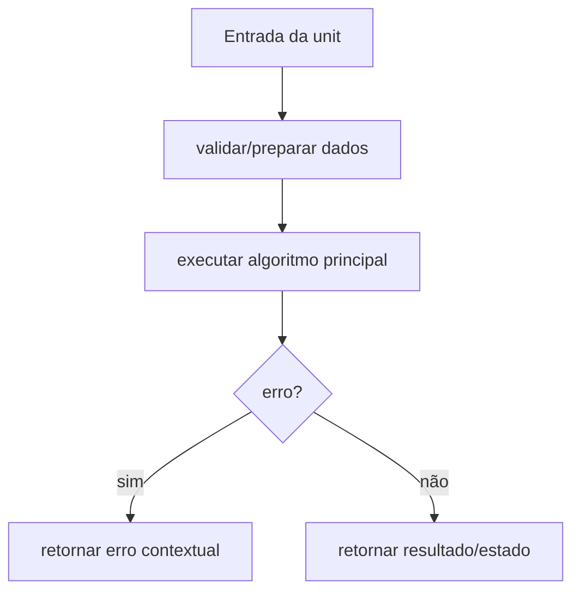

# Módulo pkg/wallet, Design Técnico

> Spec gerada pelo Reversa Writer.  
> Escala: 🟢 CONFIRMADO no código | 🟡 INFERIDO | 🔴 LACUNA

## Interface

A unit `pkg/wallet` é implementada no legado principalmente em `pkg/wallet/types.go`, `pkg/wallet/logger.go`. Sua interface é formada por funções, structs e contratos internos consumidos pelos demais módulos do monólito CLI. 🟢

| Símbolo | Assinatura / Entrada | Retorno | Observação |
|---------|----------------------|---------|------------|
| `Validate` | parâmetros: nenhum | `error` | 🟢 |
| `Update` | parâmetros: attempts int64 | `void` | 🟢 |
| `LogWallet` | parâmetros: result *GenerationResult | `error` | 🟢 |

## Fluxo Principal

1. A unit recebe dados do módulo consumidor ou da configuração runtime. 🟢
2. Entradas são normalizadas ou validadas conforme regras documentadas em `requirements.md`. 🟢
3. O algoritmo principal executa: Atualização de estatísticas com probabilidade e ETA, Validação hex de critérios. 🟢
4. Em erro, a unit retorna erro estruturado, erro contextual ou valor de falha conforme contrato do legado. 🟢
5. Em sucesso, a unit entrega resultado para o próximo componente arquitetural. 🟢

## Fluxos Alternativos

- **Entrada inválida:** validação interrompe o processamento e retorna erro compatível com o legado. 🟢
- **Configuração ausente ou default:** a unit aplica defaults quando o código legado confirma fallback. 🟢
- **Integração indisponível:** erros de dependências são propagados ou convertidos em warning conforme contrato local. 🟡

## Dependências

- `time`: dependência usada pela unit conforme análise do legado. 🟢
- `os`: dependência usada pela unit conforme análise do legado. 🟢

## Decisões de Design Identificadas

| Decisão | Evidência no código | Confiança |
|---------|---------------------|-----------|
| A unit permanece encapsulada em `pkg/wallet` e é consumida por contratos internos. | `pkg/wallet/types.go`, `pkg/wallet/logger.go` | 🟢 |
| Regras de validação são explícitas e devem ser preservadas na reimplementação. | `.reversa/context/modules.json` | 🟢 |
| Lacunas conhecidas não devem ser corrigidas sem decisão humana quando alteram comportamento. | `_reversa_sdd/domain.md` | 🟡 |

## Estado Interno

| Estado | Campo | Papel | Confiança |
|---|---|---|---:|
| `Wallet` | `Address: string` | obrigatório no contrato legado | 🟢 |
| `Wallet` | `PublicKey: string` | opcional no contrato legado | 🟢 |
| `Wallet` | `PrivateKey: string` | obrigatório no contrato legado | 🟢 |
| `Wallet` | `Mnemonic: string` | opcional no contrato legado | 🟢 |
| `Wallet` | `Network: string` | opcional no contrato legado | 🟢 |
| `Wallet` | `CreatedAt: time.Time` | obrigatório no contrato legado | 🟢 |

## Observabilidade

- Eventos, erros ou warnings devem manter mensagens e categorias equivalentes quando existentes no legado. 🟢
- Quando a unit opera com dados sensíveis, logs devem permanecer sanitizados e sem segredos. 🟢
- Métricas de performance devem ser preservadas quando a unit expõe stats ou collectors. 🟡

## Riscos e Lacunas

- 🟡 Wallet.IsValid conflita com Bitcoin/Solana e endereço Ethereum com 0x.
- 🟡 Logger legado pode persistir dados sensíveis se usado.
