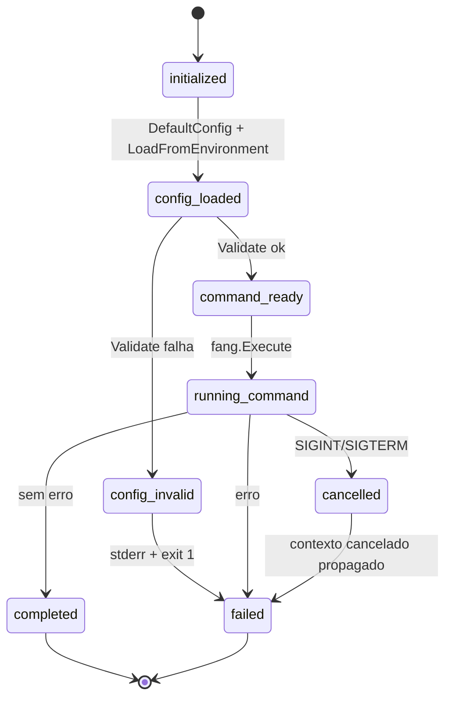
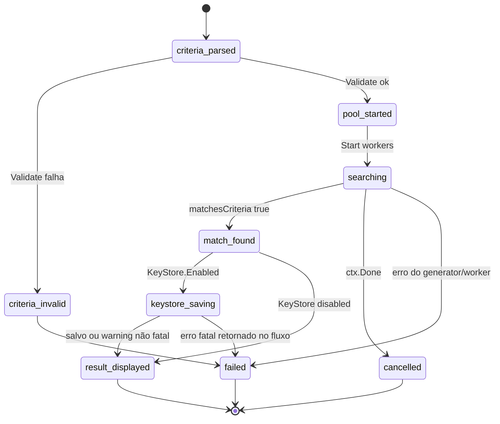
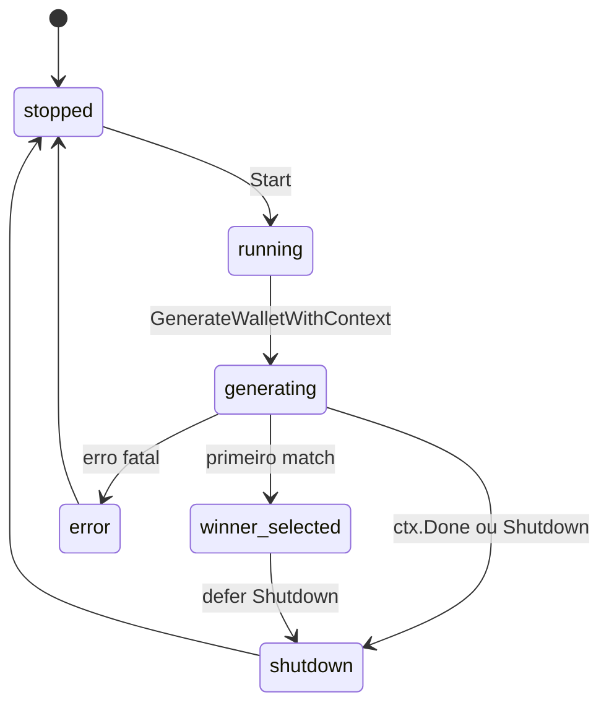
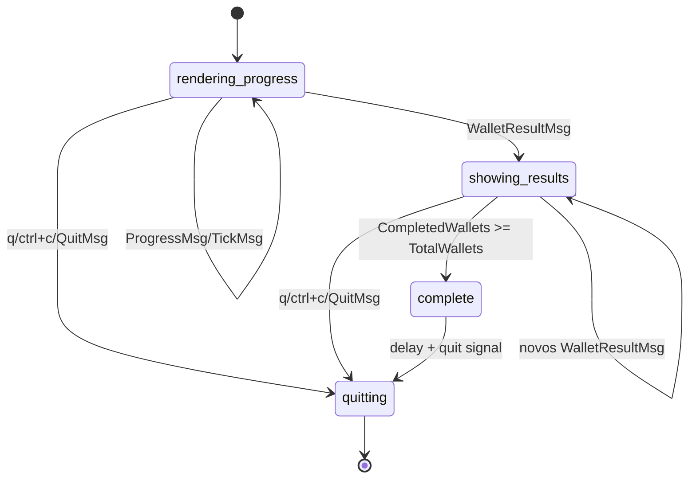
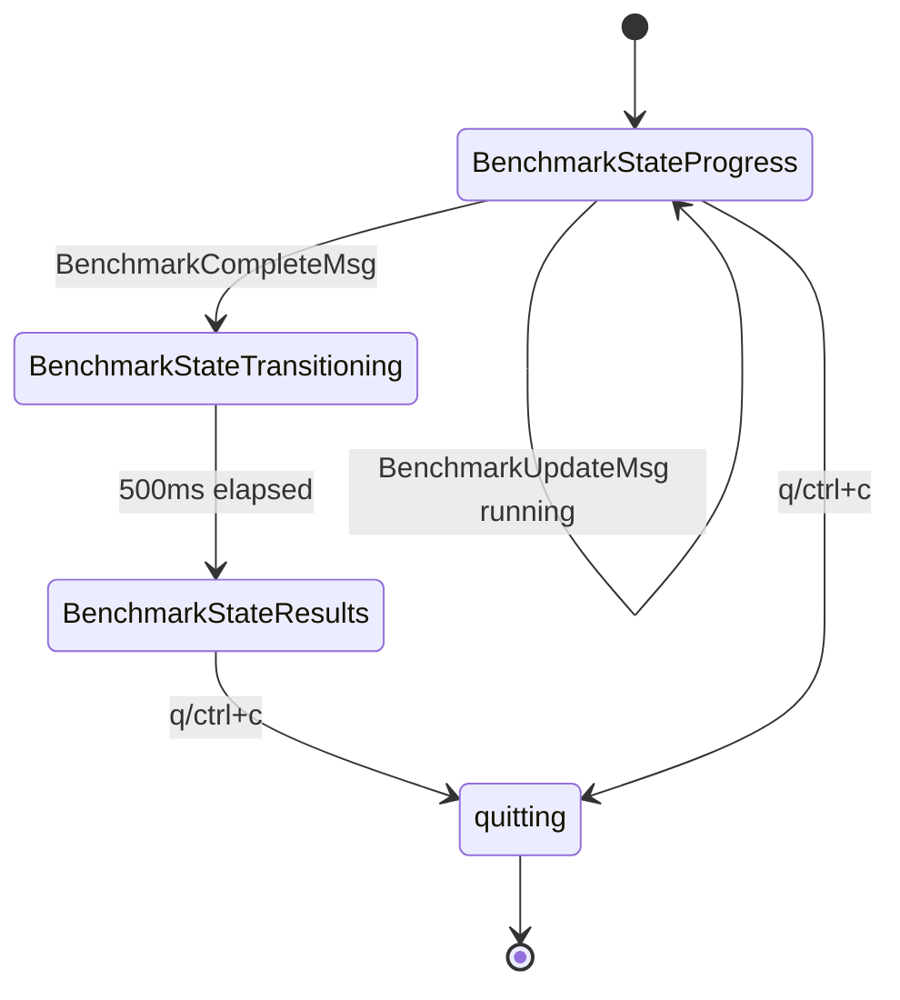
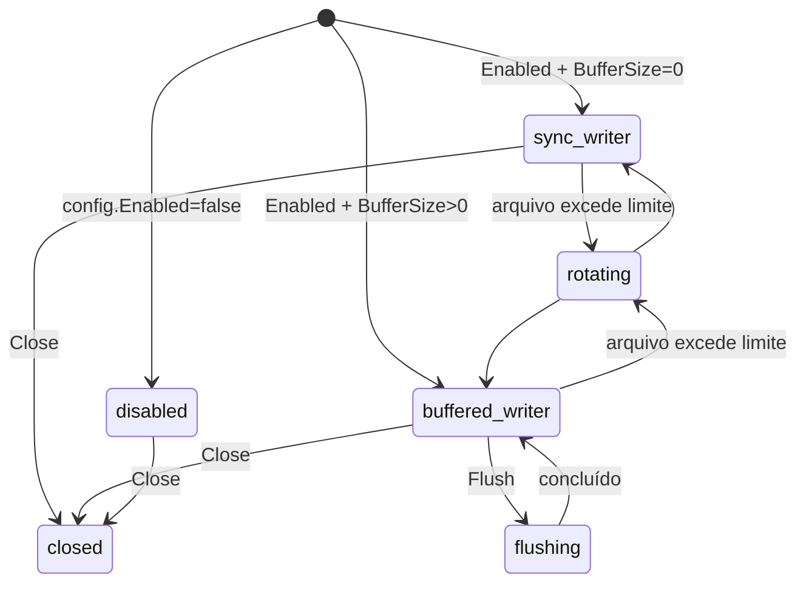
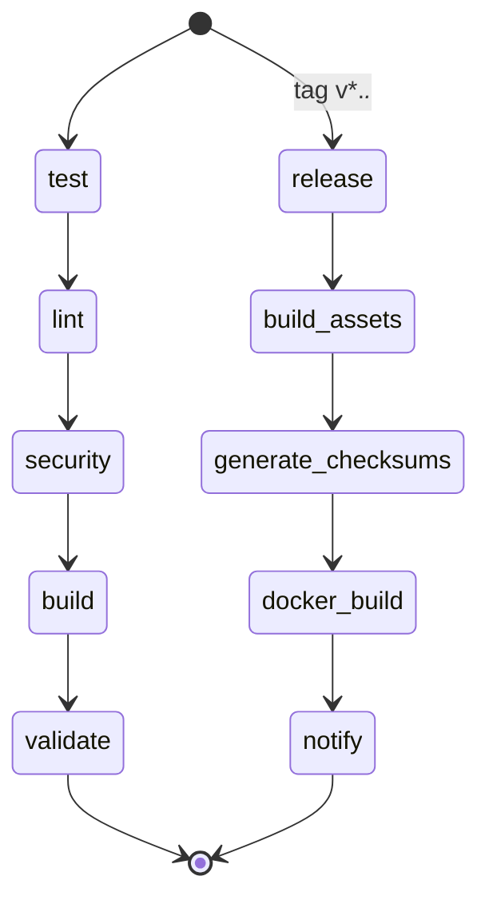

# State Machines — Detective

> Projeto: `bloco-wallet-generator`  
> Escala: 🟢 CONFIRMADO | 🟡 INFERIDO | 🔴 LACUNA

## Visão geral

O sistema não possui entidades persistentes com ciclo de vida de negócio rico, como Pedido, Usuário ou Conta. As máquinas de estado encontradas são principalmente **operacionais**: execução CLI, geração de carteira, TUI, worker pool, logging e CI/CD.

## Máquina 1 — Execução CLI

| Estado | Descrição | Confiança |
|---|---|---:|
| `initialized` | Processo iniciou, contexto de cancelamento criado. | 🟢 |
| `config_loaded` | Defaults carregados e variáveis de ambiente aplicadas. | 🟢 |
| `config_invalid` | Validação falhou; processo encerra com código 1. | 🟢 |
| `command_ready` | Aplicação Cobra/Fang criada. | 🟢 |
| `running_command` | Comando raiz/subcomando em execução. | 🟢 |
| `completed` | Execução sem erro. | 🟢 |
| `failed` | Erro tratado por `handleError()`. | 🟢 |
| `cancelled` | SIGINT/SIGTERM cancela contexto. | 🟢 |

## Máquina 2 — Geração de carteira

| Estado | Descrição | Confiança |
|---|---|---:|
| `criteria_parsed` | Flags convertidas em `GenerationCriteria`. | 🟢 |
| `criteria_invalid` | Padrão inválido, muito longo ou max attempts negativo. | 🟢 |
| `pool_started` | Worker pool iniciado. | 🟢 |
| `searching` | Workers geram chaves e endereços. | 🟢 |
| `match_found` | Endereço satisfaz prefixo/sufixo/checksum. | 🟢 |
| `keystore_saving` | Persistência de keystore/mnemonic quando habilitada. | 🟢 |
| `result_displayed` | Resultado exibido em TUI/texto. | 🟢 |
| `cancelled` | Contexto cancelado. | 🟢 |
| `failed` | Erro de geração, worker, validação ou keystore. | 🟢 |

## Máquina 3 — Worker pool

| Estado | Descrição | Confiança |
|---|---|---:|
| `stopped` | Pool criado, não executando. | 🟢 |
| `running` | `Start()` ativou execução e stats. | 🟢 |
| `generating` | Goroutines em loop de tentativa. | 🟢 |
| `winner_selected` | Primeiro resultado enviado em `resultCh`. | 🟢 |
| `shutdown` | `Shutdown()` cancela/encerra execução. | 🟢 |
| `error` | Falha ao iniciar ou gerar. | 🟢 |

## Máquina 4 — TUI de progresso

| Estado | Descrição | Confiança |
|---|---|---:|
| `rendering_progress` | Exibe padrão, dificuldade, barra e métricas. | 🟢 |
| `showing_results` | Recebe `WalletResultMsg` e exibe tabela. | 🟢 |
| `complete` | Todos os wallets concluídos; progresso 100%. | 🟢 |
| `quitting` | Usuário pressiona `q`/`ctrl+c` ou `QuitMsg`. | 🟢 |

## Máquina 5 — Benchmark TUI

| Estado | Descrição | Confiança |
|---|---|---:|
| `BenchmarkStateProgress` | Benchmark em andamento, exibindo progresso. | 🟢 |
| `BenchmarkStateTransitioning` | Resultado recebido e transição visual. | 🟢 |
| `BenchmarkStateResults` | Tabela final de resultados. | 🟢 |
| `quitting` | Usuário encerra. | 🟢 |

## Máquina 6 — Logging seguro

| Estado | Descrição | Confiança |
|---|---|---:|
| `disabled` | Logging desabilitado; writer `io.Discard`. | 🟢 |
| `sync_writer` | Escrita síncrona em stdout/arquivo/discard. | 🟢 |
| `buffered_writer` | Buffer assíncrono ativo. | 🟢 |
| `flushing` | Flush aguardando drain do buffer. | 🟢 |
| `rotating` | Rotação por tamanho de arquivo. | 🟢 |
| `closed` | Logger fechado. | 🟢 |

## Máquina 7 — CI/CD

| Estado | Descrição | Confiança |
|---|---|---:|
| `test` | Testes curtos, race detector e cobertura. | 🟢 |
| `lint` | golangci-lint, vet e fmt. | 🟢 |
| `security` | gosec, govulncheck, Semgrep/Trivy dependendo workflow. | 🟢 |
| `build` | Binários Linux/Darwin amd64/arm64. | 🟢 |
| `release` | Release por tag, upload de assets, checksum e Docker. | 🟢 |

## Lacunas de estado

| ID | Lacuna | Confiança |
|---|---|---:|
| SM-GAP-001 | Não há status persistente de carteira; carteira é resultado pontual. | 🟢 |
| SM-GAP-002 | Não há estado de importação/recuperação de keystore; apenas geração e gravação. | 🟢 |
| SM-GAP-003 | Não há máquina explícita de retries de keystore apesar de `MaxRetries`/`RetryDelay` aparecerem na config do serviço. | 🟡 |
